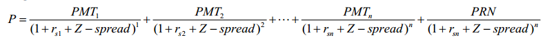
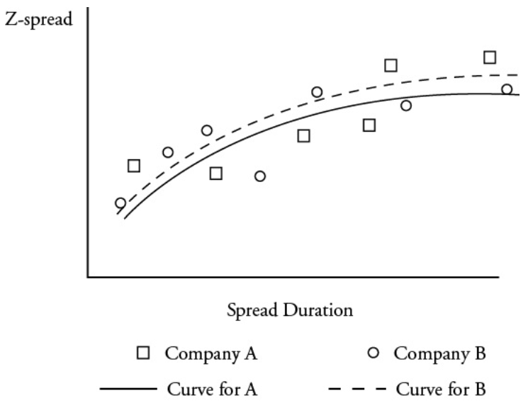

# READING 22. INTRODUCTION TO FIXED-INCOME PORTFOLIO MANAGEMENT

The candidate should be able to:

## a discuss roles of fixed-income securities in portfolios;

Provide portfolio diversification with generally low correlation to equity.
Provide regular cash flow.
Floating-rate and inflation-indexed bonds provide forms of inflation protection.

## b describe how fixed-income mandates may be classified and compare features of the mandates;

Liability-based mandates dedicate portfolio assets and reinvest future cash flows to fund future liabilities:
- Cash-flow matching funds liabilities with coupon and par amounts received on the dates the liabilities are paid.
- Duration matching (immunization) matches asset and liability duration to achieve comparable results. Both are forms of immunization. Duration matching generally gives more flexibility in asset selection and therefore may meet the objective at a lower cost.
- Horizon matching is a hybrid of cash-flow matching nearer term liabilities and duration matching the longer-term liabilities.
- Contingent immunization is a hybrid of active management with potential immunization. The portfolio must initially be overfunded and can be actively managed. If successful (unsuccessful), the surplus will grow (be lost) and the ultimate cost will end up being lower (higher) than from immunization.

|                    |Initial funding required PVA  |Risk and complexity       | Expected realized return if successful|
|--------------------|------------------------------|---------------------------|--------------------------------------|
|Cash flow matching  | 3                            | 1 - lowest                |1-lowest                              |
|Horizon    matching | 2                            | 2                         |2                                     |
|Duration matching   | 1 - lowest                   | 3                         |3                                     |
|Contingent immunization  | 4-Highest                | 4-Highest                |4-Highest                             |

Total return mandates typically seek to match or exceed the return of a benchmark index:
- Pure indexing exactly matches the holdings of the index.
- Enhanced indexing allows modest deviations (but matches duration to control interest rate risk).
- Active management does not restrict deviations versus the index.

### Enhanced indexing strategy

- The goal of the approach
  -- Mirror the most important index characteristics;
  -- Closely track index performance.

- General method: stratified sampling
  -- Identify the characteristic of each cell or significant index portfolio;
  -- The fixed-income portfolio manager identifies a subset of bonds or bond-linked exposures;
  -- The positions in each cell are adjusted over time given changes to the underlying index versus existing portfolio positions.
  -- The stratified sampling approach provides an asset manager the ability to optimize portfolio performance. Portfolio manager also seeks to minimize tracking error and limit the need to purchase or sell thinly traded securities.

- The strategy aims to replicate the index performance under different market scenarios ***more efficiently*** than the full replication of a pure indexing approach

Enhancement strategies for portfolio managers
- Lower cost enhancement
  -- The most obvious enhancement is in the area of cost reduction - reduce fund expenses or reduce the bid-ask cost of trading.
- Issue selection enhancement
  -- By using bond valuation models, identify specific issues that are undervalued to their implied value, and help enhance the return.
- Yield curve enhancement
  - Using analytical models to gauge and calculate relative value across the term structure of interest rates allows managers to develop strategies to both overweight undervalued securities and underweight overvalued securities.
- Sector/ quality enhancements
  -- Overweighting specific bond and credit sectors across the business cycle to enhance returns, and other sectors are underweighted as a result.
- Call exposure enhancement
  -- Effective duration is a sufficient risk measure for relatively small rate changes;
  -- Larger yield changes may affect bond performance significantly. Callable bonds are added to the portfolio, and the sensitivity to the price would be decreased.

## c describe bond market liquidity, including the differences among market sub-sectors, and discuss the effect of liquidity on fixed-income portfolio management;
Liquidity in the bond market (ability to buy or sell on a timely basis at or near fair market value) is substantially lower than in equity markets.
- Most bonds do not trade or trade infrequently after issuance.
- The sheer number and variety of individual bond issues is immense.
- The market is mostly over-the-counter with trade price and volume not reported.
- Liquidity is highest for sovereign government, higher-quality, and most recently issued (on-the-run) bonds.
- Smaller issues are generally less liquid.

Effects:
- Bond pricing data is more difficult to obtain.
  - matrix pricing: infer based on YTM of others
  - prepay features, difficult to obtain YTM
- Portfolio managers have to choose between more liquid bonds or less liquid bonds that may offer a liquidity premium.
  - Buy and hold investors: prefer less liquid for higher yield
  - Active investors: active strategy will compensate lower yield
- Dealer will widen the bid-ask spread
- Derivatives and ETFs are generally more liquid and an alternative to direct investment in bonds.

## d describe and interpret a model for fixed-income returns;

Return can be projected (or actual return decomposed) as the sum of:
1. Yield income: annual coupon amount / current bond price
2. Rolldown return, assuming no change in yield curve: (projected ending bond price

(BP) − beginning BP) / beginning BP

Yield income (1) + rolldown return (2) may be referred to as ***rolling yield***

3. Price change due to investor yield change predictions: (–MD × ΔY) + (½C × ΔY2)
4. Less credit losses: predicted default adjusted for recover rate
5. Currency G/L: projected change in value of foreign currencies weighted for exposure to the currency

## e discuss the use of leverage, alternative methods for leveraging, and risks that leverage creates in fixed-income portfolios;

Leveraged portfolio return can be calculated as rI + [(VB / VE) × (rI − rB)].

If rI exceeds (is below) rB, the leverage enhances (reduces) portfolio return.

Repurchase agreements (and securities lending), futures contracts, swaps, and structured investments can all be used to leverage return.

In addition to the detrimental effects if rI is less than rB, the lender of the funds can demand repayment, forcing liquidation of portfolio assets at fire sale prices, which can feed a financial crisis.

Derivatives or borrowing are explicit forms of leverage. Other forms of leverage, such as the use of structured financial instruments, are more implicit.
- Futures contracts
  - Futures contract's notional value= current value of underlying asset X multiplier
  - Leverage_futures= (notional value - margin)/margin
- Swap agreement
  - Fixed-rate payer: short a fixed-rate bond + long a floating-rate bond → i↗  →  value↗
  - Fixed-rate receiver: long a fixed-rate bond + short a floating-rate bond  → i↘  →  value↗
  - Equivalent to a long-short bond portfolio: provide leveraged exposure to bonds
- Structured financial instruments (structured products)
  - Inverse floating-rate note (inverse floater)
    - Coupon rate = C – L x R
    - Strong view that interest rates will remain low or possibly
- Repurchase agreements (repos)
  - Important source of short-term financing
  - Repos are effectively collateralized loans
  - Repo rate: interest rate on a repurchase agreement
  - Dollar interest=principal amount × repo rate  ×  term of repo in days/360
- Securities lending
  - Short sales: sale of securities the seller does not own
  - Financing-motivated security loan: a bond owner lends the bond to another investor in exchange for cash
  - Unlike repos, securities lending transactions are typically open ended. Lender may recall the securities at any time, forcing the borrower to deliver the bonds by buying them back or borrowing from another lender. The securities lender earns the interest on that collateral. If those earnings are higher than the fair compensation for the securities lent, a portion might be rebated to the securities borrower. The rebate rate equals:

Rebate rate = collateral earnings rate − security lending rate

#### Risk of leverage
Leverage alters the risk-return properties of an investment portfolio. A heavily leveraged portfolio may incur significant losses even when portfolio assets suffer only moderate valuation declines.
- Leverage can lead to ***forced liquidations***. If the value of the portfolio decreases, the portfolio's equity relative to borrowing levels is reduced and the portfolio’s leverage increases. Portfolio assets may be sold in order to pay off borrowing and reduce leverage.
- If portfolio assets are not liquidated, then the overall leverage increases, corresponding to ***higher levels of risk***.
- Decreases in portfolio value can lead to forced liquidations even if market conditions are unfavorable for selling-for example, during crisis periods. The term ***“fire sale"*** refers to forced liquidations at prices that are below fair value as a result of the seller’s need for immediate liquidation

## f discuss differences in managing fixed-income portfolios for taxable and tax exempt investors.

Taxes complicate portfolio management as managers seeking to maximize return must consider the different tax effects of each portfolio decision.

2 primary sources of investment income
- Coupon payments (investment income);
- Capital gains or losses.

Tax is payable only on capital gains and interest income that have actually been received
  - Zero-coupon bond: return on a zero-coupon bond is not taxed entirely as a capital gain;
  - T(s-t c/g)>T(L-T c/g)
  - Tc/g < T interest income/coupon
  - Capital loss不能用于抵减coupon; Capital loss只能用于抵减capital gain; Capital loss:当年的loss能抵税部分叫做"carried forward”.

# READING 23. LIABILITY-DRIVEN AND INDEX-BASED STRATEGIES

The candidate should be able to:

## a describe liability-driven investing;

Liability-driven investing is a form of asset-liability management (ALM) that manages the assets in relation to the characteristics of the liabilities. This is easier when the future liability payouts are known in amount and timing. The liabilities are essentially the benchmark for making decisions.

Asset-driven investing is a less common form of ALM and adjusts the liabilities in relation to the characteristics of the assets.

Liability-driven investing (LDI) and asset-driven investing (ADI) are special cases of ALM
- With ADI, the assets are given and liabilities are structured to manage interest rate risk.
  -  Example: a leasing company with short-term contracts that chooses to finance itself with short-term debt;
- With LDI, the liabilities are given and assets are managed.
  - Example: life insurance company acquires a liability portfolio based on the insurance policies underwritten by its sales force.

|                                     |Type I liability                             |Type II liability                                |Type III liability                        |Type IV liability                 |
|------------------------------|------------------------------------------|---------------------------------------------|------------------------------------------|-----------------------------------|
|Cash outlay amount  |Known                                       | Known                                             |Unknown                                  |Unknown                           |
|Timing                          |Known                                      |Unknown                                  |Known                                  |Unknown                                 |
|Example                       | Fixed income bond having no embedded options|Callable bond; Putable bond; Term life insurance|Floating rate note; Structure notes have principal inflation indexed bonds |Property and casualty insurance company; DB plan|
|Advantage                | Yield duration statistics can be used to measure the interest rate sensitivity of the liability|      |            |                              |

## b evaluate strategies for managing a ****single**** liability;

Immunization can be used to fund liabilities with a high degree of certainty. The assets are dedicated to this purpose and all cash flows are reinvested until needed for payout.
- Cash flow matching is without risk, assuming there are no defaults. Bonds are bought and held in sufficient amount and pay date to meet the liabilities. It is the most restrictive strategy, and so typically costs more (has lowest return).
- Duration matching achieves similar results, but is less restrictive in the assets selected. Matching Macaulay duration of the assets to liabilities balances the exposure between price and reinvestment risk. Duration and other portfolio statistics should be based on portfolio yield (IRR). To immunize a single-period liability:
  - Initial PVA equals (or exceeds) PVL. (There are exceptions to this for more complex situations where initial portfolio IRR differs from initial discount rate of the liability.)
  - Match Macaulay durations (DA = DL).
  - Minimize portfolio convexity.
  - Rebalance the portfolio to maintain the duration match.

Yield curve :

- large parallel increase 
- large parallel decrease 
- Steepening twist
- Flatening twist: Yield L increases while yield H decrease relative to yield M. 
- Positive butterfly twist: Yield L and H increase while yield M decreases. 
- Negative butterly twist: Yield L and H decrease while yield M increases. 

Immunization (duration matching) issues include the following:
- The assets have greater convexity than the single date liability; therefore, the portfolio benefits from large parallel shifts but is at risk from curve twists (nonparallel shifts). Minimizing convexity minimizes this structural risk.
- Immunization can be interpreted as zero replication, meaning a successful immunization will replicate the price and yield path of a zero-coupon bond that could have been used for a perfect cash flow match immunization.

Computing portfolio statistics: Portfolio yield (meaning YTM), duration, dispersion of cash flows, and convexity are commonly computed as weighted averages based on market value weighting of each holding in the portfolio. For ALM, these average computations are less accurate than portfolio statistics computed directly from the portfolio’s aggregate cash flows.

Portfolio statistics should be used for ALM work rather than traditional weighted average calculations based on each bond. The difference in the two approaches is determined by the shape of the yield curve:
- With a flat yield curve, there is no difference.
- In an upward-sloping yield curve, portfolio duration and IRR will be ****higher than*** average duration and YTM of the bonds because portfolio statistics reflect all cash flows (and return) to be received and the longer maturity bonds will impact the portfolio for a longer time.
- (Downward sloping curves are unusual and not discussed. In such a situation, you would build a spreadsheet and calculate all the numbers to see what happens. You cannot make such spreadsheet calculations on the exam.)

The dispersion will be important because it is related to convexity and the convexity effect. Convexity matters because, when combined with modified duration, it provides a more accurate measure of estimated price change. Recall that %Δ in value =(–MD ΔY) + (½C ΔY2).

But more specifically, in relation to immunization:

Convexity = (MacD^2+MacD+dispersion)/(1+periodic IRR)^2

The dispersion and convexity will indicate the risk exposure of the immunization strategy to structural risk from shifts and twists in the yield curve.

Portfolio statistic calculations are provided, and your challenge is to understand how to apply them in immunization situations. The actual process would require access to computer spreadsheet tools. The process is summarized here for those interested.

1. Project the time to receipt (starting with the nearest to most distant) of every portfolio cash flow.
2. Determine the aggregate portfolio cash flow in each period. The analysis uses sixmonth periods.
3. Determine the portfolio IRR that equates future cash flows with the current market value of the portfolio.
4. Use that IRR to determine the PV of each future cash flow from step 2. (The sum of those PVs will be the current portfolio market value.)
5. Calculate the PV weight (w) to apply to each payment as its PV (step 4) divided by the sum of the PVs.
6. For each cash flow, multiply its (w) by its time until receipt (t). The sum of the (w) (t)s is the portfolio’s Macaulay duration. Duration is normally expressed in years, so if the cash flow periods were in six-month increments, divide by 2 (two six-month periods in a year) for annual duration.
7. Portfolio dispersion is computed as the weighted average variance of when each cash flow is received around portfolio duration. (Remember, duration is just the weighted average of when all the cash flows are received).
8. Portfolio convexity can be computed by summing for each cash flow: [(t)(t + 1)(w)] and then divide this sum by (1 + portfolio IRRperiodic )2.

The goal of the immunized portfolio is to earn the initial portfolio IRR, not the average YTM of the bonds. Earning the IRR means the portfolio will grow to a sufficient FV to fund the liability.

## c compare strategies for a single liability and for multiple liabilities, including alternative means of implementation;

### cash flow matching

Multiple liabilities can be cash flow matched with a portfolio of zero-coupon bonds or coupon-bearing bonds whose cash flows (P&I) most closely match the liability payouts.

It is a classic strategy to eliminate the interest rate risk through building a dedicated asset portfolio of high-quality fixed-income bonds, so that matches the amount and timing of the scheduled cash outflows.
- Each cash flow are placed in a held-to-maturity portfolio

Why company do not buy back and retire its liabilities?
- The buyback strategy would be difficult and costly;
- Most corporate bonds are rather illiquid
- The corporate has motivation to improve the company’s credit rating by cash flow matching.

- Accounting defeasance
-- A way of extinguishing a debt obligation by setting aside sufficient high quality securities, such as US Treasury notes, to repay the liability.

- A concern for cash flow matching strategy is the cash-in-advance constraint
  - Cash-in-advance constraint means securities are not sold to meet obligations;
-- For company, sufficient funds must be available on or before each liability payment date to meet the obligation;
-- There might be large cash holdings between payment dates, so cash reinvestment risk would be faced, as the short-term investments returns are relatively low

### Duration matching

Duration matching can be done by matching the BPV of the assets and liabilities. The rules are as follows:
1. Initial PVA equals (or exceeds) PVL (see the caveat given under single liability rules).
2. BPVA = BPVL
3. Asset dispersion of cash flows and convexity exceed those of the liabilities. (But not by too much, in order to minimize structural risk exposure to curve reshaping).
4. Regularly rebalance the portfolio to maintain the BPV match.

### Contingent immunization 

Contingent immunization (CI) requires the portfolio be overfunded with a positive surplus (PVA > PVL). If the surplus is positive, the portfolio can be actively managed (not immunized):
- If active management is successful, the return will exceed the initially available immunization rate, the surplus will grow, and ultimate cost of the strategy will be less than immunizing.
- If active management fails, the surplus will decline to zero and the portfolio must be immunized. The ultimate cost will exceed that of immunizing.

CI approaches can be vulnerable to liquidity risk.
- If all of the assets (instead of just the surplus) are actively managed and the surplus declines, the assets must be quickly liquidated without further loss and converted to an immunizing portfolio before the surplus becomes negative.
- Even if only the surplus amount is actively managed, liquidity issues can still be a problem. If short option contracts were used, the downside risk is unlimited for calls and very large for puts (in excess of initial premiums received). Likewise, the potential losses on futures contracts are very large and could exceed the portfolio surplus.

### Derivatives overlay

Derivatives are often used to adjust the BPV of the assets and hedge or partially hedge the duration gap:
- Buying (selling) futures or receive (pay) fixed swaps increases (decreases) asset duration and BPV.
- Futures BPV ≈ BPVCTD / CFCTD (conversion factor of CTD)
  - BPV = MD × V × 0.0001
- Nf = (BPV of liability − BPV of current portfolio) / BPV of futures.
- NP for swap = (BPV of liability − BPV of current portfolio) / BPV of 1 NP for the swap.
  - BPVswap is the difference in BPV of fixed and floating side.
  
- Use interest swap
- The notional principal (NP) on the interest rate swap needed to close the duration gap to zero can be calculated by using the formula

 Asset BPV+ NP* Swap BPV/100= liability BPV

 receive-fixed swap is equivalent to buying more bond assets and will increase portfolio duration; it has positive (+) duration. 
 
 CALC: P260

- Swaption

  -   Instead of entering a swap, the pension fund could purchase an option to enter a similar received-fixed swap, which is called a receiver swaption.

    - Increase duration: enter a receiver swaption

    - Decrease duration: enter a payer swaption

CALC: P261

- Swaption collar ( buying one swaption and selling another)

Hedging ratio: the extent of interest rate risk management
- A hedge ratio of 0% indicates no hedging at all;
- A hedge ratio of 100% means fully immunized;
- In practice, the partial hedge ratios are common.

Flexibility in selecting the hedge ratio
- When interest rate are lower, plan manager would have higher hedging ratio;
- When interest rate are higher, plan manager would have lower hedging ratio;
- In all likelihood, the prudent course of action for the manager is to use a partial hedge rather than attempt to reduce the duration gap to zero.

calc: p255

## d evaluate liability-based strategies under various interest rate scenarios and select a strategy to achieve a portfolio’s objectives;

### Example of LDI: DB plan

DP plan
-- A good example of type IV liabilities;
-- Both amounts and dates are uncertain.

Basic assumptions
-- This employee has worked for G years, a sufficient length of time to ensure that retirement benefits are vested;
-- The employee is expected to work for another T years;
-- The employee will retire and live for Z years then.

Two measures of the retirement obligation
- Accumulated benefit obligation (ABO)
  - Calculates the liability based on the G years worked and current wage W0; m is a multiplier.
  -- The use of the current annual wage and the number of years worked is because the ABO represents the legal liability today;
  -- ABO is the present value of the annuity, discounted at an annual rate on high-quality corporate bond.

- Projected benefit obligation (PBO)
  - Uses the projected wage for year T instead of the current wage in the Z-year annuity, WT;
  -- It is the liability reported in financial statements and used to assess the plan’s funding status.
  - PBO always larger than the ABO by the factor of (1+w)T, assuming positive wage growth in nominal terms.
  
 

- Assuming w is less than r
-- Employees are generally compensated for price inflation, and some part of real economic growth, as well as for seniority and productivity improvements;
-- But overall the labor income growth rate does not quite keep pace with the nominal return on high-quality financial assets.

- Longevity risk
-- The risk that employees live longer in their retirement years than assumed in the model;
-- The higher value of Z increases both the ABO and PBO measures of liability.

Choose ABO or PBO?
- If the corporation want to convert the retirement plan from DB to DC, the ABO measure matters more than PBO;
- If the sponsor sees itself as an ongoing independent institution that preserves the pension plan’s current design, PBO is more appropriate measure for pension plan liabilities.

| Instrument                                                                 | Premium cost| SFR: <2.5%            | 2.5<SFR<3.3%             | SFR>3.3%     |
|----------------                                                                 |    ----------------|---------------------------|----------------------------------|---------------------|
|2.5% receive fixed swap                                          |              None|Optimal                    |Negative                           |Negative         |
|2.3% receive fixed swaption                                   |               75bp|Initial cost                 |Negative, Upfront cost  |Optimal             |
|colloar:2.3% receive fixed -3.3% payer swaption|               75bp|receive 2.3% is low|Optimal                            | payer negative|                  

|                     |Premium Cost|
|-----------------------|-------------|
|2.5% fixed-rate swap    |None|
|2.3% receiver swaption |75 bp|
|3.3% payer swaption      | 75 bp|

- if the manager expects the new SFR will be at or below 2.5%. ==>The receive 2.5% SFR swap is optimal 
  - This is equivalent to buying 2.5% fixed-rate bonds (financed by borrowing at LIBOR), increasing asset duration and BPV. The plan will benefit from the decline in rates.
  - Buying the 2.3% receiver swaption is suboptimal because there is an initial cost, and the 2.3% fixed rate received by the plan is lower.
  - The collar (buy the 2.3% receiver swaption; sell the 3.3% payer swaption) is suboptimal because the 2.3% fixed rate received by the plan is lower. The payer swaption buyer has no rational reason to exercise his right with the new SFR below 3.3%.

- if the manager expects the new SFR will be above 2.5% but below 3.3%. ==> The collar is optimal 
  - The collar (buy the 2.3% receiver swaption and sell the 3.3% payer swaption) has no intrinsic value, which is the best choice.
    - The right to receive 2.3% when rates are above 2.5% has no value.
    - The payer swaption buyer has no rational reason to exercise his right with new SFRs below 3.3%.
  - The other hedges have negative value or zero value with an up-front cost.Video covering this content is available online.
    - The swap of receive 2.5% will have negative value when SFRs are above 2.5%.
    - The receiver swaption (right to receive 2.3%) has no value when new SFRs are above 2.5% and required an initial cost.

- at some level of new SFRs above 3.3%. ==> Buying the 2.3% receiver swaption is optimal 
  - The 2.3% receiver swaption has no intrinsic value with new SFRs above 3.3%. But there was an initial premium cost. This is the best case at some level of SFRs above 3.3%.
  - The receive 2.5% swap has increasing negative value as new SFRs increase above 3.3%.
  - The collar also begins to have increasing negative value as new SFRs increase above 3.3%.
    - The receive 2.3% swaption has no value.
    - The 3.3% payer swaption increases in value as SFRs increase above 3.3%, and this is negative value to the seller (the plan).
    - As SFRs increase, that negative value will at some point exceed the initial cost of the receiver swaption, and the receiver swaption would become optimal.
    - The breakeven rate to make the payer swaption optimal is above 3.3%.

A 100% hedge eliminates the duration gap (matches BPV of assets and liabilities). In the normal scenario of BPVA < BPVL, a manager who expects interest rates to:
- Increase will reduce the hedge size, leaving the BPV of assets less than of a fully hedged duration gap. Leaving the BPV of assets at a lower level means they will decline in value less as interest rates increase.
- Decrease will increase the hedge size, increasing the BPV of assets above that of a fully hedged duration gap. Increasing the BPV of assets means they will increase in value more as interest rates decrease.

Regarding the three swap methods of reducing a negative duration gap (increase BPV of assets): 
- Entering a receive-fixed swap is generally optimal if interest rates in the future are below the swap’s SFR.
- Using a zero-cost collar (buy receiver swaption and sell payer swaption) is generally optimal if interest rates in the future are moderately higher (i.e., between the swap and payer swaption SFRs).
- Buying a receiver swaption is generally optimal if interest rates in the future exceed the payer swaption SFR by some amount.

## e explain risks associated with managing a portfolio against a liability structure;

Risks include:
- Hedge amounts are approximations based on assumed durations and ignore convexity.
- Duration assumes parallel shifts in the curve.
- Twists in the yield curve can create structural risk (risk due to curve reshaping).
- Multiple assumptions (model risk) are required to model the characteristics of complex liabilities, such as those in DB plans.
- Measurement error issues occur when weighted average characteristics are used instead of portfolio statistics based on portfolio yield (IRR).
- Futures base calculations are approximations based on an assumed CTD bond, and that CTD can change.
- Spread risk exists if the relationship between asset yield and liability discount rate changes.
- Traditionally, OTC derivatives have counterparty risk.
- Cash flow risk for exchange-traded and OTC derivatives requiring cash settlement of gain/loss or margin.
- Asset liquidity risk if positions cannot be quickly adjusted at near fair market value.

## f discuss bond indexes and the challenges of managing a fixed-income portfolio to mimic the characteristics of a bond index;

Bond index funds offer low cost diversification. Their goal is to minimize tracking error. But there are challenges (compared to equity):
- A much larger number of bond issues with diverse characteristics exists. This generally makes full replication impractical.
- Liquidity has declined post-2008, is often low, and varies by bond issue.
- Trading is OTC, and dealers have become less able to supply liquidity.
- Most individual bonds rarely trade, and price must be estimated based on matrix pricing.
- Bond index composition and characteristics can change.

Enhanced indexing matches the primary risk factors of the index. To minimize tracking error:
- Match modified duration and effective duration if there are option features.
- Match key rate durations.
- Match weighting exposure to the various bond sectors, quality ratings, issuers, and all other material factors. Cell matching is a common technique used to do this.

Bond market index replication
-- Most straight forward strategy a manager use to mimic index performance;
-- Has the bielf that active managers cannot consistently outperform the index on a risk-adjusted basis;
-- Do not require manager analysis;
-- The manager’s task is to purchase or sell bonds when there are changes to the index in addition to managing inflows and outflows for a specific fund.

- Advantages

  - Best means of diversification.

- Disadvantage

  - Neither feasible nor cost-effective for investors to pursue full-replication.

## g compare alternative methods for establishing bond market exposure passively;

Passive bond market exposure can be achieved with:
- A separately managed account that replicates the index.
- Index mutual funds, either open ended or ETFs.
- Synthetic strategies, including:
  - Total return swaps, receiving a bond index return.
  - Futures or options based on bond instruments.
  
### Mutual fund
- Pooled investment vehicles whose shares or units represent a proportional share in the ownership of the assets in an underlying portfolio.

- Open-ended mutual fund:  - New shares may be issued or redeemed at the fund’s NAV established at the end of each trading day
  - NAV is calculated based on the fund’s valuation of all existing assets minus liabilities, divided by the total number of shares outstanding.
- Characteristics
  - Economies of scale;
  - Better diversification;
  - The mutual fund must outline its stated investment objectives and periodic fees, but actual securities holdings are available on a retroactive basis;
  - Has no maturity date;
  - Be able to redeem their holdings at the fund’s NAV 

### Exchange-traded funds
- Share some mutual fund characteristics, but have more tradability features.
- Authorized participants
  - ETF solicit broker/ dealers
- Creation units
 - Large block of ETF shares often traded against a basket of underlying securities.
- ETF has greater liquidity than mutual funds, because of their availability to be purchased or sold throughout the trading day at a discount or premium relative to the NAV of the underlying bonds;
 - Authorized participant has arbitrage opportunity.
- Synthetic strategies provide another arbitrage opportunity, as the portfolio manager can trade in both OTC and exchange traded market

### TRS

- Combining elements of interest rate swaps and credit derivatives;
- The most common over-the-counter portfolio derivative strategy.
- Total return receiver: receives both the cash flows from the underlying index as well as any appreciation in the index over the period in exchange for paying LIBOR plus a pre-determined spread.
- The total return payer is responsible for paying the reference obligation cash flows, and return to the receiver but will also be compensated by the receiver for any depreciation in the index or default losses incur.

The TRS has disadvantages compared to direct investment.
- The user does not directly own the underlying securities. The TRS replicates the underlying return, but there is counterparty (credit) risk if the dealer cannot perform his side of the transaction.
- The TRS is normally shorter term in nature, and there is rollover risk if it cannot be renewed or a new counterparty cannot be found at expiration of the initial TRS.
- The specified return can be for a subset of the bond market or a sector where transaction and liquidity issues make direct investment impractical. However, the dealer must reflect these costs in the swap terms—typically increasing the spread to LIBOR paid by the TRS index return receiver.
- Structural and regulatory changes have been increasing the costs and reducing the flexibility of TRS. Dealers are now required to hold more capital, increasing their costs and making the swap terms they can offer less attractive. Collateral and mark-to-market rules are removing some of the flexibility of these instruments.

## h discuss criteria for selecting a benchmark and justify the selection of a benchmark;

Determine the client’s objectives and constraints before finalizing the strategic asset allocation. Then, select a bond index that matches the objectives and constraints as well as the desired asset class characteristics. Selecting a suitable index is complicated by:
- The possible decline in index duration as the bonds age.
- The changing characteristics of many indexes over time as the holdings change.
- The “bums problem” ( less creditworthy ) in value-weighted indexes as the largest issuers become a greater percentage of the index, but large issuance is often associated with increasing leverage and declining credit quality.

- A bond investor could start by defining the desired interest rate (duration) risk and sector exposures.
- That could lead to a custom index (instead of a broad market index) of desired sub-exposures, such as 50% in 5- to 10-year Treasuries and 50% in 1- to 3-year investment grade corporates as a benchmark.
  - credit barbell. 
    - Longer-term Treasuries (with no credit or spread risk) are used to give the portfolio the desired duration exposure. 
	- Shorter-term corporate securities are used to add additional spread return. Those shorter-term securities will be less vulnerable to relative price underperformance if spreads widen

## i describe construction, benefits, limitations, and risk–return characteristics of a laddered bond portfolio.

Laddered portfolios:

### Advantages
- Provide diversification across the yield curve and natural liquidity as a portion of the bonds come due each year. In an upward sloping yield curve, this can also be desirable as each maturing bond is rolled over into the longest (and highest yielding) maturity used in the ladder.
- Have more convexity than a bullet portfolio because their cash flows are more distributed. Compared to barbell, the ladder portfolio has much less cash flow reinvestment risk;
- Ladder has advantage in liquidity management, especially when bond is not actively traded

### Limitations for ladder portfolio
- The decision to build a laddered bond portfolio should be weighed against buying shares in a fixed-income mutual fund;
   - Mutual fund provides greater diversification of default risk.
- Actual bonds entails a much higher cost of acquisition;
- Mutual fund shares can be redeemed more quickly than the bonds can be sold, and likely at a better price.

The way to build a ladder portfolio
- Build the ladder directly;
- Use fixed-maturity corporate bond ETFs, and these ETFs have a designated year of maturity and credit risk profile.

# READING 24. YIELD CURVE STRATEGIES

The candidate should be able to:

## a describe major types of yield curve strategies;

Active Strategies When the (Upward Sloping) Yield Curve Is Expected to Be Stable
- Buy and hold — extend duration to get higher yields.
- Roll down the yield curve — portfolio weighting highest for securities at the long end of the steepest yield curve segments, maximizes price gains on securities from declines in yield as time passes.
- Carry trade — borrow at lower rates to purchase securities with higher rates.
- Sell convexity — reduce portfolio convexity to increase yield.

Active Strategies for Anticipated Changes in Yield Curve Level, Slope, or Curvature
- Duration management — increase (decrease) portfolio duration if rates are expected to decrease (increase).
- For nonparallel shifts in the curve — increase (decrease) portfolio exposure to key rate durations where relative decreases (increases) in key rates are expected.
- Buy convexity — increase portfolio convexity; decreases yield but improves price performance for larger changes in rates.
- Bullet and barbell structures — security durations are concentrated around portfolio duration (bullet) or concentrated at the ends of the yield curve (barbell). Barbells tend to have higher convexity but lower yield and tend to outperform if curvature increases.

==============Example===========================
Consider a portfolio with a benchmark that is laddered and has a duration of 10. The manager is considering three possible strategies:
1. Ladder: Match the benchmark which has an equal distribution of 1 to 19 duration bonds for portfolio duration of 10. The yield and convexity are 4.39% and 20.1 respectively.
2. Barbell: 50% in securities with a duration of 2 and 50% in securities with a duration of 18, for portfolio duration of 10. The yield and convexity are 4.30% and 24.7 respectively.
3. Bullet: 100% in securities with a duration of 10. The yield and convexity are 4.51% and 16.4 respectively.

A. State and justify the optimal strategy if the manager expects a small and very near term parallel upward shift in the yield curve.
B. State and justify the optimal strategy if the manager expects a large parallel and very near term upward shift in the yield curve.
C. State and justify the optimal strategy if the manager expects a large parallel downward shift in the yield curve over the next 12 months.
D. State and justify the optimal strategy if the manager expects an immediate steepening of the curve with short rates (duration of 1) decreasing 50 bp, no change in intermediate rates (duration of 10), and long rates (duration of 19) increasing 50 bp.
E. State and justify the optimal strategy if the manager expects an immediate steepening of the curve with short rates (duration of 1) decreasing 10 bp, intermediate rates (duration of 10) increasing 40 bp, and long rates (duration of 19) increasing 90 bp.
F. State and justify the optimal strategy if the manager expects an immediate flattening of the curve with short rates increasing 50 bp, no change in intermediate rates, and long rates decreasing 50 bp.

Answers:
A. There is no distinct advantage for any strategy. They all have the same duration and expected change in value for a parallel shift. The bullet has a yield advantage, but over a short time period
that will not matter much. The barbell has more convexity but for a small change in rates that will not matter much. The ladder more closely matches the portfolio benchmark’s duration distribution
but has no material expected return advantage in this scenario.

B. The barbell. With a large increase in interest rates, the higher convexity of the barbell will produce the greatest cushioning of price decline.

C. There is no distinct advantage for any strategy. There are conflicting issues. They all have the same duration. The bullet has a yield advantage over the next 12 months. The barbell has more convexity which will increase its value gain for a large decrease in rates. The ladder more closely matches the portfolio benchmark’s duration distribution but has no material expected return advantage in this scenario.

D. The bullet is best. With no change in intermediate rates, it will not decline in value. The others will decline in price. The manager has described a pivot in the curve. With long rates up 50 bp and
high duration there will be a large decline in value. The 50 bp decrease in shorter rates with less duration will not produce as large a value gain. Thus the barbell will decline the most and the
ladder will decline some.

E. The bullet is best for the same reasons it is best in part D. There is a steepening and that favors the bullet. There are also elements of a parallel upward shift, but all strategies have the same
duration and respond the same to a parallel shift, ignoring the small convexity effect.

F. The barbell because it has the most exposure to long duration assets where rates will decrease. This will give it the largest value gain.
==============end===========================

## b explain how to execute a carry trade;

To execute a carry trade in an upward sloping yield curve:
- Borrow at shorter-term lower rates and invest at longer-term higher rates.
- Enter a swap to pay fixed versus receive floating.
 
For a basic cross-border carry trade with a duration mismatch:
- Borrow in a lower interest rate currency to invest in a higher interest rate currency, keeping duration the same in both markets. (Note there is still a risk the interest rate changes in the two positions could differ even though the durations are the same.)
- Use a currency swap to pay the lower rate and receive the higher rate

## c explain why and how a fixed-income portfolio manager might choose to alter portfolio convexity;

Convexity matters more for larger changes in rates. When a manager is correct in expecting yield volatility to be greater (less) than current market expectations, increasing (deceasing) portfolio convexity will improve portfolio performance.
- Portfolio convexity can be increased (decreased) by shifting to a barbell (bullet) strategy by buying (selling) call options on bonds. 
- Convexity can also be decreased by replacing straight bonds with MBSs and callable bonds to increase yield.

## d formulate a portfolio positioning strategy given forward interest rates and an interest rate view;

To select the optimal bond off the yield curve:
- Project ending (manager’s projected) yield of each point on the curve and use the ending yield of each bond to project its ending price.
- Project holding period return as the percent change in price + coupon yield.
- This is pure active management; select the bond with highest projected holding period return.

Projected holding period return for each bond can be approximated as:
(–ending effective D × manager’s forecasted change in YTM) + beginning YTM

Comparing the manager’s forecast of YTM to the implied forward rate is also useful. When the manager’s forecast is:
- Lower, the bond will outperform.
- Higher, the bond will underperform.

Question: A manager calculates the implied forward rate to exist in one year for today’s 5-year bond to be 4.75%. That same 5-year bond yields 4.85% today and the 1-year bond today yields 3.5%. The manager’s opinion is that interest rates will increase and that in one year, 4-year bonds will yield 5.0%. Assume for simplicity all the bonds and interest rates are zero coupon, estimate the return that will be earned on the 5-year bond over the next year if the manager is correct.
A. 2.50%.
B. 4.00%.
C. 4.75%.

Answer: A. If implied forward rates occur, all bonds will earn the same return over the forward period being analyzed. In this case, that period is one year, so the return will equal the return of today’s one year bond (i.e., 3.5%). The manager projects the yield of today’s 5-year bond when it is a 4-year bond will be 5% and not the implied forward rate of 4.75. This 25 bp higher rate will reduce the bond’s return. It will then have a duration of approximately 4, so the return reduction is 25 × 4 =100 bp. That makes the projected return approximately 3.5 – 1.0 = 2.5%. 

## e explain how derivatives may be used to implement yield curve strategies;

Price value of a basis point (PVBP) = 0.0001 × duration × portfolio value. PVBP may be divided by 100 for PVBP per hundred of portfolio value.

- Portfolio duration can be increased by adding bond futures to the portfolio.
number of futures contracts to buy = (target pf PVBP-current pf PVBP)/PVBP futures contract
- Taking the pay-floating side of an interest rate swap increases duration. It is equivalent to borrowing at a short-term rate and buying fixed-rate bonds.
- Adding bond call options to a portfolio will increase both its duration and convexity.
- Convexity can be decreased by selling bond calls or by replacing portfolio bonds with MBSs because the embedded prepayment option in MBSs gives them negative convexity

## f evaluate a portfolio’s sensitivity to a change in curve slope using key rate durations of the portfolio and its benchmark;

Key rate durations are similar to duration, but measure expected price change if only one point on the yield curve changes. The effect of expected change in the slope or curvature of the yield curve can be modeled using key rate durations. Multiply each key
rate duration by expected change in each key interest rate by portfolio value at each key interest rate. The sum of these calculations is the expected change in value of the portfolio. The manager can repeat this exercise for different portfolio compositions and then implement the composition with the best expected return.

## g discuss inter-market curve strategies;

Inter-market carry trades can be implemented by:
- Borrowing in a lower interest rate currency to invest in a higher interest rate currency.
- Using a currency swap to pay that lower rate and receive that higher rate.
- In the market with higher rates, borrowing at shorter lower rate end of the curve to invest at the longer higher rate end of the curve. Plus, enter an FX swap to receive the same shorter-term rate (being paid on the borrowing) versus pay the rate of a lower interest rate currency.

To avoid having a currency risk exposure on the inter-market trade:
- Use swaps and enter a receive fixed versus pay floating in the steeper yield curve market. Plus, enter an offsetting swap to receive floating versus pay fixed in the flatter yield curve market.
- Use bonds to replicate the economic exposures of the four positions taken with the two swaps.
- Buy bond futures in the steeper curve market and sell note futures in the flatter curve market. (If the contracts settle in the investor’s currency, there is no currency exposure.)

## h construct a duration-neutral government bond portfolio to profit from a change in yield curve curvature;

These strategies presume portfolio duration is kept the same. To increase portfolio return when yield curve curvature will:
- Increase, use a barbell strategy.
  - A butterfly portfolio, short intermediate-term bonds and long the barbell will be even better.
- Decrease, use a bullet strategy.
  - A butterfly portfolio, short the barbell and long intermediate-term bonds will be even better.

Steepening Curve: The bullet is the best with no exposure to the relative large increase in rates for the higher duration bond. The barbell is the worst with the
greatest relative exposure to the large increase in rates for the higher duration bond.

Flattening Curve: The barbell is the best with the greatest exposure to the relative large decrease in rates for the higher duration bond. The bullet is the worst with
no exposure to the relative large decrease in rates for the higher duration bond.

Now consider an increase or decrease in bond curvature with the intermediate rate increasing or decreasing relative to the longer and shorter rate.
- Increasing curvature: The barbell is the best with no exposure to the relative increase in intermediate rates. The bullet is the worst with 100% exposure to the
relative increase in intermediate rates.
- Decreasing curvature: The bullet is the best with 100% exposure to the relative decrease in intermediate rates. The barbell is the worst with no exposure to the
relative decrease in intermediate rates.

A butterfly portfolio shorting intermediate-term bonds (borrowing at intermediate rates) and investing the proceeds in the barbell portfolio is like a super barbell. This can be called short the body (intermediate) and long the wings (barbell).
- It profits from increasing curvature.
- It also has net positive convexity and profits from high volatility. Recall the barbell with more disperse cash flow will have greater convexity than the concentrated cash flow short bullet position. Thus, long the barbell convexity less short the bullet convexity will be net positive convexity.

A butterfly portfolio shorting the barbell portfolio (borrowing at a combination of shorter and longer rates) and investing the proceeds in intermediate-term bonds is like a super bullet. This can be called short the wings and long the body.
- It profits from decreasing curvature.
- It also has net negative convexity and profits from having higher yield. Recall that in a rational market the compensation for giving up convexity is higher yield, all
else the same.

Condor trades work the same and are evaluated the same as butterfly trades. The only modification is that two positions with relatively close duration are used for the bullet.

For example, a super bullet butterfly could be constructed as long the 7 duration and short the 3 and 11 duration wings. A condor is similar but could use an equal weighted combination of long the 6.5 and 7.5 duration instead of a single long 7 duration position. The wings would remain as short the 3 and 11 duration.

## i evaluate the expected return and risks of a yield curve strategy.

5 sources:
  1. Interest income
  2. Price return -current yield curve
  3. Price return - forecasted yield curve
  4. FX changes
  5. Credit rating changes
  
A general framework for analyzing the effect of expected changes in the level, slope, and curvature of the yield curve focuses on projecting three sources of portfolio return over an analysis period. A one-year horizon analysis is common. Project the following:
1. Interest income.
2. The price returns from securities rolling down the current yield curve for one year.
3. The price returns from the expected (manager-predicted) changes in the yield curve.

Repeat the process for both the portfolio and benchmark; the difference in the two projected returns is the expected value added by active management.

# READING 25. FIXED-INCOME ACTIVE MANAGEMENT: CREDIT STRATEGIES

The candidate should be able to:

## a describe risk considerations in investment-grade and high-yield corporate bond portfolios;

Credit risk is narrowly defined as loss caused by a counterparty or debtor’s failure to pay. It includes the probability of nonpayment (default risk) and the percentage of loss if there is default (1 − percentage of loss recovery). Credit risk is broadly used to also include:
- Spread risk as the spread bond will underperform in relative price change when spread widens.
%Δ value = –MD Δy
%Δ relative value = –DS Δs
spread = y_higher yield − y_government
- Credit migration risk if credit quality is downgraded.
- Liquidity risk as lower credit quality bonds are typically more difficult to trade in a timely manner at close to fair value.

Generally, IG bonds are more affected by interest rate risk because their spread changes are more moderate than interest rate changes. HY bonds are more affected by spread risk because spread changes are the larger.

There is also pronounced negative correlation between spread and risk-free interest rate changes for HY. These are generalizations and not inevitable in every situation.

Modified duration - interest rate sensitivity
Spread duration - spread sensitivity

For most bonds, MD and Ds are the same, except floating rate securities:
Given MD=0.25, Ds=9.1:
  - Rf up 20bp: P down 0.05%;
  - Spread up 20bp, P down 1.82%

Negative correlation between Rf and credit spread: 
Weak economy -> Rf down -> Prob of Default up -> Spread up

Effective Duration
Empirical Duration: regression of actual price and interest rate change

IG: more sensitive to IR risk
HY: more sensitive to Credit risk
but no absolute, in all cases

## b compare the use of credit spread measures in portfolio construction;
 
- Benchmark spread is the difference in YTM of a spread instrument and a comparable duration on-the-run government bond yield: (spread = y_higher yield − y_government). 
- Gspread is the same but uses the interpolated duration matched government yield. straight line interpolation of two closest maturity. can be used to hedge IR risk.
  - Advantage: simplicity. It is easy to calculate and understand, and different investors usually calculate it the same way.
  - Usage:
    - Is useful for portfolio construction, because the calculation indicates a way to hedge the credit securities’ interest rate risk.
    - Is also useful for estimating yield and price changes for fixed-rate credit securities without embedded options.
- Ispread is the same but uses swap fixed rates as the benchmark. SFR (more maturities / smoother YC, but not risk free). not used to hedge IR risk.
    - The advantages are a smoother yield curve because swap fixed rates (SFR) are quoted for many different maturities compared to only a few on-the-run government yields. 
    - There can be disadvantages. 
      - First, spread is intended to be a comparison to a credit risk free benchmark rate. SFRs normally reflect very high quality (but not fully credit risk free) rates. Under normal economic conditions the SFR serves as a reasonable proxy for risk free, but in periods of crisis this may not hold.
      - Second, SFRs are not the same as government bond yields and so I- and G-spread are not identical. When government bonds are used to hedge the interest rate risk, I-spread will not directly measure the expected hedged return.
- All three are nominal spreads because they are based on differences in YTM.

--------------------------------G-spread---------------------------------

On 31 March 2016, a portfolio manager gathers information for the following bonds.
1. Citigroup 3.75% due 16 June 2024
2. US Treasury 1.5% due 31 March 2023 (on-the-run 7-year Treasury note)
3. US Treasury 1.625% due 15 February 2026 (on-the-run 10-year Treasury note)

|                                            |Price     |Yield    |Effective Duration|
|-------------------------             |-----------|-----------|--------------------|
|Citigroup 3.75%               |103.64  |3.24%   |7.0|
|US Treasury 1.5%           |99.80    | 1.53%  |6.7|
|US Treasury 1.625%      |98.70    | 1.77%   |9.1|

Later, the 7-year Treasury note’s yield falls from 1.53% to 1.43% while the 10-year Treasury note yield remains unchanged. What is the price change in the Citigroup bond?

Correct Answer :
- Assume weight of the 7-year note “a”, weight of the 10-year note “b”.
- Duration match: 6.7a + 9.1b = 7; a + b = 1 → a= 87.5%; b=12.5%.
- The linearly interpolated yield from the two government bonds is
0.875×1.53% + 0.125×1.77% = 1.56%.
- The G-spread on the Citigroup bond is 1.68% = 3.24% – 1.56%.
- The new yield on the interpolated Treasury: 1.47% = [0.875(1.43%) + 0.125(1.77%)].
- The interpolated Treasury yield has fallen by 0.09%, from 1.56% to 1.47%. Therefore, assumes that the yield of the Citigroup bond has fallen by 0.09% as well.
- The price change of the Citigroup bond is 103.64 × (7 × 0.09%) =0.65.

------------------------------------------------------------------

Z-spread is the incremental amount that if added to the government bond spot rate curve would discount the bond’s future cash flows to its price.

Usage: compare relative value for bonds without embedded options.

Option-adjusted spread
- Is the constant spread that, when added to all the one-period forward rates on the interest rate tree, makes the arbitrage-free value of the bond equal to its market price. OAS is computed in a manner similar to Z-spread but uses an assumed volatility of interest rates to generate multiple future paths of interest rates and the bond’s future cash flows. It is required when there are embedded option features in the bond and represents an “expected average” increment of return to the benchmark rates. 

- Usage: is most useful for comparing bonds with different features, such as embedded options.
- Disadvantages
  - Depends on the assumptions of future interest rate volatility.
  - The realized spread will either be more or less than the OAS, depending on whether the option is actually exercised. 
- The most appropriate measure for a portfolio-level spread is the OAS.
- To calculate a portfolio OAS, each bonds OAS is weighted by its market value.

Excess return or expected excess return can be modeled as: XR or EXR = (s × t) − (Δs × SD) − (t × p × L).

- Embedded options spread, added to on-the-spot rate curve:
  - Z-spread: Zero (IR) volatility spread. Trial and error add to spot rate (credit risk free). Not consider embedded option
  - OAS: assume IR volatility -> IR tree of possible forward rate -> future cash flow -> single spread trial and error. Expected average incremental return, simulated average result

- Z-spread= Credit Risk + Liq Risk + Option Risk
- OAS= Credit Risk + Liq Risk

- Option-free: Z=OAS
- Putable: Z < OAS
- Callable: Z > OAS

EXR= s*t - ds*SD - t*PD*EL

Portfolio OAS = Sum (wi * OASi)

===============EXAMPLE- Using credit spread data==========

A manager has collected data on both a bullet (no embedded options), callable, and putable bond of the same issuer. The bonds are similar in all other regards.

|Bond           | A                  |  B                |C                   |
|-----------------|-----------------|-----------------|-----------------|
|G-spread    |  425        |   423          | 426|
|I-spread      |429          | 426           |429|
|Z-spread      |435         |  434          | 434|
|OAS           |351           |503           |434|
|Price          | 95.00      |97.00      |99.00|
|Accrued interest, per 100 par |0.60 |1.10 |0.75|

1. Based on the data provided, determine which bond is most likely option free and explain why.
2. Determine which bond is most likely the putable bond and explain why its OAS is similar to, higher, or lower than it’s Z-spread. Your answer must also discuss direction in interest rate movement that would make the put feature relevant.
3. If 3 and 2 million par of bond A and C are purchased, calculate the most relevant measure of portfolio spread.

Answers:
1. Bond C, with no embedded option, Z-spread and OAS should be the same.

2. Bond B, the OAS exceeds the Z-spread because it captures the potentially favorable impact of the put feature on the investor’s return. If rates increase, the investor can redeem the bond early and reinvest at those higher rates, increasing the return earned. 

Said another way, the put price establishes a floor on the value of the bond and increases the investor’s return if rates increase.

3. Because bonds with embedded options are being used, OAS is the best spread measure.
- Market weights are needed to compute the portfolio spread and full price with accrued interest should be used). 
- For example for bond A, 95 + 0.60 = 95.60.
- Market value A = (3,000,000 / 100) × (95.60) = 2,868,000; w = 59.0%
- Market value C = (2,000,000 / 100) × (99.75) = 1,995,000; w = 41.0%
- Portfolio market value = 4,863,000
- Portfolio OAS = 0.590(351) + 0.410(434) = 385 bp

## c discuss bottom-up approaches to credit strategies;

Bottom-up focuses on identifying individual security misvaluation. The advantage is individual securities are more likely to be inefficiently priced. One way to implement bottom-up is:
- Identify the benchmark universe of bonds to consider and the relevant sector divisions of bonds to analyze.
- Use historical data and projections to determine expected excess return by bond.
- Consider any other relevant differences between the bonds and then decide which to over- or underweight.

Bottom-up: 
  - Easy to gain information advantage within one sector to identify over-valued or under-valued securities
  - Problem: macro factors such as portfolio duration and interest rate change can overwhelm value added with individual security valuation changes

Top down: 
  - Focus directly on macro factors
  - Problem: these same factors are examined by many others and it may be harder to gain an information advantage.

Bottom-up approach involves selecting the individual bonds or issuers that the investor views as having the best relative value from among a set of bonds or issuers with similar features.
- Divide the Credit Universe.
  - Establishing her universe of eligible bonds and then dividing the universe of eligible bonds into industry sectors
- Identify the “best” relative value bond within each sector.
  - The key to relative value decisions is weighing the compensation for credit-related risks (that is, the expected excess return) against the expected magnitude of the credit-related risks.
    - Historical default rate
    - Information on the average spread level for each sector and credit rating

 	
- In general, bonds of company B offer slightly higher spread. Assuming the two issuers are equal in all other regards, the B bonds offer better excess return and are more attractive.
- Both issuers have several available issues. Any specific bond issue that plots above (or below) the issuer’s curve is potentially more attractive (or unattractive) for purchase.
- These are tentative conclusions and the bonds should be examined carefully for other considerations such as differences in: 
  - Liquidity.
  - Date of issuance; older issues are generally less liquid.
  - Pending new supply; if the issuer is about to issue a new security of similar remaining maturity the older issue is likely to decline in liquidity.
  - Seniority in bankruptcy; subordinated debt is likely to experience greater loss (less recovery) in bankruptcy.
  - Size of issue and total issuance outstanding by issuer; 
    - generally larger individual issues and total issuance make it economical for more investors to analyze and follow the bonds. Therefore, the increased issuance is often associated with better liquidity and higher bond prices. 
    - However, there can be too much supply of a given issue and issuer, leading to the opposite effect. The supply may saturate the market demand, leading to less liquidity, wider bid-ask, and higher credit spreads. Excessive issuance could also be associated with too much leverage and declining credit quality。

Final credit portfolio construction involves identifying the optimal risk exposures and best relative value holdings, and is likely to involve compromise.
- In specifying exposure to credit risk, the manager should consider both spread duration and market value allocation.
  - Spread duration measures expected percent change in value from spread change. Generally, for ***investment grade*** bonds and when default is not expected to be a significant factor, sensitivity of the portfolio to ***spread change*** is the most relevant measure of spread risk. This is best measured by SD and duration contribution.
  - In contrast, for ***HY*** and bonds where default risk is high, ***market value allocation*** is the more relevant measure of credit risk. 
- The manager must also be prepared to compromise in selecting best relative value. The first, second, or even third choice bond may turn out to be unavailable for purchase. The manager can:
  - Substitution: Move down his relative value list and find the best available substitute bond.
  - Indexing: Temporarily invest in a suitable index fund (or use swaps or other derivatives to replicate such exposure) until the desired bonds are available.
  - Cash: Temporarily hold cash and not have the desired bond market exposure until the desired bonds are available.

## d discuss top-down approaches to credit strategies;

Top-down focuses on macroeconomic factors that affect credit and interest rate risks. Such managers often look at historical patterns in credit risk changes and spreads. They are more likely to actively manage both interest and credit risk. (Bottom-up managers often just match the interest rate risk of their benchmark.)

1. Macro factors that are important
- economic growth; overall corporate profitability; default rates; risk appetite; changes in expected market volatility; changes in credit spreads; interest rates; industry trends; and currency movements.
2. Desired credit quality determination
- Credit cycle: Expectations for the credit cycle are reflected in variations of the default rate over time;
- Credit spread changes: Changes in credit spreads are usually a good predictor of changes in default rates one year ahead. An investor seeking to outperform the market will likely need a forecast horizon longer than one year.
3. Assess the credit quality
- Average credit rating: Arithmetic weighting and Non-arithmetic weightings

A portfolio in which 50% of the bonds are rated A1/A+ and the other 50% are rated Ba3/BB−.
  - Using arithmetic weighting:
  
    - The average credit quality score is (50% × 5) + (50% × 13) = 9. This score of 9 corresponds to an average credit rating of Baa2/BBB.

  - Using a non-arithmetic weighting:
  
    - The average credit quality score is 918 = (50% × 70) + (50% ×1,766). The score of 918 corresponds most closely to an average credit rating of Ba1/BB+.

The average credit rating using non-arithmetic weightings is two levels (notches) below the rating using arithmetic weighting.

When portfolio span a broad range of the credit spectrum, ***arithmetic weighting will underestimate*** its credit risk.

- Average OAS
  - Credit quality without the risk of credit spread volatility;
  - To calculate a portfolio’s average OAS, each bond’s individual OAS is weighted by its market value.
- Average spread duration
  - The risk of credit spread volatility.
- Duration times spread (DTS)
  - A measure of credit quality that attempts to account for both average OAS and average spread duration;
  - DTS= spread duration×OAS
  - Less intuitive than average spread duration and average OAS.

---------------------------------EXAMPLE: Top-down analysis---------------------------------

An investor with a 1-year holding period is analyzing 4 single rating indexes. Each index uses bonds that all have the same credit rating.

|Index Rating (numeric value)       | Current OAS, bp       | Projected OAS,  bp             |Projected Credit Loss %, (p x L)                              | Spread D|
|------------------------------------|-----------------------|--------------------------------|-------------------------------------------------------------|-----------------------|
|A (1)                               |          275         |                        250      |                                     0.01                    |                    4.5|
|BBB (2)                             |                 325  |                          285    |                                        0.04                 |                  5.5|
|BB (3)                             |                475    |                            400  |                                     0.12                   |                4.3|
|B (4)                               |              625     |                           499  |                                          0.37               |                         5.8|

The numeric value in parentheses after the letter rating is used by the investor to determine arithmetic weighted average portfolio credit value.
1. Calculate the expected annual excess return for a portfolio weighted 50/50 in Index BBB and BB.
2. Calculate average current OAS, spread duration, and duration times spread (DTS) for the portfolio in Question 1.
3. Calculate the average numeric credit rating for the portfolio in Question 1 as well as a portfolio weighted 50/50 in Index A and B.
4. Discuss the ways in which comparing the two average portfolio credit ratings in Question 3 to determine the portfolios exposure to credit risk is misleading and state three alternate ways to measure the credit risk exposure using the information provided. No calculations are required.

Answers:
1. Average portfolio starting OAS: 0.5(325) + 0.5(475) = 400 bp
Average portfolio spread change: 0.5(285 − 325) + 0.5(400 − 475) = 58 bp decline
Average portfolio credit losses: 0.5(4) + 0.5(12) = 8 bp loss
Average portfolio spread D: 0.5(5.5) + 0.5(4.3) = 4.90
Expected excess return: XR = (s × t) − (Δs × SD) − (t × p × L) = 1(400) + 4.9(58) – 8 = 676 bp

2. Average portfolio starting OAS: 0.5(325) + 0.5(475) = 400 bp
Average portfolio spread D: 0.5(5.5) + 0.5(4.3) = 4.90
Average portfolio duration times OAS: 4.9 (400) = 1960 bp

3. Portfolio BBB and BB: 0.5(2) + 0.5(3) = 2.5
Portfolio A and B: 0.5(1) + 0.5(4) = 2.5

4. Credit risk typically increases at a more than linear rate as credit rating quality is lowered.
That means portfolio A and B is likely risker than BBB and BB even though the average numbers are the same. Other ways to compare credit risk exposure are to compare:
Average OAS.
Average spread D.
Average D times spread (DTS).

------------------------------------------------------------------

4. Industry sector allocation
- Quantitative tools: such as regression analysis
  - For example, the average spread of bonds within an individual industry sector and rating category could be compared with the average spread of the bonds that are in that same rating category but exclude the chosen industry sector.
- Information on spreads in an industry sector and other considerations 
  - For example, the portfolio manager may consider that the credit quality of BB rated bonds in the media industry sector is superior to the credit quality of the average BB rated bond.
- Financial ratio analysis
  - Compare sectors on a spread-versus-leverage basis to identify relative value opportunities.
5. Expected excess return in top-down approach
- EXR ≈ (s × t) – (Δs × SD) – (t × p × L)

1. Interest rate measurement and management
- Actively manage the portfolio based on expectations of future changes in interest rates and future interest rate volatility.

 Measure interest rate exposure
- Effective duration: parallel yield curve shifts.
  - Expects yields will decline by more than what the market is pricing: make its effective duration is greater than the benchmark duration.
- Key rate duration: non-parallel yield curve shifts.
  - Expects yield curve will flatten beyond what is priced into market:   structure portfolio to be more sensitive to long-term interest rates and less sensitive to short-term interest rates.
- Effective convexity: the exposure to interest rate volatility.
  - Expects interest rate volatility will be high: structure the portfolio to have greater convexity than the benchmark
- Derivatives
  - Manage the portfolio’s effective duration and key rate durations
  - Advantages
    - Key rate durations can be controlled independently of credit spread curve exposures;
    - High liquidity.
  - Disadvantages
    - Not all investors are willing or able to use derivatives
- Maturity management
  - select appropriate credit securities to target effective duration and key rate durations
  - Advantages
    - It can be accomplished without the use of derivatives.
  - Disadvantages
    - It may be difficult to match key rate durations closely, for desired corporate bonds are not available in all maturities.
    - Duration and yield curve exposure will change in the same direction.
    - Without using derivatives, it is almost impossible to structure an absolute return portfolio with low or zero interest rate exposure, unless the portfolio consists exclusively of bonds with very short maturities or floating-rate notes.

2. Interest rate volatility management
  - Credit securities: callable bonds or agency pass-through mortgages.
  - Derivatives: options.

3. Country and currency exposure
  - Portfolio will be exposed to currency fluctuations as well as changes in interest rates;
  - It is more common for investors to use forwards and futures to manage currency exposures;
  - These instruments are generally highly liquid and enable investors to manage currency risk separately from other portfolio exposures.

 4. Spread curves
  - A particular credit spread curve will flatten or steepen, and two spread curves will converge or diverge

## e discuss liquidity risk in credit markets and how liquidity risk can be managed in a credit portfolio;

Liquidity risk has become more of a problem following the 2008–2009 financial crises.
Managing liquidity risk includes:
- Holding larger positions in cash and highest quality government securities.
- Using liquid derivatives as an alternative to less liquid underlying assets, such as CDS.
- Use IG or HY ETFs as a temporary investment to gain market exposure and diversification until the desired underlying securities are available.

## f describe how to assess and manage tail risk in credit portfolios;

Tail risk refers to the fact that extreme adverse market events are more common than consistent with a normal distribution of return. 

### Assess tail risk
- Scenario analysis
  - Examines portfolio performance under specific situations.
- Historical scenario analysis
  - Past periods when securities prices demonstrated unusual behavior.
- Hypothetical scenario analysis
  - Envisioning events that have not occurred but might cause large moves in security prices.
- Correlations in scenario analysis
  - Assessing potential changes in correlations between security prices.
  - Because many portfolios depend on diversification as a source of risk management. During periods of financial crisis, correlations tend to move closer to 1.0.

Managing tail risk is difficult because these are unusual events but management includes:
- Quantifying the risk and holding sufficient highly liquid securities.
- Diversifying the portfolio and more particularly trying to identify securities that will do well under specific tail risk conditions.
  - Advantages: this strategy may have only a modest incremental cost.
  - Limitations
    - It is difficult to identify attractively valued investment opportunities;
    - Portfolio diversification may not fully achieve an investor’s objectives.
- Using tail risk hedges for specific tail risks.
  - Disadvantages
    - It has a cost, and tail risk hedges tend to be most expensive when the tail risk event seems most likely to occur;
    - Investors who cannot use derivatives may be unable to hedge certain tail risks.

## g discuss considerations in constructing and managing portfolios across international credit markets;

International credit markets offer additional opportunities to identify mispriced securities and diversify risk. The emerging market bond sector has been increasing in size. In quality it is compared to the U.S. high-yield sector, but there are differences:
- It has more exposure to the ***commodity and banking*** businesses.
- Explicit or implicit government guarantees are common. This is an advantage but the rights of non-domestic investors in bonds issued within the country can be unclear.
- A bond’s rating is generally limited to no higher than that of the rating of the government of the bond issuer’s country.
- Liquidity risk is greater and currency risk must be considered.
- Legal risk

## h describe the use of structured financial instruments as an alternative to corporate bonds in credit portfolios.

Structured finance may offer:
- Higher yield and expected return.
- Tailoring of risk exposure with various tranches.
- An efficient way to gain (or avoid) exposure to specific credit sectors such as real estate or auto loans.
- Diversification.

### MBS

are a form of ABS that represent rights to receive cash flows from portfolios of mortgage loans.

-  Advantages
  -  High Liquidity
  -  Less default risk
  -  Exposure to real estate
    - MBS can be used more directly express targeted or levered investment views on the real estate sector.
  -  Exposure to expected changes in interest rate volatility
    - Interest rate decreases, MBS will suffer prepayment risk; interest rate increases, MBS will suffer extension risk.
    - So if an investor expects that interest rate volatility will decrease, she can buy agency MBS in her portfolio.

### ABS: 

is backed by several types of non-mortgage assets as collateral, including automobile loans, automobile lease receivables, credit card receivables, student loans, bank loans, and accounts receivable.
-  Advantages
  -  Are more-liquid alternatives to corporate bonds for expressing views on some sectors;
  -  Can express views on consumer credit;
  -  Can provide portfolio diversification and return benefits.

### CDO: 

Collateralized debt obligation is a security backed by a diversified pool of one or more debt obligations.
- Exposure to Default Correlations:
  -  As correlations increase, the value of mezzanine tranches usually increases relative to the value of senior and equity tranches.
  -  Correlation tend to be highly negative, can profit by selling the subordinated, and buying the senior tranche.
  -  Correlation tend to be highly positive, can profit by buying the subordinated, and selling the senior tranche.

Advantages
-  Relative value: the valuation of CDOs may vary from the valuation of their underlying collateral.
-  Leveraged Exposure to Credit:
  -  Mezzanine and equity tranches can gain additional return, if the underlying collateral has strong returns.

Disadvantages
-  Do not provide much diversification;
-  Do not offer unique exposure to a sector or market factor.

### Covered bond: 

is a debt obligation issued by a financial institution, usually a bank, and backed by a segregated pool of assets called a “cover pool”.

-  Advantage
  -  In the event of default, bondholders have recourse against both the financial institution and the assets in the cover pool: dual backing (collateral + general obligation), less risky
