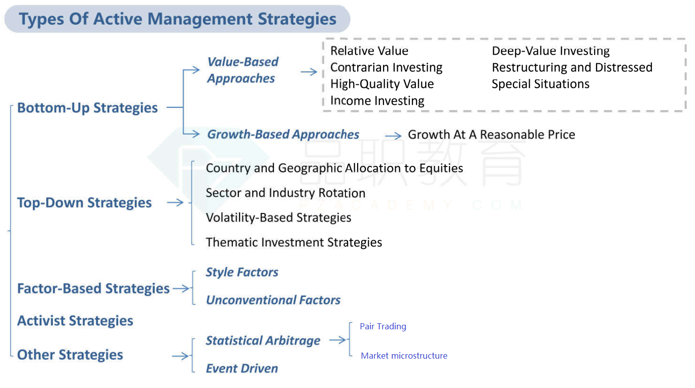
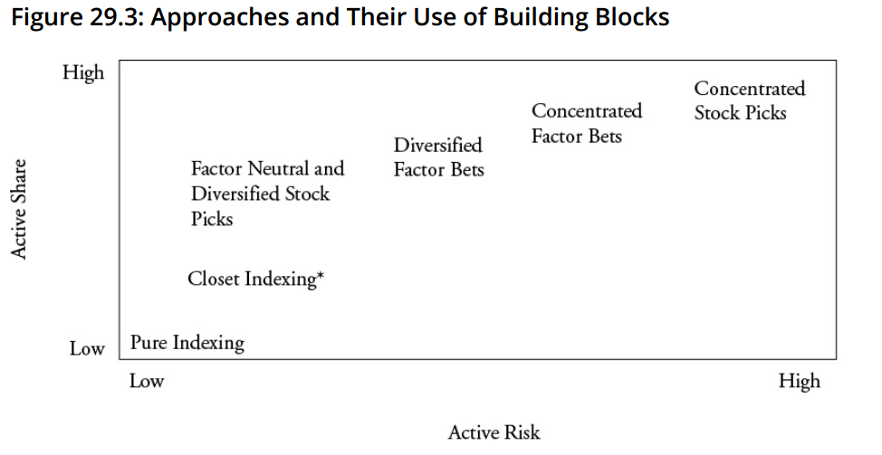

# READING 26. INTRODUCTION TO EQUITY PORTFOLIO MANAGEMENT

The candidate should be able to:

## a describe the roles of equities in the overall portfolio;

- Capital appreciation
- Divident income
- Diversification
- Inflation hedge

Client investment consideration:
- positive screening
- negative screening
- thematic investment

## b describe how an equity manager’s investment universe can be segmented;

- Size (market capitalization) and style (growth, value, or blended).
- Geographic segmentation (which includes developed markets, emerging markets, and frontier markets).
- Economic activity segmentation by sectors or industries. Classification can be based on a market-oriented or a production-oriented approach.
- Or combinations of the previous can be used.

## c describe the types of income and costs associated with owning and managing an equity portfolio and their potential effects on portfolio performance;

Income can be generated from:
- Dividends, mostly in the form of regular dividends received.
- Lending securities for a fee and earning funds on cash collateral received.
  - Pro: fee
  - con/issue:
     -  price down
     -  quality of borrower and ability to return
     -  need borrower to return dividend
     -  lose right to vote
- Writing options for the premium received.
- Dividend capture through buying a stock just before and selling it just after it goes ex-dividend.

Management fee. in or separate.
Other costs to consider are:
- Transaction and trading costs, which may be explicit or implicit.
- Strategy costs—generally active strategies will have higher cost. Passive strategies may incur hidden costs such as predatory pricing when others anticipate and trade ahead of the passive investor.
- Liquidity demands

Equity portfolios also incur fees and costs. These include:
- Management and performance (incentive) fees.
  - incentive: high-watermark
- Administration fees.
- Marketing and distribution fees.
- Trading costs. explicit/implicit (spread, slippage cost)
- Investment strategy costs.
  - active: more investment analysis and transaction
  - passive: predatory trading

## d describe the potential benefits of shareholder engagement and the role an equity manager might play in shareholder engagement;

Shareholder engagement refers to shareholders and managers seeking to influence the companies they invest in through calls and/or shareholder voting. 

Benefits:
- Engagement benefits the company with improved corporate governance. (strategy, capital allocation, compensation, board of directors)
- It may benefit shareholders through higher stock price. 
- Free riders who don’t incur the costs of engagement also benefit.

Cost:
- Active -> do
- Passive -> avoid/minimize
- Larger -> easily absorb

Activist investors take this further and propose resolutions to be voted on and seek the support of others or engage in proxy flights to achieve their goals.

Limitations:
- Focus on short-term goals
- Lead to acquisition of MNI
- Potential conflicts of interest

## e describe rationales for equity investment across the passive–active spectrum.

Equity portfolios are often characterized as being actively or passively managed.
However, in practice, portfolios may exhibit characteristics from both investment strategies. 
Rationales for equity portfolios to span across the passive-active spectrum include 
  - manager confidence,
  - client preferences
  - benchmark selection
  - client mandates

active management costs/risks, 
 - reputation risk: results from violations to rules, regulations, client agreements, or moral principles
 - key person risk
 - taxes.

# READING 27. PASSIVE EQUITY INVESTING

The candidate should be able to:

## a discuss considerations in choosing a benchmark for a passively managed equity portfolio;
An equity index used as a benchmark for equity investment strategies must be
- Rules-based: The rules for including and excluding stocks in the portfolio, the weighting scheme, and the rebalancing frequency must be consistent, objective, and predictable so investors can replicate the investment performance of the index.
- Transparent: The rules underlying the index are public, clearly stated and understandable to investors.
- Investable: Investors can replicate the return and risk performance of the index.

Considerations in choosing a benchmark include 
- determining the desired market exposure, 
  -  Market segment
  - Capitalization (size)
  - growth vs value (style)
  - other risk factors: momentum, liq, volatility, quality
- identifying the methods used in constructing and maintaining the index
  - exhaustive or selective
  - weighting method
    - market cap / liq weighting, most common - free float, exclude closely held
    - price: DJIA, equal number of shares
    - equal: reduce concentration risk, small cap bias, volatile, factor-indifferent
    - fundamental

stock concentration: HHI

effective number of stocks = 1/(sum(wi^2))

effective number of stocks '<' actual number, reflects the disproportionate effect of large cap stocks in the index.

Rebalance: +- weight

Reconstitute: add/remove to index

## b compare passive factor-based strategies to market-capitalization-weighted indexing;
Passive strategy can be achieved by either:
- market-capitalization-weighted investment strategy 
- passive factor-based strategy (also known as smart β). Goal: improve on the risk/return performance by offseting higher cost
   - growth factor
   - value factor
   - size factor
   - yield factor
   - momentum factor
   - quality factor
   - volatility factor

Three types of passive factor-based strategies
- Return oriented: dividend yield, momentum and fundamentallyweighted strategies
  - dividend yield strategies, Dividend yield strategies can include dividend growth as well as absolute dividend yield.
  - momentum strategies is generally defined by the amount of a stock’s excess price return relative to the market over a specified time period.
  - fundamentally weighted strategies.

- Risk oriented: Risk-oriented strategies seek to reduce downside volatility and overall portfolio risk.
  - Volatility weighting is a strategy where all of an index’s constituents are held and then weighted by the inverse of their relative price volatility.
  - Minimum variance investing requires access to a mean–variance optimizer.
  - Risk weighting has the advantages of being simple to understand and providing a way to reduce absolute volatility and downside returns.
  - However, the development of these strategies is based on past return data, which may not reflect future returns.

- Diversification oriented include equally weighted indexes and maximum-diversification strategies.
  - Equal weighting: the low single-stock risk comes by way of the weighting structure of 1/n, where n is equal to the number of securities held.
  - Diversification strategies then can attempt to maximize future diversification by determining portfolio weights using past price return volatilities.

Passive factor-based strategies often use multiple benchmarks, including both factor based and market-cap-weighted indexes. This increases tracking error.
 - The advantages of passive factor-based investing include that it is typically less costly than active management, but still offers the investor factor exposure based on the investor’s view of the market (which is known as factor rotation).
 - The disadvantages include that, relative to passive cap-weighted investing, management fees and trading commissions are higher

## c compare different approaches to passive equity investing;
- Pooled investments:
  - mutual funds
    - The primary advantage is its ease of investing and record keeping.
    - The benefits of investing passively using mutual funds are low costs and the convenience of the fund structure
  - ETF: ETFs are another form of pooled investment vehicle. They are registered funds that can be bought and sold throughout the trading day and change hands like stocks.
    - Advantages:
      - Ease of trading, low management fees, and tax efficiency;
    - Unlike with traditional open-end mutual funds, ETF shares can be bought by investors using margin borrowing;
      - Investors can take short positions in an ETF;
    - ETFs offer flexibility in that they track a wide array of indexes.
    - Disadvantages
    - The need to buy at the offer and sell at the bid price;
    - Commission costs;
    - The risk of an illiquid market when the investor needs to buy or sell the actual ETF shares
- Derivative based strategy to recreate risk/return performance of an index.
  - overlay positions (completiion overlays, rebalancing overlays, currency overlays) to adjust existing portofolio risk/return exposure
    - A completion overlay addresses an indexed portfolio that has diverged from its proper exposure.
  - A rebalancing overlay addresses a portfolio’s need to sell certain constituent securities and buy others.
 -  A currency overlay assists a portfolio manager in hedging the returns of securities that are held in a foreign currency back to the home country’s currency
  - adv: quickly, efficiently, cheaply; liquid; easy to leverage;
  - disadv: finite expiration need to roll over; position limits; specialty needs not met; OTC - conterparty risk; basis risk increase tracking error
- Separately managed. Hold all or a representative sample.
  - An equity investor who builds an indexed portfolio will need to subscribe to certain data on the index and its constituents.
  - The investor also requires a robust trading and accounting system to manage the portfolio, broker relationships to trade efficiently and cheaply, and compliance systems to meet applicable laws and regulations.
  - Program trading is a strategy of buying or selling many stocks simultaneously

## d compare the full replication, stratified sampling, and optimization approaches for the construction of passively managed equity portfolios;

### full replication: costly

Advantages
- Usually accomplishes the primary goal of matching the index performance;
-  Easy to comprehend.

Disadvantages
- Requires that the asset size of the mandate is sufficient and that the index constituents are available for trading;
- Not all indexes lend themselves to full replication

### stratified sampling: 
strata formed across multiple dimensions, size up -> less tracking error

- The various strata will be mutually exclusive and also exhaustive and they should closely match the characteristics and performance of the index.
- Is most frequently used when the portfolio manager wants to track indexes that have many constituents or when dealing with a relatively low level of assets under management.

### optimization:

 MPT minimize tracking error. drawback: based on historical relationship; not mean-variance efficient (solution: constraint on total portfolio variance to be volatility of benchmark)
 
Optimization typically involves maximizing a desirable characteristic or minimizing an undesirable characteristic, subject to one or more constraints.

Advantages
- A lower amount of tracking error than stratified sampling;
- The optimization process accounts explicitly for the covariance among the portfolio constituents.

Disadvantages
- Usually the constituents and weights of an optimized portfolio are determined based on past market data;
- Need to be run frequently and adjustments made to the portfolio, which can be costly.
 
 
### blended:
  - full replication for index with small number of liquid stocks
  - stratified sampling or optimization for index with lots of heterogeneous, thinly traded stocks

Adding to the sample size with liquid stocks first reduces tracking error; but as less liquid stocks are added, the costs and tracking error increase

## e discuss potential causes of tracking error and methods to control tracking error for passively managed equity portfolios;

Tracking error initially declines as sample size increases because the manager first purchases the most liquid, lowest transaction cost stocks. But after a point, as less liquid stocks with higher transaction costs are added to increase the sample size, tracking error increases.

The tracking error of an indexed equity fund increases with:
- Management fees charged to manage the fund.
- Paying commissions (or bid-asked spread) to execute trades.
- The addition of less liquid securities with higher transaction costs to the sample.
- The use of intra-day trading to manage the portfolio. Intra-day trading means making security transacts during the day at prices other than closing prices; while performance of the benchmark index is based on close of day pricing.
- Cash drag in the portfolio. The fund typically has some cash as funds flow in or to meet redemptions, but cash is in the long run the lowest return asset; while indexes are computed as the return of a fully invested portfolio with no cash drag 

Reducing tracking error requires a continuing evaluation of the tradeoff between the benefits of larger sample size and increasing costs. 

Derivatives can be used to minimize the effects of cash drag

## f explain sources of return and risk to a passively managed equity portfolio.

Attribution analysis is a key tool in helping the manager identify the sources of tracking error.

Securities lending can generate fee income to offset some of the costs of managing the portfolio and reduce tracking error.

Corporate governance and investor activism is important for both passive and active investors.

# READING 28. ACTIVE EQUITY INVESTING: STRATEGIES

The candidate should be able to:

## a compare fundamental and quantitative approaches to active management;

Differences between Fundamental and Quantitative Approaches

|                          |Fundamental                        |Quantitative                                     |
|---------------------------|-----------------------------------|-------------------------------------------------|
|Style                      |Subjective                       |Objective                                            |
|Decision-making process     |Discretionary                   |Systematic, non-discretionary                    |
|Primary resources          | Human skill, experience, judgment | Expertise in statistical modeling             |
|Information used           |Research (company/industry/economy|) Data and statistics|
|Analysis focus         |Conviction (high depth) in stock-,sector-, or region-based selection         |A selection of variables, subsequently applied broadly over a large number of securities|
|Orientation to data             |Forecast future corporate parameters and establish views on companies |Attempt to draw conclusions from a variety of historical data|
|Portfolio construction        |Use judgment and conviction within permissible risk parameters| Use optimizers  |
|Rebalance                |Continously, Anytime                           | Regular intervals                              |

Managers can use a blend of bottom-up and top-down approaches. For example, 
- a topdown strategist sets target country or sector weights, and then bottom-up portfolio managers select the best investments consistent with these weights. 
- Or the bottom-up managers could drive the portfolio construction process through selecting the best individual investments, with a top-down-based derivatives overlay added to remove unintended macro exposures.

## b analyze bottom-up active strategies, including their rationale and associated processes;
Bottom-up strategies analyze information at the company level to generate investment ideas.
 
Bottom up strategies can be divided into value and growth styles.

Value substyles include relative value, contrarian, high-quality value, income investing, deep value, restructuring and distressed debt, and special situations.
- Relative value: Comparing price multiples such as P/E and P/B to peers. An undervalued company has an inexplicably low multiple relative to the industry average.
- Contrarian investing: Purchasing or selling securities against prevailing market sentiment. For instance, buying the securities of depressed cyclical stocks with low or negative earnings.
- High-quality value: Equal emphasis is placed on both intrinsic value and evidence of financial strength, high quality management, and demonstrated profitability (the “Warren Buffet” approach).
- Income investing: Focus is on high dividend yields and positive dividend growth rates.
- Deep-value investing: Focus is on extremely low valuations relative to assets (e.g., low P/B), often due to financial distress.
- Restructuring and distressed debt investing: Investing prior to or during an expected bankruptcy filing. The goal is to release value through restructuring the distressed company or through the company having sufficient assets in liquidation to generate appropriate returns.
- Special situations: Identifies mispricings due to corporate events such as divestures, spin-offs, or mergers

Growth-based approaches attempt to identify companies with revenues, earnings, or cash-flows that are expected to grow faster than their industry or the overall market. Analysts will be less concerned about high valuation multiples and more concerned
about the source and persistence of the growth rates of the company. Focus could be on:
- Consistent long-term growth.
- Shorter-term earnings momentum.
- GARP (growth at a reasonable price); looking for growth at a reasonable valuation. Often this strategy will use the P/E-to-growth (PEG) ratio, which is calculated as the stock’s P/E ratio divided by expected earnings growth in percentage terms

- Quantitative bottom-up managers look for quantifiable relationships between company level information (e.g., P/E ratio) and expected return that will persist into the future.
- Fundamental bottom-up managers incorporate both quantifiable and qualitative characteristics of individual companies into their analysis (e.g., business model and branding, competitive advantage, and quality of company management and corporate governance).

## c analyze top-down active strategies, including their rationale and associated processes;
Top-down managers typically use broad market ETFs and derivatives to overweight the best markets and underweight the least attractive markets 

Top-down strategies focus on the macroeconomic environment, demographic trends, and government policies to make investment decisions. 

Top-down strategies could focus on geography, industry, equity style rotation, volatility-based strategies, or thematic investment ideas.
- Country/Geography
- Industry sector
- Volatility: Volatility trading can be conducted through VIX futures, variance swaps, or option volatility strategies such as straddles.
- Thematic investment strategies: Focus on opportunities presented by new technologies, changes in regulations, and economic cycles. Themes could be long term and structural such as the shift to cloud computing, blockchain technology, or clean energy. Themes might also be shorter term in nature such as the impact on the value of a currency of a major political vote.

The proliferation over recent years of structured products and focused ETFs has provided managers with greater flexibility in implementing passive factor investing (sometimes referred to as ‘smart β’ products), allowing the manager to target a specific style or sector at a time when they believe it will outperform.

## d analyze factor-based active strategies, including their rationale and associated processes;
Quantitative strategies often use factor-based models, which aim to identify factors that drive performance historically and are likely to continue to do so in the future. 
- rewarded
- unrewarded

Identify factors performance - Hedged Portfolio Approach
1. rank by factor
2. divide into quantiles
3. form a long/short portfolio: long best 10% short worst 10%
4. track performance

Drawbacks of HPA:
1. ignore middle quantiles
2. assume linear factor vs return relationship
3. if factors are correlated, then less diversification
4. assume can short
5. not "pure" factor, will have exposure to other risk factors

Factors can be based on fundamental characteristics such as value and growth, and price momentum, or on unconventional data.

Factor Timing / Equity style rotation

A common subcategory of factor investing is equity style rotation, where the manager believes that different factors work well at different times. These strategies allocate to portfolios that represent factor exposures when that particular style is expected to
outperform.

## e analyze activist strategies, including their rationale and associated processes;

Activist investors specialize in taking meaningful stakes in listed companies and then publicly pushing for changes to the management, strategy, or capital structure of the company that they believe will enhance value

### Process
- Screening and analysis of activist opportunities.
- Buying an initial stake in the target company (typically less than 10% of voting rights).
- Submitting a public proposal for changes to the company, usually in the form of an ***open letter*** to the company.
- If no agreement, threatening a ***proxy contest*** (a proxy contest is a shareholder vote to force the proposed changes on the company).
- If no agreement, launching a proxy contest.
- Continuing to negotiate with management, but with no agreement eventually taking the matter to a proxy contest

### Target companies
- Target companies tend to feature slower earnings and revenue growth than the market,
- negative share price momentum, and 
- weak corporate governance. 

This poor track record is evidence that changes need to be made and makes it more likely the activist will garner support from other disgruntled shareholders in a proxy contest.

### Tactics used by activist

These include:
- Seeking board representation (once attained this can be used to change management).
- Writing open letters to management detailing the changes, meeting with management and engaging with other shareholders to court support in a proxy contest.
- Proposing changes at an annual general meeting (AGM).
- Proposing financial restructuring including increased dividends and share buybacks.
- Reducing extravagant management compensation.
- Launching legal proceedings against management for breach of fiduciary duties.
- Launching a media campaign against existing management.
- Breaking up a large inefficient conglomerate.

The typical defenses that are used by management resisting the activist’s proposed changes include:

- Use of multi-class share structures, which grant multiple votes to founders.
- “Poison pill” clauses, which allow existing shareholders to purchase more shares in the target company at a discount, diluting the stake of the activist.
- Staggered board provisions, which mean the board is re-elected partially each year, and hence, cannot be replaced simultaneously.

### Impact
Studies show that activism does lead to improvements in growth, profitability, and corporate governance; however, it also leads to higher debt levels. The added performance of activist funds has been modest with hedge fund data showing Sharpe ratios slightly above the broad stock market.

## f describe active strategies based on statistical arbitrage and market microstructure;

Stat arb funds look to profit from anomalies in technical market data (i.e., prices and volumes), for example,
- pairs trading
  - Pairs trading identifies two securities in the same industry that are historically highly correlated with each other and aims to profit from taking advantage of a temporary breakdown in this relationship. The strategy buys the underperforming security while shorting the outperforming securities. 
  - The strategy profits from mean reversion if the long (previous underperform) now outperforms, while the short (previous outperformer) nowunderperforms. 
  - The risk is that the breakdown of the observed previous relationship is long term in nature, there is no mean reversion, and in fact the long continues to underperform the short position in the pairs trade
- market microstructure: HFT to capture misprice in a milliseconds.
  - take advantage of mispricing opportunities occurring due to imbalances in supply and demand that are expected to only last for a few milliseconds. 
  - Investors with the tools to analyze the limit order book of an exchange, and the capability for high-frequency trading are in a position to capture such opportunities.

Event-driven strategies (risk arb) exploit market inefficiencies that may occur around mergers and acquisitions, earnings announcements, bankruptcies, share buybacks, special dividends, and spin-offs

## g describe how fundamental active investment strategies are created;

The fundamental active investment process consists of the following steps:
1. Define the investment universe in accordance with the fund mandate.
  - Define the market opportunity (investment thesis) and explain why it is there.
2. Prescreen the investment universe to obtain a manageable set of securities for detailed analysis.
  - For example, a value manager might screen to remove stocks with high P/E multiples.
3. Analyze the industry, competitive position, and financial reports of the companies.
4. Forecast performance, most commonly based on cash flows or earnings.
5. Convert forecasts to valuations.
6. Construct a portfolio of profitable investments with the desired risk profile.
  - Incorporate any top-down view on sectors/markets at this stage.
7. Rebalance the portfolio with buy and sell disciplines.

Pitfalls in fundamental investing include
 - behavioral biases: confirmation bias, illusion of control, availability bias, loss aversion, overconfidence, and regret aversion.
 - the value trap, where a stock that appears to be attractive because of a significant price fall, may in fact be overvalued and decline further. 
 - the growth trap. favorable future growth prospects are already reflected, or over-reflected, in the price. 

## h describe how quantitative active investment strategies are created;
The quantitative active investment process includes the following steps:
 1. Define the market opportunity.
 2. Acquire and process data. The most commonly used data in quantitative investing typically fall into the following categories: company mapping, company fundamentals, survey data, unconventional data.
 3. Back-test the strategy.
   1. obtain sample of historical data
   2. calc E/Y and subsequent performance
   3. rank stocks by E/P: factor score = (actual E/P - avg E/P) / σ E/P 
   4. Calc IC (information coefficent), Spearman, Pearson
   5. The Pearson IC of the raw data is sensitive to even a few outliers (extreme high or low historical return). The Spearman Rank IC addressees this issue and is often considered more robust (superior).
 4. Evaluate the strategy. Out of sample testing, VaR and max drawdown
 5. Portfolio construction. Consider risk models (rely on commercial risk models), trading costs

Pitfalls in quantitative investing include
- look-ahead 
- survivorship biases, 
- overfitting / data mining,
- unrealistic turnover assumptions,
- transaction costs
- short availability.

## i discuss equity investment style classifications.
The two main approaches used in style analysis are holdings-based and returns-based.
- Holdings-based approaches aggregate the style scores of individual holdings, 
  - The Morningstar Style Box
- returns-based approaches analyze the investment style of portfolio managers by regressing historical portfolio returns against a set of style indexes.

### Return-based

Advantages
- Requires minimal information
- Can be executed quickly
- Cost effective
- More widely applied

Disadvantages:
- May be ineffective in characterizing current style
- Difficult to detect more aggressive positions

### Holding based
Advantages:
- More accurate than returns-based
- Facilitates comparisons of individual positions
- Capture changes in style more quickly

Disadvantages:
- More data intensive than returns-based analysis
- Less effective for funds with substantial positions in derivatives.

# READING 29. ACTIVE EQUITY INVESTING: PORTFOLIO CONSTRUCTION

The candidate should be able to:

## a describe elements of a manager’s investment philosophy that influence the portfolio construction process;

The three main building blocks of active return (excess return above a benchmark) for an active equity manager are:
- Active rewarded ***factor (β) weightings*** (taking exposures that differ from the benchmark). Factor exposures include market, size, value, momentum, liquidity, et cetera.
- α skills— ***factor timing*** timing rewarded and unrewarded factors, sectors, and securities. This primarily generates excess return through ***identifying mispricings***.
- Position sizing—large positions affect all three sources of active returns, but will primarily generate high idiosyncratic risk (good/bad luck). It may be a required part of a concentrated manager’s α-generating strategy

Active return =Return from factor tilts + Security selection

RA=∑(βpk−βbk)×Fk+(α+ε)

- The α (α) is the active return of the portfolio
- ε is the idiosyncratic return (noise/luck), resulting from a random shock.

A manager’s choices with respect to portfolio concentration are a function of his beliefs regarding the nature of his investment skill.
- The ***factor-oriented manager*** believes that she is skilled at properly setting and balancing her exposure to rewarded factors.
  - Target specific exposure to factors (∑(βpk−βbk)×Fk )
  - Maintains a diversified portfolio.
- The ***stock picker*** believes that he is skilled at forecasting securityspecific performance over a specific horizon.
  - Assume a higher degree of idiosyncratic risk (α + ε).
  - Concentrated portfolio
  - the return not explained by exposure to rewarded factors—α (α) is the active return attributable to manager skill, and ε is the idiosyncratic return—noise or luck (good or bad) (In practice it is very difficult to distinguish between α and ε)

E(RA) = IC * sqrt(BR) * σRA * TC

- E(RA) = expected active return of the portfolio
- IC = expected information coefficient of the manager, calculated as the correlation between manager forecasts and realized active returns 
- BR = breadth—the number of truly independent decisions made by the manager each year 
- TC = transfer coefficient, a number between 0 and 1 that measures the level to which the manager is constrained—TC will take a value of 1 if the manager has no constraints, and 0 if the manager is fully constrained
- σRA = the manager’s active risk (the volatility of active returns)

## b discuss approaches for constructing actively managed equity portfolios;

Decision-making can be 
- systematic (rule-driven) or 
- discretionary (opinion driven). Discretionary managers are more likely to engage in factor timing, hold concentrated portfolios, and are less likely to use formal portfolio optimization techniques. 

Information used can be top-down (relating to the macro environment) or bottom-up (relating to individual securities).

Objectives and constraints of managers can be 
- absolute (e.g., maximize Sharpe ratio subject to maximum volatility) or 
- relative (e.g., maximize information ratio subject to maximum active risk). 
- Other constraints may focus on minimizing risk, maximizing exposures to desired factors, or heuristic approaches.

## c distinguish between Active Share and active risk and discuss how each measure relates to a manager’s investment strategy;

Active Share measures the degree to which the number and sizing of the positions in a manager’s portfolio differ to those of a benchmark

AS= 1/2 Sum ABS(wib-wip)

A closet indexer is defined as a fund that advertises itself as being actively managed but is substantially similar to an index fund in its exposures.

## d discuss the application of risk budgeting concepts in portfolio construction;

Risk budgeting is a process by which the total risk appetite of the portfolio is allocated among the various components of portfolio choice.

An effective risk management process requires that the portfolio manager do the following:
- Determine which type of risk measure is most appropriate to her strategy.
- Understand how each aspect of the strategy contributes to its overall risk.
- Determine what level of risk budget is appropriate.
- Properly allocate risk among individual positions/factors.

Absolute risk measures focus on the size and composition of absolute portfolio variance (i.e., without reference to any benchmark variance) 

Portfolio variance can also be separated into variance attributed to factor exposures and unexplained variance. A manager that generates most of her returns from exposure to rewarded factors (such as a multi-factor diversified manager) would expect to see a large contribution to risk explained by rewarded factors and a low contribution to risk from unexplained idiosyncratic risks. The contribution to portfolio variance of a factor is analogous to the contribution to portfolio variance of an asset, with weights replaced by β sensitivities and assets replaced by factors. 

Relative risk is an appropriate measure when the manager is concerned with performance relative to a market index. 

Active variance, which is the variance of the differences between portfolio and benchmark returns, can be broken down in an analogous manner to absolute variance.

The contribution of asset i to portfolio active variance (CAVi) is given by the equation:

Adding up the CAVs for all the assets in the portfolio will give the variance of the portfolio’s active return (AVp).

Practical considerations when considering the appropriate level of portfolio risk include:
- Implementation constraints (e.g., limits on position sizes) causing information ratio degradation as active risk increases.
  - Constraints on short positions or on leverage may limit the manager’s ability to under/overweight. 
  - Liquidity issues may increase costs as a manager increases active risk, which leads to a degradation of the information ratio as the extra costs weigh on active returns.
- Limited diversification opportunities in higher risk investments.
  - The mathematics of the Markowitz efficient investment frontier clearly shows that the relationship between return and risk is concave. 
  - Expected returns increase with risk but at a declining pace. 
  - Portfolios with higher risk/return targets eventually run out of high-return investment opportunities and lose the ability to diversify efficiently, thereby reducing the Sharpe ratio.
- Leverage increasing volatility and causing lower geometric average compounded returns over multiple periods.

Rg = Ra - σ^2/2

## e discuss risk measures that are incorporated in equity portfolio construction and describe how limits set on these measures affect portfolio construction;

Risk constraints can be classified as 
- heuristic (based on experience like arbitrary position limits), appear as controls imposed on the permissible portfolio composition through some exogenous classification structure. Such constraints are often based on experience or practice, rather than empirical evidence of their effectiveness.
  - Exposure concentrations by security, sector, industry, or geography;
  - Net exposures to risk factors, such as β, size, value, and momentum;
  - Net exposures to currencies;
  - Degree of leverage;
  - Degree of illiquidity;
  - Turnover/trading-related costs;
  - Exposures to reputational and environmental risks, such as actual or potential carbon emissions; and
  - Other attributes related to an investor’s core concerns.
- Formal risk are often statistical in nature and directly linked to the distribution of returns for the portfolio.
  - Volatility: the standard deviation of portfolio returns.
  - Active risk: tracking error or tracking risk.
  - Skewness:
  - Drawdown: the portfolio loss from its high point until it begins torecover.
  - Value at risk (VaR), Conditional Value at risk (CVaR), Incremental Value at risk (IVaR), Marginal Value at risk (MVaR)

Formal constraints require the estimation of return distributions which introduces estimation error. This estimation error can be magnified by leverage and the idiosyncratic risk of concentrated positions.

Other points of note regarding risk constraints include:
- Leverage magnifies the negative impact of incorrect risk estimations. 
- Unexpected increases in volatility can also derail investment strategies. 
- Risk measures used depend on the style of management. 
- Portfolios with fewer positions will have higher estimation errors

## f discuss how assets under management, position size, market liquidity, and portfolio turnover affect equity portfolio construction decisions;
The market impact cost of an investment strategy is an implicit cost related to the price movement caused by managers executing trades in the market.
 
Managers with higher AUM, higher turnover and shorter time horizons, whose trades have a higher information content, dealing in smaller-cap less-liquid securities, will have higher market impact costs.

A firm focused on small-cap stocks must either limit its AUM, diversify, limit turnover, or adapt its trading strategy to cap impact costs as AUM grow.

Slippage costs provides an estimate of the cost to execute a transaction when the order is executed in a single trade.

Slippage is often measured as the difference between the execution price and the midpoint of the bid and ask quotes at the time the trade was first entered.

There are four conclusions we can draw:
- Slippage costs are usually more important than commission costs.
- Slippage costs are greater for smaller-cap securities than for large-cap securities.
- Slippage costs are not necessarily greater in emerging markets.
- Slippage costs can vary substantially over time, especially when market volatility is higher.

## g evaluate the efficiency of a portfolio structure given its investment mandate;

A well-constructed portfolio should deliver the characteristics promised to investors in a cost-efficient and risk-efficient way. This involves:
- A clear investment philosophy and a consistent investment process.
- Risk and structural characteristics as promised to investors.
- Achieving desired risk exposures in the most efficient manner.
- Reasonably low operating costs given the strategy.

Funds aiming to deliver different required characteristics will have different wellstructured portfolios. The following general points can be made about portfolios that have the same desired characteristics:

- Portfolios that can achieve desired risk exposures with fewer positions are likely to have more focus on risk management in the portfolio construction process. While this will not guarantee excess return, it does indicate risk efficiency is likely higher.
- If two portfolios have similar risk factor exposures, the product with the lower absolute volatility and lower active risk will likely be preferred (assuming similar costs).
- If two portfolios have similar active and absolute risks, similar costs, similar manager α skills, then the portfolio with the highest Active Share is preferable because this will leverage the α skill of the manager and have higher expected return.
- When selecting equity managers to create the equity allocation of a multi-asset fund, managers should be combined to create an overall equity allocation in the portfolio that is well-constructed. A risk factor exposure that is desired but not present in one manager could be compensated for by adding a different manager that specializes in generating exposure to that risk factor.

## h discuss the long-only, long extension, long/short, and equitized market-neutral approaches to equity portfolio construction, including their risks, costs, and effects on potential αs.

An investor’s choice between following long-only or long/short strategies is influenced by several factors, including:
- Long-term risk premiums.
- Capacity and scalability.
- Limited legal liability.
- Regulation.
- Transactional complexity.
- Costs.
- Personal ideology.

Long extension portfolios guarantee investors 100% net exposure with a specified short exposure. A typical 130/30 fund will have 130% long and 30% short positions.

Market-neutral portfolios aim to remove market exposure through offsetting long and short positions. 

Pairs trading is a common technique in building market-neutral portfolios, with quantitative pair trading referred to as statistical arbitrage.

Benefits of long/short strategies include 
- the ability to better express negative views, 
- the ability to gear into high-conviction long positions, 
- the removal of market risk to diversify, and 
- the ability to better control risk factor exposures.

Drawbacks of long/short strategies include 
- potential large losses because share prices are not bounded above, 
- negative exposures to risk premiums,
- potentially high leverage for market-neutral funds, 
- the costs of borrowing securities, and collateral demands from prime brokers. 
- Being subject to a short squeeze on short positions is also a risk.

