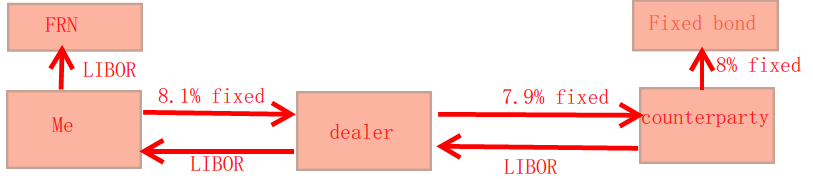

# READING 31. RISK MANAGEMENT

The candidate should be able to:

## a discuss features of the risk management process, risk governance, risk reduction, and an enterprise risk management system;

Risk management is a continual process of:
- Identifying and measuring specific risk exposures.
- Setting specific risk tolerance levels.
- Monitoring the process and taking any necessary corrective actions.

Risk governance should originate from senior management, which determine the structure of the system 
- A decentralized risk governance system has the benefit of putting risk management in the hands of the individuals closest to everyday operations.
- A centralized system (also called an enterprise risk management system or ERM) provides a better view of how the risks of the business units are correlated.

## b evaluate strengths and weaknesses of a company’s risk management process;
In evaluating a firm’s ERM system, the analyst should ask whether:
- Senior management consistently allocates capital on a ***risk-adjusted*** basis.
- The ERM system properly identifies and defines all relevant internal and external risk factors.
- The ERM system utilizes an appropriate model for quantifying the potential impacts of the risk factors.
- Risks are properly managed.
- There is a committee in place to oversee the entire system to enable timely feedback and reactions to problems.
- The ERM system has built in checks and balances.

## c describe steps in an effective enterprise risk management system;
An effective system will:
- Identify each risk factor to which the company has exposure.
- Quantify the factor in measurable terms.
- Include each risk in a single aggregate measure of firm-wide risk. VaR will be the most commonly used tool.
- Identify how each risk contributes to the overall risk of the firm. This is an advantage of VaR.
- Systematically report the risks and support an allocation of capital and risk to the various business units of the firm.
- Monitor compliance with the allocated limits of capital and risk.

## d evaluate a company’s or a portfolio’s exposures to financial and nonfinancial risk factors;

Financial risks:
- Market risk: Factors that directly affect firm or portfolio values (e.g.,interest rates, exchange rates, equity prices, commodity prices, etc.).
- Liquidity risk: The possibility of sustaining significant losses due to the inability to take or liquidate a position quickly at a fair price.
- Credit risk: Default of a counterparty. This risk can be mitigated through the use of derivative products, such as credit default options.
Mitigating strategies for financial risks will typically include the use of financial and credit derivatives including options, futures and/or forward contracts, futures options, and swaps.

 Nonfinancial risks:
- Operations risk (nonfinancial risk). The potential for failures in the firm’s operating systems, including its ERM system, due to personal, technological, mechanical, or other problems.
- Model risk (nonfinancial risk). Models are only as good as their construction and inputs (e.g., the assumptions regarding the sensitivity of the firm’s assets to changes in risk factors, the correlations of the risk factors, or the
likelihood of an event).
- Sovereign risk: There are elements of credit risk here, as changes in spread will affect bond prices, but the underlying issues are political. The country must choose economically viable policies to be able to repay and be willing
to repay.
- Regulatory risk (nonfinancial). Different securities in the portfolio can fall under different regulatory bodies. Also, synthetic positions (combinations of two or more securities to create the effect of a totally different asset) can be
quite confusing.
- Some other risks (all nonfinancial) include political risk, settlement risk, tax risk, and legal risk, which relate directly or indirectly to changes in the political climate.

Due to the difficulties in predicting the occurrence and size of a loss due to nonfinancial risks, managers will often simply purchase insurance protection.

## e calculate and interpret value at risk (VaR) and explain its role in measuring overall and individual position market risk;

Issues:
- The VaR time period should relate to the nature of the situatiion.
- The percentage selected will affect the VaR.
- The left-tail should be examined 
 
 
 
## f compare the analytical (variance–covariance), historical, and Monte Carlo methods for estimating VaR and discuss the advantages and disadvantages of each;

### Analytical method (variance-covariance)
5% VaR is 1.65 standard deviations below the mean.
1% VaR is 2.33 standard deviations below the mean.
less than 1 year: square root rule
very short period (1 day): return=0.

Advantages of the analytical method include:
- Easy to calculate and easily understood as a single number.
- Allows modeling the correlations of risks.
- Can be applied to shorter or longer time periods as relevant

Disadvantages of the analytical method are mostly related to its assumption that returns are normally distributed. Specific issues include:
- Securities may have skewed returns. option
- Many securities exhibit a greater number of extreme return events than are consistent with the normal distribution. This is called leptokurtosis or more
commonly “fat tails” and means the amount and frequency of losses is underestimated by the method.

### Historical VaR Method
Advantages of the historical method include:
- Very easy to calculate and understand.
- Does not assume a returns distribution.
- Can be applied to different time periods according to industry custom

Disadvantage:
- assume pattern will repeat
- many securities change characteriscs with passage of time

### Monte Carlo VaR Method
The primary advantage of the Monte Carlo method is also its primary disadvantage. It can incorporate any assumptions regarding return patterns, correlations, and other factors the analyst believes are relevant. For some portfolios it may be the only reasonable approach to use.
That leads to its downside:
-  the output is only as good as the input assumptions.
-  This complexity can lead to a false sense of overconfidence in the output among the less informed.
-  It is data and computer intensive which can make it costly to use in complex situations (where it may also be the only reasonable method to use).

## g discuss advantages and limitations of VaR and its extensions, including cash flow at risk, earnings at risk, and tail value at risk;
VaR, whatever the method of computation, has several advantages over other risk measures:
- It has become the industry standard for risk measurement and is required by many regulators.
- It aggregates all risk into one single, easy to understand number.
- It can be used in capital allocation. 

VaR also has clearly acknowledged limitations:
- Some of the methods (Monte Carlo) are difficult and expensive.
- The different computation methods can generate different estimates of VaR.
- It can generate a false sense of security. It is only as good as the inputs and estimation process. Even when done correctly it is probabilistic; things can always be worse.
- It is one-sided, focusing on the left tail in the return distribution, and ignores any upside potential.

VaR should not be used in isolation but in combination with other tools and actions - extensions:
- VaR projections should be continually back-tested to compare actual results across multiple time periods with projections. Does the pattern of results fit the probability and outcomes projected by VaR?
- Incremental VaR (IVaR) is the effect of an individual item on the overall risk of the portfolio. IVaR is calculated by measuring the difference between the portfolio VaR before and after an additional asset, asset class, or other aspect of the portfolio is changed.
- Cash flow at risk (CFAR) measures the risk of the company’s cash flows. Some companies cannot be valued directly, which makes calculating VaR difficult or even meaningless. Even when VaR can be calculated, CFAR may offer additional information. CFAR is interpreted much the same as VaR, but substitutes cash flow for value. In other words, CFAR is the minimum cash flow loss at a given probability over a given time period.
- Earnings at risk (EAR) is analogous to CFAR only from an accounting earnings standpoint. Both CFAR and EAR are often used to add validity to VaR calculations.
- Tail value at risk (TVaR) is intended to give additional insight into what happens if VaR is exceeded. It is VaR plus the average of the outcomes in the tail. For example, if the 5%, 1-day VaR is $1 million and TVaR is $2.7 million, then 5% of the time losses exceed $1 million and the average lost is another $1.7 million beyond $1 million for a total average loss of $2.7 million.
- Credit VaR projects risk due to credit events. 
- Stress testing is a complement to VaR

## h compare alternative types of stress testing and discuss advantages and disadvantages of each;
### Scenarios
Stylized scenarios
1. Parallel yield curve shifts.
2. Changes in steepness of yield curves.
3. Parallel yield curve shifts combined with changes in steepness of yield curves.
4. Changes in yield volatilities.
5. Changes in the value of equity indices.
6. Changes in equity index volatilities.
7. Changes in the value of key currencies (relative to the U.S. dollar).
8. Changes in foreign exchange rate volatilities.
9. Changes in swap spreads in at least the G-7 countries plus Switzerland

- Actual extreme events
- Hypothetical evente: not previously but might

limitation:
- incorrect assumption, correlations
- user bias

### Stress testing
- Factor push analysis
- Maximum loss optimization
- Worst-case scenarios

## i evaluate the credit risk of an investment position, including forward contract, swap, and option positions;

- current default risk
- potential default risk
- cross default provisions

## j demonstrate the use of risk budgeting, position limits, and other methods for managing market risk;
- Risk budgeting
  - Return on capital
  - Return on VaR
- Position limits
- Liquidity limits
- Performance stopout
- Risk factor limits
- Scenario analysis limits
- Leverage limits

## k demonstrate the use of exposure limits, marking to market, collateral, netting arrangements, credit standards, and credit derivatives to manage credit risk;

Methods used to limit credit risk include besides credit VaR:
- Limiting exposure, which means limiting the amount of loans to any individual debtor or the amount of derivative transactions with any individual counterparty.
- Marking to market is employed with many derivative contracts. Contracts are settled on a regular basis, which means that profits and losses are settled.
- Collateral is often required in transactions that generate credit risk. In derivatives markets, both parties are often required to post margin, and if the contract is marked to market, either side may be required to post addition margin (collateral).
- Payment netting is frequently employed in derivatives contracts that can generate credit exposure to either side. The party with the net payment due is the only party at risk. 
- Closeout netting is also employed in bankruptcy proceedings. In this case, all the transactions between the bankrupt company and a single counterparty are netted to determine the overall exposure. 
- Impose minimum credit standards
- Transfer credit risk using crdedit derivatives: CDS, credit spread forward, credit spread option, TRS

## l discuss the Sharpe ratio, risk-adjusted return on capital, return over maximum drawdown, and the Sortino ratio as measures of risk-adjusted performance;
- Sharpe ratio:
  - limit: normality, not proper for portfolio with option (non-symmetric)
- RAROC: Risk-adjusted return on invested capital 
- RoMAD: Return over maximum drawdown 
  - max drawdown: max HWM to lowest low
- Sortino ratio:
  - Sortino Ratio = $frac{R_p-MAR}{Downside deviation}$
  - MAR: Minimum Acceptable Portfolio
  -  The motivation behind the downside measure of volatility utilized in the Sortino ratio is the sense that very good performance (high returns) can unfairly inflate the volatility measure (the standard deviation used as the risk measure). 
  
  
## m demonstrate the use of VaR and stress testing in setting capital requirements.
VaR and stress testing are useful tools in this process. 
- VaR can be interpreted as a maximum loss at a given probability. It has the benefits of capturing the diversification benefits between business units and can be integrated with the firm’s risk
management process.
- Stress testing is a natural complement to VaR by allowing the firm to consider even more extreme events.

Other methods of allocating capital include:
- Nominal, notional, or monetary position limits.
- Max loss limits.
- Internal and regulatory capital requirements.

# READING 32. RISK MANAGEMENT APPLICATIONS OF FORWARD AND FUTURES STRATEGIES

The candidate should be able to:

## a demonstrate the use of equity futures contracts to achieve a target β for a stock portfolio and calculate and interpret the number of futures contracts required;

$$ number of contracts = \\frac {(\\β_T-\\β_P}{\\β_f} * \\frac{V_P}{P_f * multiplier} $$

Hedging is rarely perfect:
- numerator and denominator are not based on the same item;
- βs and duratioins not reflect the acutal subsequent market value changes;
- hedge results are measured prior to contract expiration
- number of contracts is rounded
- future and spot price not fairly priced based on cash and carry arbitrary model.

Ex post Effective β = % change in portfolio value / % change in index

## b construct a synthetic stock index fund using cash and stock index futures (equitizing cash);

A synthetic equity position requires buying contracts and holding sufficient cash earning rf to pay for the contracts at contract expiration

A synthetic cash position requires selling contracts and holding sufficient shares (with dividends reinvested in more shares) to provide the shares to deliver and close the short position

Manager C holds equity positions similar to the Russell 2000 and wishes to synthetically convert $50,000,000 to cash equivalents for five months. He decides to use a contract overlay position rather than sell the stocks and then have to repurchase them. The Russell 2000 futures contract price is 1,135 with a multiplier of 500. The Russell Index dividend yield is 1.7%, and the zero coupon bond rate is 0.9%.

Calculate:
-  i) the number of contracts for the position, 
-  ii) the effective beginning investment in cash equivalents, 
-  iii) the effective number of shares in the index converted to cash, and iv) assuming the index closes at 1,057, demonstrate the strategy is equivalent to having invested at the risk-free rate.

Answers:

i. The βs of the index and portfolio were not given, are assumed to be equal, and, therefore, do not affect the calculation. The number of contracts to sell is:

50,000,000(1.0095/12) / (1,135)(500) = 50,187,010 / 567,500 = 88.44 ≈ 88 

ii. The effective initial amount of cash equivalents is:

[88($500)(1,135)] / 1.0095/12 = $49,940,000 / 1.0037402 = $49,753,910

iii. The effective number of shares converted to cash is:

88(500) / 1.0175/12 = 44,000 / 1.0070485 = 43,692.04

With dividends reinvested, this is ending shares of:

43,692.04(1.0175/12) = 44,000

iv. At contract expiration, the index and contract price will converge to 1,057. The pay off on the short contract position is a gain because the contract price declined. The gain is:

(1,135 – 1,057)(88)($500) = $3,432,000

The ending value of the shares is:

44,000(1,057) = $46,508,000

This makes the total ending value $49,940,000 versus an initial synthetic cash position of $49,753,910 for an effective annual return:

($49,940,000 / $49,753,910)12/5 – 1 = 0.9%

This synthetic position produced a return equivalent to the initial risk-free rate of 0.9%.

## c explain the use of stock index futures to convert a long stock position into synthetic cash;

## d demonstrate the use of equity and bond futures to adjust the allocation of a portfolio between equity and debt;

number of contracts = yield β * (MD_T-MD_P)/MD_F * (V_P/P_f*multiplier)

βy：对冲系数：
- yield β/hedge ratio，其含义是手里每持有一份债券，则需要用 b1 份国债期货去对冲。
原理：以持有的债券为 Y，以调整 duration 的期货为 X，回归出方程：Y=b0+b1X+ε，其中的 b1 就是 yield β，意为每份 Y 需要 b1 份 X 对冲(MVHR)。
- 考试没有说明 yield β 的值时，默认为 1

注意：MDT—MDP，决定 contracts 份数是正或负，
- 如果是正数代表 long 国债期货；即如果要调增 duration 则需要 long 国债期货
- 如果是负数代表 short 国债期货，；如果要凋减 duration 则需要 short 国债期货

## e demonstrate the use of futures to adjust the allocation of a portfolio across equity sectors and to gain exposure to an asset class in advance of actually committing funds to the asset class;

Adjusting asset allocation uses the same number of contracts formulas but requires multiple steps:
- Adjustments are often stated as percent allocations; however, the calculations require dollar or other nominal amounts (e.g., a 10% shift of a EUR 50M portfoliois a EUR 5M Vp).
- Changing an allocation requires selling contracts to remove one exposure and buying contracts to create a different exposure.

## f explain exchange rate risk and demonstrate the use of forward contracts to reduce the risk associated with a future receipt or payment in a foreign currency;

- Transaction exposure
- Translation exposure: accounting
- Economic exposure

## g explain the limitations to hedging the exchange rate risk of a foreign market portfolio and discuss feasible strategies for managing such risk.
An equity investment in a foreign market has both equity risk and foreign exchange risk. The investment is exposed to both the change in value of the foreign investment measured in the foreign currency and the change in value of the foreign currency. This leads to four possible hedging strategies: hedge neither risk, hedge one but not the other risk, or hedge both risks. If both risks are perfectly hedged, all risk is removed and the hedged results should equal the investor’s (not the foreign asset’s) risk-free rate.

# READING 33. RISK MANAGEMENT APPLICATIONS OF OPTION STRATEGIES

The candidate should be able to:

## a compare the use of covered calls and protective puts to manage risk exposure to individual securities;

### S-C
profit = –max(0, ST − X) + ST − S0 + C0

maximum profit = X + C0 − S0

maximum loss = S0 − C0

breakeven price = S0 − C0

S0 = initial stock price paid

### S+P
profit = max(0, X − ST) + ST − S0 −P0

maximum profit = ST − S0 −P0 (no upside limit)

maximum loss = S0 − X + P0

breakeven price = S0 + P0

## b calculate and interpret the value at expiration, profit, maximum profit, maximum loss, breakeven underlying price at expiration, and general shape of the graph for the following option strategies: bull spread, bear spread, butterfly spread, collar, straddle, box spread;

### bull spread: CL-CH
profit = max(0, ST − XL) − max(0, ST − XH) − CL0 + CH0

maximum profit = XH − XL − CL0 + CH0

maximum loss = CL0 − CH0

breakeven price = XL + CL0 − CH0

### bear spread CH-CL or PH-PL
profit = max(0, XH − ST) − max(0, XL − ST) − PH0 + PL0

maximum profit = XH − XL − PH0 + PL0

maximum loss = PH0 − PL0

breakeven price = XH + PL0 − PH0

### butterfly spread  CL+CH-2CM or PL+PH-2PM
profit = max(0, ST − XL) − 2max(0, ST − XM) + max(0, ST − XH) − CL0 + 2CM0 − CH0

maximum profit = XM − XL − CL0 + 2CM0 − CH0

maximum loss   = CL0 − 2CM0 + CH0

breakeven prices = XL + CL0 − 2CM0 + CH0 and 2XM − XL − CL0 + 2CM0 − CH0

### Straddle: C+P

profit = max(0, ST − X) + max(0, X − ST) − C0 −P0

maximum profit = ST − X − C0 −P0 (unlimited upside as ST increases)

maximum loss = C0 + P0

breakeven price = X − C0 −P0 and X + C0 + P0

graph: V

### reverse straddle: -C-P
graph: flatten A

### collar: S+P-C
The usual goal is for the owner of the underlying asset to buy a protective put and then sell a call to pay for the put. 

If the premiums of the two are equal, it is called a zero-cost collar. 

The collar is a good strategy for locking in the value of a portfolio at a minimal cost.
The cost is zero if the appropriate put and call have the same premium

profit = max(0, XL − ST) − max(0, ST − XH) + ST − S0

maximum profit = XH − S0

maximum loss = S0 − XL

breakeven price = S0

### Box spread  CL-CH+PH-PL
The ending value of the box spread is the same no matter what the ending value of the underlying. The initial investment (net option premium) is the same, so if the options are priced correctly, the difference in ending and beginning value of the box spread must reflect the risk-free rate. 

If the options are not priced correctly and the box spread return is not the risk-free rate, the box spread has identified an arbitrage opportunity

## c calculate the effective annual rate for a given interest rate outcome when a borrower (lender) manages the risk of an anticipated loan using an interest rate call (put) option;
The general rule for interest rate options (such as caps and floors) is the interest rate for the payout is set at the expiration of the option but paid at the end of the interest rate period, not when the option expires.

payoff = (NP)[max(0, LIBOR − strike rate)](D / 360)

### Calculate EBR:
Initial borrow cost: Call premium
FV(premium) = premium[1 + (current LIBOR + spread)(maturity / 360)]

when the firm actually borrows on April 1 (31 days in the future), it is effectively receiving:

net amount = loan − FV(premium)

effective dollar interest cost = $10,000,000(LIBOR_April 1 + 0.02)(90 / 360) − (call payoff)

The call payoff is:

payoff = (NP)[max(0, LIBOR − strike rate)(D / 360)]

The effective annual rate (EAR) of borrowing for the 90 days is:

EAR = [($10,000,000 + effective dollar interest cost) / net amount]^(365/90) − 1

If the firm did not hedge, the effective annual rate would be:

EAR without hedge = ($10,100,000 / $10,000,000)(365/90) − 1 = 0.04118

#### Example #2:
In 40 days, a firm wishes to borrow $5 million for 180 days. 

The borrowing rate is LIBOR plus 300 basis points.

The current LIBOR is 5%. 

The firm buys a call that matures in 40 days with a notional principal of $5 million, 180 days in underlying (D = 180), and a strike rate of 4.5%. 

The call premium is $8,000.

Calculate the effective annual rate of the loan if at expiration LIBOR = 4%, and calculate if LIBOR = 5%.

Answer:

First we compute the implied net amount to be borrowed after the cost of the call:

$5,000,000 – $8,000[1 + (0.05 + 0.03)(40 / 360)] = $4,991,929

For LIBOR = 0.04 at expiration, the dollar interest cost is (the option is out-of-the-money):

$5,000,000(0.07)(180 / 360) = $175,000

The effective annual rate is:

($5,175,000 / $4,991,929)(365/180) − 1 = 0.0758

For LIBOR = 0.05, the call option is in-the-money:

payoff = ($5,000,000)[max(0, 0.05 − 0.045)(180 / 360)] = $12,500

The dollar interest cost is effectively:

$5,000,000(0.08)(180 / 360) − $12,500 = $187,500

The effective annual rate is:

($5,187,500 / $4,991,929)(365/180) − 1 = 0.0810

You should verify that the rate of 0.0810 is the highest possible rate by trying other values higher than LIBOR = 4.5%.

- 分子：本金+总利息，包括：NP+利息—IRO call 赚取的部分；
- 分母：到手的 NP，即 NP-FV(premium)
- 其值为持有期有效利率，再进行年化即可

四个考试时要注意的事宜：
1. 如果是 lander 计算 effective interest rate，分母是所有的支出，包括：NP+long IRO put 的 FV(premium)
2. 计算 IRO call 的 FV（premium），要用 current LIBOR 单利计算
3. 判断是否行权（行权利率直接与到期日 LIBOR 比较，不考虑 LIBOR 上浮的问题）
4. 计算 effective interest rate 时用复利，其它用 LIBOR 时都用单利

#### Example #3: Lender's view , using IRO put
EXAMPLE: Interest rate put
- In 40 days, a bank plans to lend $5 million for 180 days. 
- The lending rate is LIBOR plus 300 basis points. 
- The current LIBOR is 5%. 
- The bank buys a put that matures in 40 days with a notional principal of $5 million, 180 days in the underlying, and a strike rate of 4.5%. 
- The put premium is $5,000.

Calculate the effective annual rate of the loan if at expiration LIBOR = 4%, and then calculate the rate if LIBOR = 5%.

Answer:
First we compute the total amount the bank pays out (lends) at time of the loan. This means computing the future value of the premium and adding it to the loan amount.

Loan amount plus future value of premium paid:

$5,000,000 + $5,000[1 + (0.05 + 0.03)(40 / 360)] = $5,005,044

This amount is used for computing the effective interest rate earned on the outflow of cash at the beginning of the loan. 

The dollar interest earned by the bank will be based upon the prevailing rate applied to the loan and the payoff of the put. 

In this case, the expression is:

effective interest earned = $5,000,000(LIBOR_maturity + 0.03)(180 / 360) + (put payoff)

The effective annualized rate on the loan is:

EAR = [($5,000,000 + effective dollar interest earned) / ($5,005,044)]^(365/180) − 1

You can see where the lender gets hurt because both the principal returned and the interest earned are based upon the $5 million, but the effective loan is $5,005,044.

If LIBORmaturity equals 4%, the payoff of the put would be:

payoff = ($5,000,000)[max(0, 0.045 − 0.04)(180 / 360)] = $12,500

The dollar interest earned is:

$5,000,000(0.04 + 0.03)(180 / 360) = $175,000

The effective interest rate is:

EAR = [($5,000,000 + $175,000 + $12,500) / ($5,005,044)](365/180) − 1

    = [($5,187,500) / ($5,005,044)](365/180) − 1
	
    = 0.07531 or 7.531%
	
While not asked, you might notice that in this case the put turned out to be desirable. 

Without the put the bank would have earned LIBOR + 300 bp or 7%.

If LIBORmaturity = 0.05, the dollar interest earned is:

$5,000,000[0.05 + 0.03](180 / 360) = $200,000

EAR = [($5,200,000) / ($5,005,044)](365/180) − 1

    = 0.08057 or 8.057%
Without the hedge, and LIBOR = 5% + 300 bp, the lender would have earned $200,000 on only $5million for an effective rate of 0.08278 = [($5,200,000) / ($5,000,000)](365/180) − 1.

#### EAR
- Borrowing at floating rates:
  - The rate of borrowing is roughly calculated as outflows divided by inflows.
  - Outflow is repayment of principal and interest minus any option payoffs
  - Inflow is the loan proceeds minus the total option cost. The borrower often pays for a call option to protect against rising rates, and that reduces the net amount of borrowed funds in the denominator.
- Lending at floating rates:
  - The rate of return is roughly calculated as inflows divided by outflows.
  - Inflow is receipt of principal and interest plus any option payoffs
  - Outflow is the loan proceeds plus the total option cost. The lender often pays for a put option to protect against falling rates and that increases the net amount of lent funds in the denominator.
  
- For both borrowing and lending:
  - The adjustment for the option payoff is always in the numerator.
  - The adjustment for the option cost is always in the denominator.

## d calculate the payoffs for a series of interest rate outcomes when a floating rate loan is combined with 1) an interest rate cap, 2) an interest rate floor, or 3) an interest rate collar;

### Cap Floor
When a long position in a cap is combined with a floating-rate loan, the payoffs can offset interest costs when the floating rate increases. 

Because caps trade over the counter, the terms of the cap are very flexible, so the cap buyer/borrower can align the settlements of the cap with the interest rate payments.

### IR Collar
An interest rate collar is a combination of a cap and a floor where the agent is long in one position and short in the other. 

If the agent buys a 6% cap on LIBOR and sells a 3%floor on LIBOR, the agent will receive cash payments when LIBOR exceeds 6%, and the agent will make payments when LIBOR is below 3%. 

If LIBOR is between 3% and 6%, the agent neither receives nor pays.

This would be attractive to a bank that has among its liabilities large deposits with floating interest rates.
- When the rates start to rise, the bank’s increasing costs can be offset by the payments from the collar. 
- By selling the floor, the bank may have to make payments if the interest rates on the deposits fall too much, but the bank earned a premium for exposing itself to this risk. That premium offsets the cost of the cap.
- The overall position provides some certainty to the bank, because it essentially provides a predetermined range for the cost of funds.

zero-cost collar (a.k.a. a zero-premium collar).
- The motivation for zero-cost collars is that they are a way of providing interest rate protection without the cost of the premiums.
- Calling the collar zero cost is misleading in some regards. There is no initial cost but there is a back end cost if rates move in such a way that payments must be made.
 
## e explain why and how a dealer Δ hedges an option position, why Δ changes, and how the dealer adjusts to maintain the Δ hedge;

Dealers use Δ hedging to hedge the risk of short call or put positions. 

Short calls are hedged by buying the underlying and short puts by shorting the underlying. 

The option Δ is the number of underlying needed for the hedge. 

As the underlying, time to expiration, and other conditions change; Δ can change and the hedge must be rebalanced. 

If more (less) units of the underlying are needed, buy them (sell them) and borrow (lend) the needed funds

## f interpret the gamma of a Δ-hedged portfolio and explain how gamma changes as in-the-money and out-of-the-money options move toward expiration.

Gamma measures change in Δ as the underlying changes. It is typically a smaller second order effect.
 
But gamma becomes very large, Δ changes quickly, and the hedge becomes very difficult to maintain for ATM options approaching expiration.

- In general and all else the same, if the underlying changes more, the Δ could have changed more, a larger rebalancing will be needed, and the hedge can suffer more significant losses.
- Rounding the number of shares used in the hedge to a whole number can also produce a small error

Vega
Because volatility does not affect the immediate price of shares used in the hedge but does affect the price of the options, it introduces another element in the performance of the hedge:
- An increase in volatility makes both calls and puts more valuable.
- A decrease in volatility makes both calls and puts less valuable.

# READING 34. RISK MANAGEMENT APPLICATIONS OF SWAP STRATEGIES

The candidate should be able to:

## a demonstrate how an interest rate swap can be used to convert a floating-rate (fixed-rate) loan to a fixed-rate (floating-rate) loan;
Interest rate swaps are used to change the nature of the cash flows (either fixed or floating) on assets and liabilities. 

A floating-rate (fixed-rate) payment on a liability can be effectively converted to a fixed-rate (floating-rate) by entering a pay-fixed, receivefloating (pay-floating, receive-fixed) swap. The goal is for the cash flow received on the swap to offset the original payment on the liability, such that the nature of the net payment on the liability is opposite from the original.
 
For a floating- (fixed-) rate asset, the manager will enter a pay-floating, receive-fixed (pay-fixed, receive-floating) swap.
The goal is to have the payment on the swap offset the receipt on the asset, such that the net receipt is opposite in nature from the original.

## b calculate and interpret the duration of an interest rate swap;

Dswap = Dasset − Dliability

For a pay-floating counterparty in a swap, the duration can be expressed as follows:

Dpay floating = Dfixed − Dfloating > 0

For a pay-fixed counterparty, the duration can be expressed as follows:

Dpay fixed = Dfloating − Dfixed < 0

## c explain the effect of an interest rate swap on an entity’s cash flow risk;

Cash flow risk, uncertainty regarding the size of cash flows, is a concern with floating rate instruments. Because their cash flows are reset each period according to the prevailing rate at the beginning of the period, however, their market values are subject to only minor changes.

Market value risk is a concern with fixed-rate instruments. A decline in interest rates, for example, increases the value of the liability (or pay-fixed side of a swap), thus increasing the liability of the borrower.

For individual assets and liabilities, the tradeoff is between the market value risk associated with fixed rates and the cash flow risk associated with floating rates.

Floating rate liability, => cash flow risk => in exchange for fixed rate using IRS => Higher duration
if IR up => liability value up => Equity market value down (A=L+E)

## d determine the notional principal value needed on an interest rate swap to achieve a desired level of duration in a fixed-income portfolio;

Vp(MDT) = Vp(MDp) + NP(MDswap)
where:
Vp = original value of the portfolio
MDi = modified duration i (i = swap, target, portfolio without swap)
NP = notional principal of the swap

=> NP = Vp * (MDT-MDp)/MDswap

Be sure to enter the net duration of the swap correctly in the denominator of the equation (i.e., negative if pay-fixed; positive if receive-fixed). 
You can tell if you have entered it correctly because the sign on the notional principal should always be positive.

You are the treasurer of a company with a 4-year, $20 million FRN outstanding at LIBOR.
- You are concerned about rising interest rates in the short term and would like to refinance at a fixed rate for the next two years.
- A swap dealer arranges a 2- year plain vanilla interest rate swap with annual payments in which you pay a fixed rate of 8.1% and receive LIBOR. 
- The counterparty receives 7.9% and pays LIBOR.
- Assume that the counterparty has a $20 million fixed-rate debt outstanding at 8%. One-year LIBOR is currently 7%. 
 
 Diagram and compute each party’s net borrowing cost and first-year cash flows.
 
 
 
 Your net borrowing cost is:
 
(LIBOR − LIBOR) + 0.081 = 0.081 = 8.1%

The counterparty’s net borrowing cost is:

(0.080 − 0.079) + LIBOR = LIBOR + 0.001 = LIBOR + 0.1%

The swap dealer’s spread is:

0.002 = 0.20% = 20 basis points = (0.081 − 0.079) + (LIBOR − LIBOR)

At the end of the first year, assuming LIBOR is 7%, your fixed-rate payment under the swap is:

fixed-rate payment = (0.081 – 0.07)($20,000,000) = $220,000

Your total interest costs equal the LIBOR-based interest payments plus the swap payment:

$20,000,000(0.07) + $220,000 = $1,620,000

At the end of the first year, the counterparty’s fixed-rate receipt under the swap is:

(fixed-rate receipt) = (0.079 − 0.07)($20,000,000) = $180,000

The counterparty’s total interest costs equal the 8% interest payment on their outstanding fixed-rate debt minus the swap payment:

$20,000,000(0.08) − $180,000 = $1,420,000

The cash flows to the swap dealer are:$220,000 − $180,000 = ($20,000,000 × 0.002) = $40,000

Everybody is happy. You’ve converted floating-rate debt to fixed-rate debt, your counterparty has converted fixed-rate debt to floating-rate debt, and the swap dealer has made $40,000 without being exposed to interest rate risk. 

## e explain how a company can generate savings by issuing a loan or bond in its own currency and using a currency swap to convert the obligation into another currency;

Borrowing in a foreign country via a foreign bank may be difficult, and the interest rates may be high. 
A U.S. firm that wishes to initiate a project in a foreign country, say Korea, might not have the contacts necessary to borrow Korean currency (the won) cheaply. 
A Korean counterparty may exist that would like to borrow dollars to invest in the United States.
The U.S. firm borrows in the United States because it has established relationships with banks in the United States. 
It swaps the principal (borrowed dollars) with the Korean counterparty for the won, which the Korean firm borrowed in Korea

## f demonstrate how a firm can use a currency swap to convert a series of foreign cash receipts into domestic cash receipts;

Follow these steps in determining the appropriate swap:

1. Divide the foreign cash flow received by the foreign interest rate to determine the corresponding foreign-denominated notional principal (NP).

a. This is the foreign NP that would have produced the foreign cash flow at the given foreign interest rate.

2. Using the current exchange rate, convert the foreign NP into the corresponding domestic NP.

3. Enter a swap with this NP.

  a. Pay the foreign cash flows received on the assets and receive the equivalent domestic amount.
  b. The amount of each domestic cash flow is determined by multiplying the domestic interest rate by the domestic NP.
  
  
================Example 1 =====================

Consider a U.S. firm that wishes to convert its quarterly cash flows of €6 million each to dollars upon receipt. The exchange rate is currently €0.8/$, and the swap rates in the United States and Europe are 4.8% and 5%, respectively. To obtain the swapped dollar cash flow, we first back out the notional principal in euros, translate this to a dollar notional principal, and then calculate the interest in dollars:
The corresponding dollar amount is €480,000,000 / (€0.8/$) = $600,000,000. 
The quarterly interest payments on this amount would be $600,000,000(0.048 / 4) = $7,200,000.
The swap would then allow the firm to exchange its €6,000,000 quarterly inflow for  $7,200,000 per period.

The maturity of the swap would be negotiated to meet the needs of the firm. You should note that no exchange of principals was required.

===============Example 2 =========================

A firm will be receiving a semiannual cash flow of €10 million. The swap rates in the United States and Europe are 6% and 5%, respectively. The current exchange rate is €0.9/$. Identify the appropriate swap needed to convert the periodic euro cash flows to dollars.

Answer:

For the euros, the NP = €10,000,000 / (0.05 / 2) = €400,000,000. The corresponding dollar amount is €400,000,000 / 0.9 = $444,444,444. Using these values for the swap, the firm will give the swap dealer €10,000,000 every six months over the maturity of the swap for:
$444,444,444(0.06 / 2) = $13,333,333

## g explain how equity swaps can be used to diversify a concentrated equity portfolio, provide international diversification to a domestic portfolio, and alter portfolio allocations to stocks and bonds;

### Swap with fixed payments, 

The swap does create some secondary risks, including:

- Counterparty risk if the swap dealer experiences difficulty and is unable to make the swap payments as expected to the firm.

- Basis risk if the return on the stock portfolio does not exactly match the S&P return payments the firm must make on the swap.

- Some cash flow risk in that the S&P payments to the swap dealer are unlikely to match the fixed payments to the firm. If a net is paid, the firm must have the cash available. Note: if the firm had sold the stock and actually bought fixed rate bonds, there is no cash flow risk as the firm just collects coupons.

### Swaps to Create International Diversification

As a variation on the previous example, suppose the firm

- had a $500 million equity portfolio and swapped $100 million to receive the 7% fixed rate. The firm effectively has 20% fixed rate bond exposure.

-  Now the firm does a second swap for $50 million, paying the S&P return and receiving the return for the MSCI, an international stock index.

- This would further diversify the portfolio by creating a 10% allocation to international equity.

This second swap will have the same secondary risks as the first swap, but the cash flow risk is potentially even greater because the firm is receiving an index return rather than a known fixed rate. 

- Consider the worst case scenario, where the S&P return paid is very large due to a high return on the S&P but the MSCI return is a large negative. The firm contracted to receive the MSCI return and when that return is negative, that means the firm must pay the MSCI return. The firm could end up making two payments with no receipt in a worst case scenario. Notice paying the MSCI return out when it is negative simply replicates the loss in value that would have occurred if the firm owned the MSCI and it declined. However, the swap requires cash to be paid, while owning the MSCI would only be a decline in market value. Economically they are the same result but the swap creates cash flow issues.

The swap does create some secondary risks, including:

- same as above for fixed payments

- cash flow risk can be greater than above.

Benefits of using the swap are that

- transaction costs for the swap are generally lower than actually selling domestic stocks to buy international stocks.

- The swap can be for a defined period if this is a temporary exposure that is desired. 

- Also the swap can be structured as payment in U.S. dollars to limit the foreign currency exposure from owning foreign denominated assets and any need to hedge the currency exposure. The dealer may consider these factors in pricing the swap, so the firm should consider whether the pricing is still attractive (to the firm)

### Changing Allocations of Stock and Bonds

- Equity for Equity: More Mid -cap, less Large-cap, swap

- Bond for bond: More IG less HY, swap

A manager can swap all or part of the return on a portfolio for the return on a domestic equity index, the return on a foreign index, or the return on a fixed-income index. A manager desiring an exposure to foreign equities equivalent to 15% of the existing portfolio, for example, could enter a swap with a foreign NP equivalent to that amount.
The manager pays the swap dealer the return on that portion of the portfolio and receives the return on the foreign equity index equivalent to an investment in the amount of the notional principal.

## h demonstrate the use of an interest rate swaption 1) to change the payment pattern of an anticipated future loan and 2) to terminate a swap.

- Using Swaptions to Hedge a Future Loan Transaction

 exercise date of the swaption = the beginning of the loan
 
 net payment = NP[swap rate + (loan spread)](Dt / 360)

- Using Swaptions to Potentially Terminate an Existing Swap Early

- Synthetically Adding or Removing a Call Feature on Existing Debt
