# READING 36. EVALUATING PORTFOLIO PERFORMANCE

The candidate should be able to:

## a demonstrate the importance of performance evaluation from the perspective of fund sponsors and the perspective of investment managers;

Fund sponsor’s perspective: Performance evaluation improves the effectiveness of a fund’s investment policy by acting as a feedback and control mechanism. It:
- Shows where the policy is effective and where it isn’t.
- Directs management to areas of underperformance.
- Indicates the results of active management and other policy decisions.
- Indicates where other, additional strategies can be successfully applied.
- Provides feedback on the consistent application of the policies set forth in the IPS.

Investment manager’s perspective: As with the fund sponsor’s perspective, performance evaluation can serve as a feedback and control mechanism. 
- Some investment managers may simply compare their reported investment returns to a designated benchmark.
- Others will want to investigate the effectiveness of each component of their investment process.

## b explain the following components of portfolio evaluation: performance measurement, performance attribution, and performance appraisal;

The three primary concerns to address when assessing the performance of an account are:

1. The return performance of the account over the period. This is addressed through ***performance measurement***, which involves calculating rates of return based on changes in the account’s value over specified time periods.

2. How the manager(s) attained the observed performance. This is addressed by ***performance attribution***. This looks into the sources of the account’s performance (e.g., sector or security selection) and the importance of those sources.

3. Whether the performance was due to investment decisions. This is addressed by ***performance appraisal***. The objective is to draw conclusions regarding whether the performance was affected primarily by investment decisions, by the overall market, or by chance.

## c calculate, interpret, and contrast time-weighted and money-weighted rates of return and discuss how each is affected by cash contributions and withdrawals;

### TWRR

The time-weighted rate of return (TWRR) calculates the compounded rate of growth over a stated evaluation period of one unit of money initially invested in the account. It requires a set of subperiod returns to be calculated covering each period that has an external cash flow. The subperiod results are then compounded together:

RP = (1 + Rs1)(1 + Rs2)(1 + Rs3)(1 + Rs4)... (1 + Rsk) − 1

- This approach requires a fund market value on the date of each external cash flow. 
- The subperiod results are then compounded together. 
- The resulting TWRR is unaffected by the external cash flows.

TWRR 的特点：
- TWRR 不考虑外部现金流的影响（not affected by external cash flows）
- 计算时需要知道 MVt
- TWRR 对数据敏感，估值、成本高（ data intensive and expensive）
- 基金经理无法控制外部现金流时（manager can not controls the timing of external cash flows），使用 TWRR 计算收益率

### MWRR

The money-weighted rate of return (MWRR) is the internal rate of return (IRR) on all funds invested during the evaluation period, including the beginning value of the portfolio.

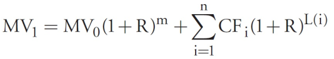

- The MWRR, unlike the TWRR, is heavily influenced by the size and timing of cash flows.
- The TWRR is the preferred method unless the manager has control over the size and timing of the cash flows.
- The MWRR will be higher (lower) than the TWRR if funds are added prior to a period of strong (weak) performance.

MWRR 的特点：
- MWRR 考虑了外部现金流的影响
- 对外部现金流的规模和时间敏感（sensitive to the size and timing of external cash flows）
- 基 金 经 理 可 以 控 制 外 部 现 金 流 的 时 间 时（ manager controls the timing of external cash flows），使用 MWRR 计算收益率
- MWRR 只需要知道期初和期末的估值（only requires a beginning and end of period market value）

### TWRR VS MWRR

Generally, TWRR is used for manager evaluation and GIPS® reporting because it reflects only the return of the assets and not client decisions to add or subtract funds.

A special case can exist if the manager controls the timing of fund additions and withdrawals. This can happen with some portfolios, such as hedge funds and other limited partnership investments. If the manager controls the timing of cash flows, MWRR is appropriate for performance reporting and GIPS®.

TWRR reflects what would have happened to the beginning value if no external cash flows had occurred.

TWRR calculations can be data intensive and expensive to perform because they require a portfolio market value on the date of all external cash flows.

MWRR only requires a beginning and end of period market value

### LIRR
A Bank Administration Institute (BAI)2 study recommends that TWRR can be approximated by calculating the MWRR over frequent time intervals and then chainlinking those returns over the evaluation period. 

The BAI study concluded that only if
  - there are large (> 10% of the account’s value) external cash flows or
  - volatile performance swings 
  
 will this linked internal rate of return (LIRR) fail to provide a close approximation to the true TWRR

## d identify and explain potential data quality issues as they relate to calculating rates of return;

Potential problems relating to data quality:
- When accounts contain illiquid (infrequently priced) assets, estimates or educated guesses must sometimes be used to calculate returns.
- For many thinly-traded fixed-income securities, current market prices may not be available. Estimated prices may be derived from dealer quoted prices on securities with similar attributes. This is known as matrix pricing.
- Highly illiquid securities may be carried at cost or the price of the last trade, thus not reflecting the current price.
- Account valuations should include trade date accounting, including accrued interest and dividends.

## e demonstrate the decomposition of portfolio returns into components attributable to the market, to style, and to active management;

P = M     +    S       +          A
 
P = M   +      B-M      +        P-B

where:

P = portfolio return,  M = market index return, S = return to style, 

A = return due to active management, B = portfolio benchmark return

S = B − M

A = P − B

M ---------------> S----------------->A 

## f discuss the properties of a valid performance benchmark and explain advantages and disadvantages of alternative types of benchmarks;

A valid benchmark should meet the following criteria: SAMURAI
1. Specified in advance: The benchmark is known to both the investment manager and the fund sponsor. It is specified at the start of an evaluation period.
2. Appropriate: The benchmark is consistent with the manager’s investment approach and style.
3. Measurable: Its value can be determined on a reasonably frequent basis.
4. Unambiguous: Clearly-defined identities and weights of securities constitute the benchmark.
5. Reflective of current investment opinions: The manager has current knowledge and expertise of the securities within the benchmark.
6. Accountable: The manager(s) should accept the applicability of the benchmark and be accountable for deviations in construction due to active management.
7. Investable: It is possible to replicate the benchmark and forgo active management.

There are seven primary types of benchmarks in use:

1. Absolute: An absolute benchmark is a return objective (e.g., aims to exceed a minimum return target).
- satisfy: Specified in advance、Measurable
- Advantage: Simple and straightforward benchmark：简单直观
- Disadvantages: Not an investable alternative：不可投资的
2. Manager universes: The median manager or fund from a broad universe of managers or funds is used as the benchmark.
- satisfy Appropriate , Measurable）
- Advantage：Measurable（可测算的）
- Disadvantage：
 - survivor bias：只统计还存活没有被清盘的基金经理，因此其结果被高估
 - rely on compiler's representations：依赖编制者的陈述，统计的准确与否依赖编制者的报告是否准确
 - Cannot be identified or specified in advance：事先不可知
 - Not an Unambiguous and not Investable：不清晰且不可投资
3. Broad market indices: There are several well-known broad market indices that are used as benchmarks (e.g., the S&P 500 for U.S. common stocks).
- Advantages：
 - Well recognized, easy to understand, and widely available
 - Unambiguous、investable、measurable、specified in advance
 - appropriate to use
- Disadvantage：Manager’s style may be different from the index style（基金经理的风险与指数的风格不同）

4. Style indices: Investment style indices represent specific portions of an asset category.
- Advantages：
 -  Well recognized, easy to understand, and widely available
 -  If the index reflects the manager's style and it is investable, it is an appropriate benchmark
- Disadvantages：
 -  larger than considered prudent：不够谨慎
 -  Differing definitions of investment style can produce quite different benchmark returns：对风格指数不同的定义会带来不同的基准收益率
 -  In these cases they are not appropriate benchmarks：有些情况不是合适的基准
5. Factor-model-based: Factor models involve relating a specified set of factor exposures to the returns on an account.
- Advantage：
- Useful in performance evaluation：可用于业绩评估
- They capture the systematic sources of return that affect an account’s performance, they help managers and fund sponsors better understand a manager’s investment style：捕获影响账户业绩的系统性,收益来源，帮助基金经理和基金资助人更好的了解基金经理的投资风格
- Disadvantages：
- they are not always intuitive to the fund sponsor and particularly to the investment managers：对基金资助人不总是直观的，特别是投资经理
- data and modeling are not always available and may be expensive：历史数据或模型不可得或成本高
- It may be ambiguous because different factor models can produce different output：可能是模糊的，因为不同的因素模型可提供不同的输出结果

6. Returns-based: Returns-based benchmarks are constructed using (1) the managed account returns over specified periods and (2) corresponding returns on several style indices for the same periods. 特殊的 Factor-Model-Based，结合了 Style Indices 和 Factor-Model-Based 的特点， 用固定的四个风格指数回归所得到的多因素模型，RB=b0+b1×RLV+b2×RLG+b3×RSV+b4×RSG+ε
- satisfy Unambiguous、Investable
- Advantage：
- generally easy to use and are intuitively appealing：通常易于使用和直观的显示
- satisfy most benchmark validity criteria：满足大多数基准的有效性标准（好的基准）
- particularly useful in situations where the only information available is account returns：特别适用于只知道账户收益率信息的情况
- Disadvantages：
- may hold positions in securities and economic sectors that a manager might find unacceptable：可能持有的证券头寸和基金经理找到的经济因素是不可接受的
- require many months of observation to establish a statistically reliable pattern of style exposures：需要几个月的观察来建立一个统计上可靠的风格敞口模式

7. Custom security-based: A custom security-based benchmark reflects the manager’s investment universe, weighted to reflect a particular approach.
- Advantage：
- Meets all of the required benchmark properties and satisfies all of the benchmark validity criteria：满足基准特性的所有要求，所有的基准都是有效标准的
- Allows continual monitoring of investment processes：允许持续的监控投资过程
- Allow fund sponsors to effectively allocate risk across investment management teams：允许基金的资助人有效的在投资管理团队分配风险
- Disadvantages：
- Can be expensive to construct and maintain：构建和维护的成本比较贵
- Lack of transparency: not composed of published indexes：缺乏透明度：不是公开的指数

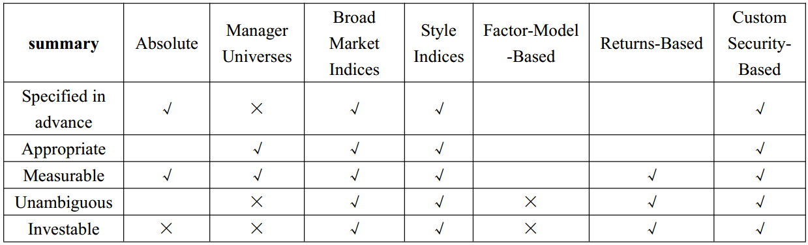

## g explain the steps involved in constructing a custom security-based benchmark;

The construction of a custom security-based benchmark entails the following steps:

Step 1: Identify the important elements of the manager’s investment process.

Step 2: Select securities that are consistent with that process.

Step 3: Weight the securities (including cash) to reflect the manager’s process.

Step 4: Review and adjust as needed to replicate the manager’s process and results.

Step 5: Rebalance the custom benchmark on a predetermined schedule.

## h discuss the validity of using manager universes as benchmarks;

Using the median account as a benchmark has a number of drawbacks:

1. It fails several properties of a valid benchmark:
- It is impossible to identify the median manager in advance.
- It is ambiguous, as the median manager is unknown.
- The benchmark is not investable.
- It is impossible to verify the benchmark’s appropriateness due to the ambiguity of the median manager.

2. Fund sponsors who choose to employ manager universes have to rely on the compiler’s representations that the accounts within the universe have been screened, input data validated, and calculation methodology approved.

3. As fund sponsors will terminate underperforming managers, universes will be subject to “survivor bias.” As consistently underperforming accounts will not survive, the median will be biased upwards. Without a valid reference point, evaluating manager performance using this benchmark becomes suspect.

## i evaluate benchmark quality by applying tests of quality to a variety of possible benchmarks;

While no one statistical test is definitive, the following indicate a high-quality benchmark:

- Minimize systematic bias, meaning portfolio and benchmark return will track closely with a regression correlation approaching 1.0, no correlation (approaching zero) between style (S) and manager value added (A), and positive correlation between S and total value added (E).

- Low tracking error, where tracking error is defined as the standard deviation of A.

- Systematic risk characteristics that are similar to those of the portfolio.

- High coverage, meaning most of the portfolio positions are also in the benchmark.

- Low turnover to minimize costs of replicating the benchmark.

- Positive active positions, indicating that in long-only portfolios the manager significantly overweights those positions where the manager has a favorable view.

## j discuss issues that arise when assigning benchmarks to hedge funds;

The diversity of hedge funds has led to problems when designating a suitable benchmark. In most cases, hedge funds hold both short and long investment positions.

Problems with using traditional techniques to assess long-short hedge funds include the following:
- It is possible for MV0 to be zero for a long-short portfolio, making the return calculation nonsensical.
- Many hedge funds use an “absolute return” approach, which makes relative performance comparisons with a traditional benchmark less useful.

This leads to performance measurement issues as well as administrative and compliance issues. Given these complications, other performance methods that may be more appropriate are:

1. Value-added return: One approach is to evaluate in terms of performance impact. A return can be calculated by summing up the performance impacts of the individual security positions, both long and short.

2. Separate long/short benchmarks: It may be possible to construct separate long and short benchmarks. These could then be combined in their relevant proportions to create an overall benchmark.

3. The Sharpe ratio: The confusion over exactly what constitutes a hedge fund, as well as the myriad strategies employed by hedge fund managers, has led to the popular use of the Sharpe ratio, which compares portfolio returns to a risk-free return rather than a benchmark.

## k distinguish between macro and micro performance attribution and discuss the inputs typically required for each;

The basic concept of performance attribution is to identify and quantify the sources of returns that are different from the designated benchmark. There are two basic forms of performance attribution:

1. Macro performance attribution is done at the fund sponsor level. The approach can be carried out in percentage terms (a rate-of-return metric) and/or in monetary terms (a value metric).

2. Micro performance attribution is used by both fund managers (to analyze the performance of the individual portfolio managers they use) and the portfolio managers themselves (to determine sources of excess returns).

Note the distinction does not relate to who is carrying out the performance attribution, but rather to the variables being used.

There are three main inputs into the macro attribution approach:

1. Policy allocations: It is up to the sponsor to determine the asset categories and weights as well as to allocate the total fund among asset managers. As in any IPS development, allocations will be determined by the sponsor’s risk tolerance, long term expectations, and the liabilities (spending needs) the fund must meet.

2. Benchmark portfolio returns: A fund sponsor may use broad market indices as the benchmarks for asset categories and narrowly-focused indices for managers’ investment styles.

3. Fund returns, valuations, and external cash flows: 

- When using percentage terms, returns will need to be calculated at the individual manager level. This enables the fund sponsor to make decisions regarding manager selection. 
- If also using monetary values, account valuation and external cash flow data are needed to compute the value impacts of the fund sponsor’s investment policy decision making.

## l demonstrate and contrast the use of macro and micro performance attribution methodologies to identify the sources of investment performance;

### Macro Attribution Analysis

There are six levels of investment policy decision-making, by which the fund’s performance can be analyzed:

1. Net contributions.
2. Risk-free asset.
  - the fund’s starting value and its net external cash inflows are invested at the risk-free rate
3. Asset categories. 
  - assumes that the fund’s net contributions value is invested based on the fund sponsor’s policy allocations to the specified asset category benchmarks. 
  - This is a pure index fund approach reflecting SAA
  
  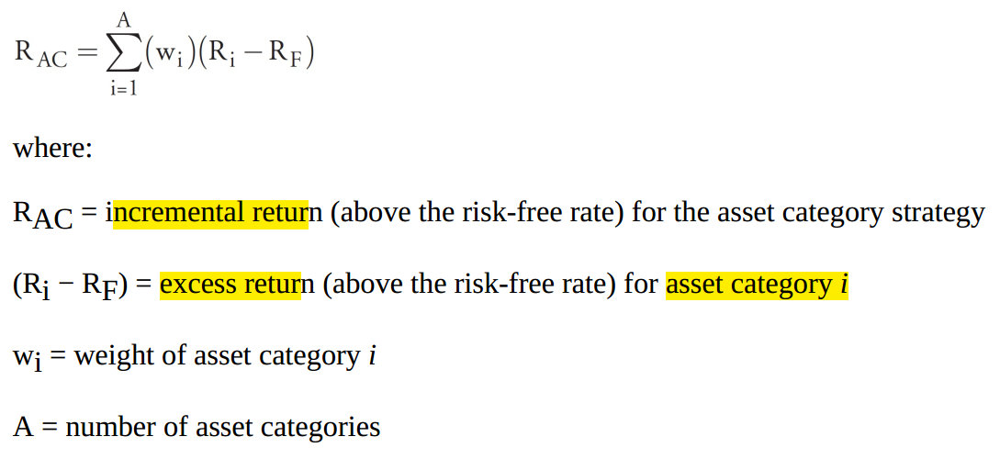 
4. Benchmarks.
  - assumes that the beginning value and external cash flows of the fund are passively invested in the aggregate of the managers’ respective benchmarks. 
  - This is also a pure index fund approach but reflecting the sponsor’s TAA decisions. 
  - The difference between the manager benchmarks and the asset category benchmarks (aggregated) is also known as the “misfit return” or “style bias.”
  
  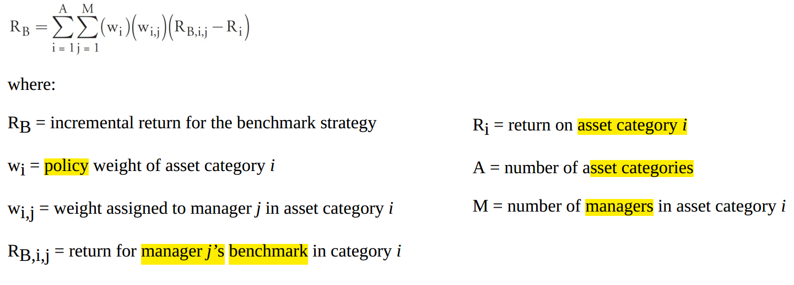
  
5. Investment managers.
  - assumes that the beginning value and external cash flows of the fund invested are the actual results of the managers. 
  - This is not an index approach but still reflects sponsor decision making as the sponsor selects the managers. 
  - This incremental return reflects the value added by the managers.
  
  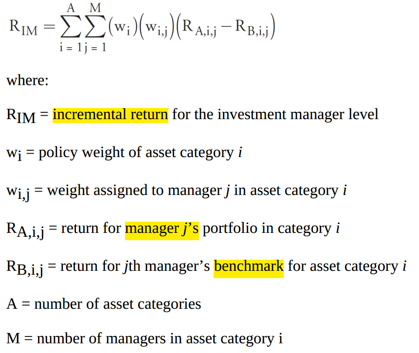
  
  
6. Allocation effects.
  - This is a balancing “plug” figure. 
  - It is the difference between the fund’s ending value and the value from the investment managers level.
  - This is created if fund sponsors deviate slightly from their policy allocations. 

The levels represent investment strategies management can utilize to add value to the fund;

these levels increase in risk, expected return, and tracking error as one progresses down the list.

### Micro Attribution Analysis

Micro performance attribution consists of analyzing individual portfolios relative to designated benchmarks. The value-added return (portfolio return minus benchmark return) can be broken into three explained components:
 - (1) pure sector allocation,
 - (2) allocation/selection interaction, and
 - (3) within-sector selection.
 - (4) It is not unusual to also see an unexplained residual component.

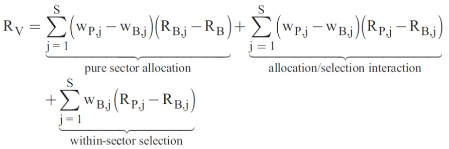

- Pure sector allocation looks at whether the manager over- or underweighted a market sector that over- or underperformed the total return of the benchmark. It ignores the return of the stocks the manager selected so it purely captures the ability of the manager to emphasize outperforming sectors and avoid underperforming sectors.

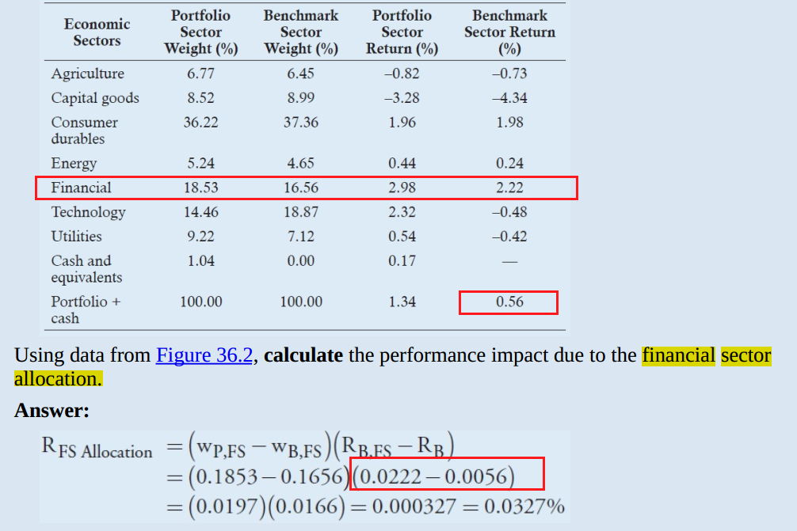

- Within-sector selection does the opposite. It uses benchmark weights, so it ignores the manager’s sector weighting decisions and only focuses on the manager’s performance within a sector versus that of the benchmark within that sector. Essentially it measures the manager’s stock picking skill.

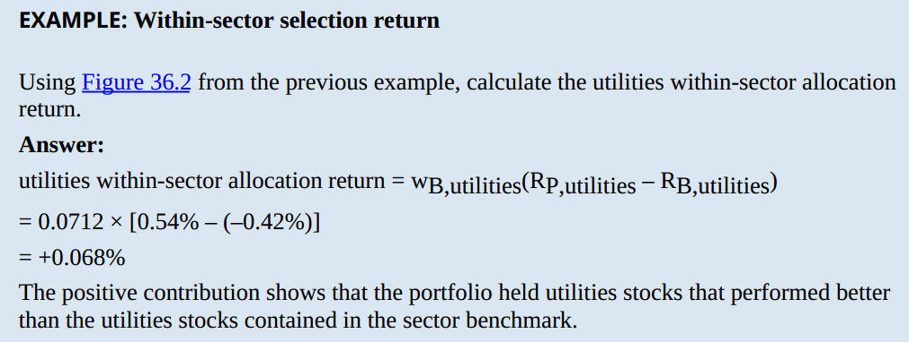

- Adding the previous two components will not total to the portfolio incremental return in most situations. A joint allocation/selection interaction is needed that sums over-/underweighting and stock selection. Joint effects are common in many models that break down return. They are mathematically necessary.

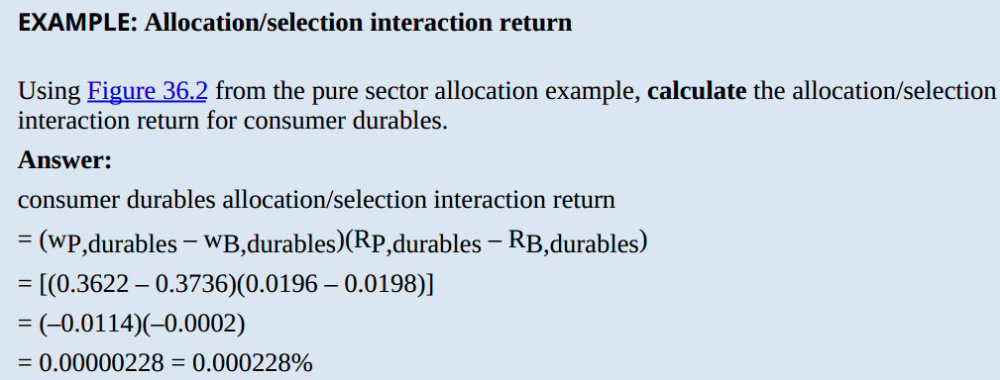

## m discuss the use of fundamental factor models in micro performance attribution;

It should be possible to construct multifactor models to conduct micro attribution. This involves combining economic sector factors with other fundamental factors.

Constructing a suitable factor model would involve the following:
- Identify the fundamental factors that will generate systematic returns.
- Determine the exposures of the portfolio and the benchmark to the fundamental factors at the start of the evaluation period.
- Determine the manager’s active exposure to each factor.
- Determine the active impact. This is the added return due to the manager’s active exposures.

The results of the fundamental factor micro attribution will indicate the source of portfolio returns, based upon actual factor exposures versus the manager’s normal factor exposures (e.g., sector rotation), the manager’s ability to time the market (e.g., adjust the portfolio beta and/or duration in response to market expectations), and so on

### fundamental factor model vs return based style analysis

The methods are similar in that they both use the following initial steps in constructing a suitable factor model:
- Identify the fundamental factors that will generate systematic returns.
- Determine the exposures of the portfolio and the benchmark to the fundamental factors.
- Determine the performance of each of the factors.

In this way, the fundamental factor model micro attribution results will look very similar to a returns-based style analysis and can be determined the same way (e.g.,the returns to the portfolio are regressed against the returns to several different indices to determine the factor exposures).

The primary difference between them is the use of other fundamental factors (e.g.,  anagement’s use of leverage, market timing, sector rotation, the size of the firm, and so on) that would not ordinarily be used in a returns-based style analysis.

## n evaluate the effects of the external interest rate environment and active management on fixed-income portfolio returns;

Attribution analysis of a fixed-income portfolio amounts to comparing the return on the active manager’s portfolio to the return on a passively managed, risk-free portfolio. The difference between the two can be attributed to the effects of the external interest rate environment and the manager’s contribution.

1. Effect of the external interest environment:
- Return on the default-free benchmark assuming no change in the forward rates.
- Return due to the actual changes in interest rates.

2. Contribution of the management process:
- Return from interest rate management.
- Return from sector/quality management.
- Return from the selection of specific securities.
- Return from trading activity

## o explain the management factors that contribute to a fixed-income portfolio’s total return and interpret the results of a fixed-income performance attribution analysis;

The manager’s contribution to the portfolio return (i.e., the return to active management) can be divided into four components:

1. Interest rate management effect: The ability of the manager to predict changes in relevant interest rates.

2. Sector/quality effect: The ability of the manager to select and overweight (underweight) outperforming (underperforming) sectors and qualities.

3. Security selection effect: The ability of the manager to select superior securities to represent sectors.

4. Trading activity: The residual effect; assumed to measure the return to active trading (buying and selling) over the period.

## p calculate, interpret, and contrast alternative risk-adjusted performance measures, including (in their ex post forms) alpha, information ratio, Treynor measure, Sharpe ratio, and M2;

The final stage of the performance evaluation process, performance appraisal, measures compare returns on a risk-adjusted basis. The following are five methods of performance appraisal in their ex post (historical) forms:

1. Ex post alpha (Jensen’s alpha): Alpha is the difference between the account return and the return required to compensate for systematic risk. Alpha uses the ex post SML as a benchmark to appraise performance.

2. Information ratio: Excess return is measured against variability of excess return.

3. The Treynor measure: The Treynor measure calculates the account’s excess return above the risk-free rate, relative to the account’s beta (i.e., systematic risk).

TR=(Rp-Rf)/Beta

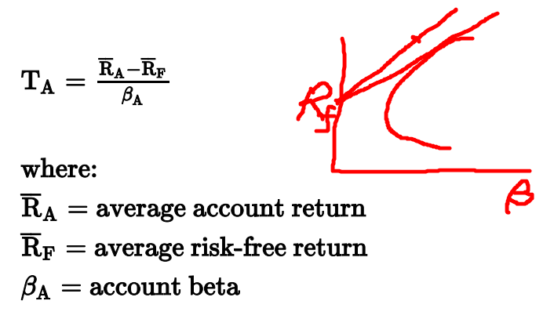          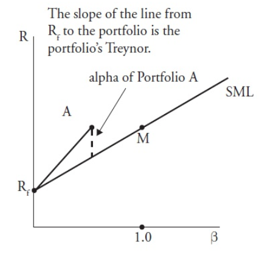

4. The Sharpe ratio: Unlike the previous two methods, the Sharpe ratio calculates excess returns above the risk-free rate, relative to total risk measured by standard deviation.

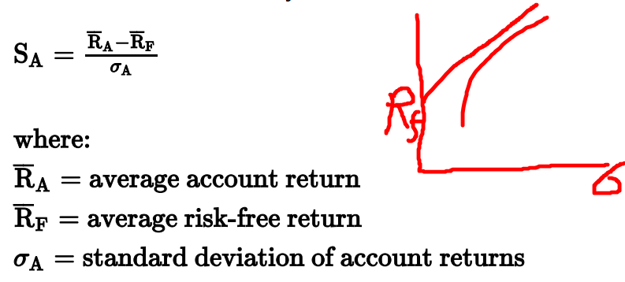

5. M2: Using the CML, M2 compares the account’s return to the market return if the two had equal risk.

 M2 measures the value added or lost relative to the market if the portfolio had the same risk (standard deviation) as the market. It measures the result of a hypothetical portfolio that uses leverage to increase risk and return if the portfolio has less risk than the market or lends at the risk-free rate to lower risk and return if the portfolio has more risk than the market.
 

M^2=Rf+SR*SDm

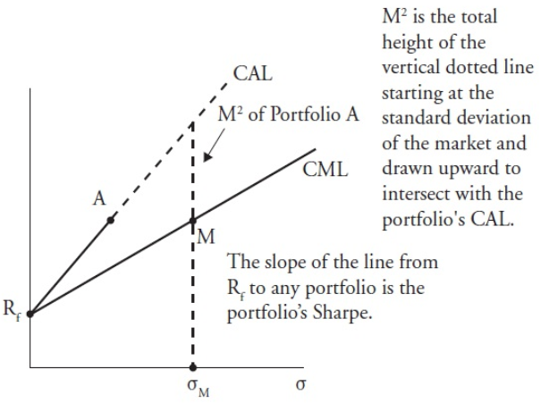

### Summary

- Alpha and Treynor both measure risk as systematic risk (beta). They will agree in that a manager with positive alpha will have a Treynor in excess of the market Treynor. They may not always agree in relative ranking. A manager with the highest alpha may not have the highest Treynor.

- Both Alpha and Treynor are criticized because they depend on beta and assumptions of the CAPM. The criticisms include 
  - (1) the assumption of a single priced risk rather than some form of multifactor risk pricing and 
  - (2) the use of a market proxy, such as the S&P 500, to stand for the market. Roll’s critique shows that small changes in what is assumed to be the market can significantly change the alpha and Treynor calculations and even reverse the conclusions of superior or inferior performance and rankings.

- Superior (inferior) Sharpe will mean superior (inferior) M2. Both measure risk as total risk (standard deviation).

- Measures like M2 that use a benchmark are also subject to the criticism the benchmark used may not be precisely replicable. M2 uses the standard deviation of the market. As a related issue, transaction cost to replicate the market or a custom benchmark are not considered.

- Any ex post calculation is a sample of true results and actual results can be different in the future. Even if results do reflect true manager skill, the manager can change approach or style in the future.

- Alpha, Treynor, and Sharpe are the more widely used measures.

- Also remember from Levels I and II that the highest relative return measure does not necessarily mean the highest return. For example, a very low risk portfolio with low beta or standard deviation could have a higher alpha and Sharpe but a very risky portfolio with lower alpha and Sharpe can still have the higher absolute return.

## q explain how a portfolio’s alpha and beta are incorporated into the information ratio, Treynor measure, and Sharpe ratio;

- Treynor considers only beta, market-related risk.
- Sharpe is based on total portfolio risk (standard deviation of total return), which includes both beta (market related) risk and alpha (value added) related risk.
- The information ratio considers only value added and its variability. It is based only on alpha risk.

## r demonstrate the use of performance quality control charts in performance appraisal;

Quality control charts plot managers’ performance relative to a benchmark, with a statistical confidence interval.

The manager’s value-added return is plotted on the vertical axis, and time is plotted on the horizontal axis. The center of the vertical axis is where the portfolio and benchmark returns are equal, so the value-added return is zero. The solid, horizontal line originating at zero can be thought of as the benchmark return, and any portfolio returns plotting off the horizontal line would represent those occasions when the portfolio and benchmark returns are not equal.

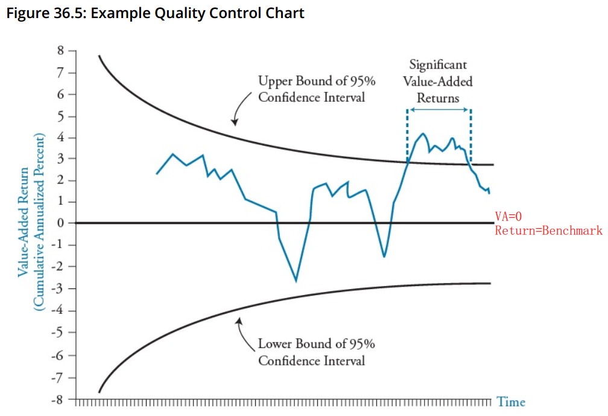

Management can plot the manager’s value-added returns on the chart to determine whether they are randomly generated or are derived through superior management. If they tend to be consistently above or below the line, this could indicate superior or
inferior performance, respectively

## s discuss the issues involved in manager continuation policy decisions, including the costs of hiring and firing investment managers;

The costs of hiring and firing investment managers can be quite expensive, both in time and money:

1. A proportion of the existing manager’s portfolio may have to be liquidated if the new manager’s style is significantly different.

2. Replacing managers involves a significant amount of time and effort for the fund sponsor.

Some fund sponsors have a formalized, written manager continuation policy (MCP) which includes the goals and guidelines associated with the management review process:

- Replace managers only when justified (i.e., minimize unnecessary manager turnover).
  - Short periods of underperformance should not necessarily mean automatic replacement.
- Develop formal policies and apply them consistently to all managers.
- Use portfolio performance and other information in evaluating managers:
  - Appropriate and consistent investment strategies (i.e., the manager doesn’t continually change strategies based upon near term performance).
  - Relevant benchmark (style) selections.
  - Personnel turnover.
  - Growth of the account.

## t contrast Type I and Type II errors in manager continuation decisions.

Type I and Type II errors refer to incorrectly rejecting or failing to reject the null hypothesis, respectively. Stating the null hypothesis as the manager generates no value added and the alternative hypothesis as the manager adds value, there are two potential statistical errors:

- H0: The manager adds no value.
- HA: The manager adds positive value.

Type I error—Rejecting the null hypothesis when it is true. That is, keeping managers who are returning no value-added.

Type II error—Failing to reject the null when it is false. That is, firing good managers who are adding value.

# READING 37. OVERVIEW OF THE GLOBAL INVESTMENT PERFORMANCE STANDARDS

The candidate should be able to:

## a discuss the objectives, key characteristics, and scope of the GIPS standards and their benefits to prospective clients and investment managers;

### GIPS objectives:

Establish global, industry-wide best practices for the calculation and presentation of investment performance.

Facilitate the accurate and unambiguous presentation of investment performance results to current and prospective clients.

Facilitate a comparison of the historical performance of investment management firms.

Encourage full disclosure and fair global competition without barriers to entry.

Encourage self-regulation.

### GIPS characteristics:

Voluntary minimum standards for performance presentation.

Firms must meet all requirements on a firm-wide basis in order to claim compliance.

Only investment management firms may claim compliance.

Provide a minimum standard where local or country-specific laws, regulation, or industry standards may not exist.

Require managers to include all actual fee-paying discretionary portfolios in composites defined according to similar strategy and/or investment objective.

Firms must present a minimum of five years of GIPS-compliant history or since inception if less than five years. After presenting at least five years of compliant history, the firm must add annual performance each year going forward up to 10 years, at a minimum.

Firms may link years of noncompliant performance but must present only compliant data for periods beginning on or after January 1, 2000.

Firms must use prescribed calculation and presentation methods and include required disclosures in presentations.

Meeting the objective of full and fair disclosure will likely require more than compliance with the minimum requirements of the GIPS.

To fully explain the performance included in a presentation, firms are encouraged to present all relevant supplemental information.

In cases in which applicable local or country-specific laws or regulations conflict with the GIPS, the standards require firms to comply with the local law or regulation and make full disclosure of the conflict.

Firms are encouraged to develop monitoring processes and controls for maintaining GIPS compliance.

Firms must document the policies used to ensure the existence and ownership of client assets.

January 1, 2011, is the effective date of the 2010 edition of the GIPS. Presentations that include performance for periods beginning on or after January 1, 2011, must comply with the 2010 version of the GIPS.

### Scope of the GIPS:

Firms from any country may come into compliance with the GIPS. Compliance with the standards will facilitate a firm’s participation in the investment management industry on a global level.

For periods prior to January 1, 2006, firms are granted reciprocity, so that if pre-2006 data are presented in compliance with a previous edition of the GIPS or a Country Version of GIPS (CVG), such data may continue to be shown as compliant with the revised GIPS.

The benefits to existing and prospective clients derive from the ability to compare the performance of firms operating in different countries with different sets of established practices. The GIPS ensure that performance data are complete and fairly presented so that existing and prospective clients can have greater confidence in comparative investment results.

### Benefits of GIPS

the ability to compare the performance of firms operating in different countries with different sets of established practices.

ensure that performance data are complete and fairly presented so that existing and prospective clients can have greater confidence in comparative investment results.

the GIPS provide managers with the ability to compete fairly in foreign markets.

In addition to external benefits to GIPS compliance, firms can identify weaknesses in internal management controls during the implementation of GIPS.

## b explain the fundamentals of compliance with the GIPS standards, including the definition of the firm and the firm’s definition of discretion;

GIPS compliance must be on a firm-wide basis. Total firm assets are defined as the total fair value of all assets the firm manages, including non-fee-paying and nondiscretionary portfolios. Also included in the definition are assets delegated to subadvisers, as long as the firm has selected the sub-advisers. If (according to the firm’s definition of discretion) a portfolio is deemed discretionary, it is considered sufficiently free of client-mandated constraints such that the manager is able to pursue its stated
strategy, objectives, or mandate.

A firm is defined as “an investment firm, subsidiary, or division held out to clients or potential clients as a distinct business entity.”

A distinct business entity is defined as “a unit, division, department, or office that is organizationally or functionally separated from other units, divisions, departments, or offices and that retains discretion over the assets it manages and that should have
autonomy over the investment decision-making process.”

Firms must meet all the requirements of GIPS and the ethical intent. Partial compliance is not acceptable. Policies and procedures must be developed, maintained, and documented to meet the requirements.

## c explain the requirements and recommendations of the GIPS standards with respect to input data, including accounting policies related to valuation and performance measurement;

GIPS input data requirements

Standard 1.A.1. All data and information necessary to support the firm’s performance presentation, including calculations, must be stored and maintained.

Standard 1.A.2. For periods beginning on or after January 1, 2011, portfolios must be valued at fair value according to GIPS principles. Cost or book values are not permitted.

Standard 1.A.3. Portfolio valuation.
- Prior to January 1, 2001, portfolios must be valued at least quarterly.
- Beginning on or after January 1, 2001, at least monthly.
- Beginning on or after January 1, 2010, at least monthly and on the date of all large external cash flows.

Standard 1.A.4. For periods beginning January 1, 2010, firms must value portfolios as of the calendar month-end or the last business day of the month.

Standard 1.A.5. For periods beginning January 1, 2005, firms must use trade-date accounting.

Standard 1.A.6. Accrual accounting must be used for fixed-income securities and all other assets that accrue interest income. Market values of fixed-income securities must include accrued income.

Standard 1.A.7. For periods beginning January 1, 2006, composites must have consistent beginning and ending annual valuation dates. Unless the composite is reported on a non-calendar fiscal year, the beginning and ending valuation dates must be at calendar year-end (or on the last business day of the year).

GIPS input data recommendations

Standard 1.B.1. Rather than only at large external cash flows, portfolios should be valued at each external cash flow.

Standard 1.B.2. Valuations should be obtained from an independent third party.

Standard 1.B.3. Dividends from equities should be accrued as of the ex-dividend date.

Standard 1.B.4. When presenting net-of-fees returns, firms should accrue investment management fees

## d discuss the requirements of the GIPS standards with respect to return calculation methodologies, including the treatment of external cash flows, cash and cash equivalents, and expenses and fees;

GIPS calculation methodology requirements

Standard 2.A.1. Total returns must be used.

Standard 2.A.2. Time-weighted rates of return that adjust for external cash flows must be used. Periodic returns must be geometrically linked. External cash flows must be treated in a consistent manner with the firm’s documented, compositespecific policy in order to determine when portfolios in the composite require revaluation. For periods beginning January 1, 2010, firms must value portfolios on the date of all large external cash flows.

Cash and cash equivalents

Standard 2.A.3. Returns from cash and cash equivalents held in portfolios must be included in total return calculations.

Fees and expenses

Standard 2.A.4. All returns must be calculated after the deduction of the actual trading expenses incurred during the period. Estimated trading expenses are not permitted.

Standard 2.A.5. If the actual direct trading expenses cannot be identified and segregated from a bundled fee:

1. When calculating gross-of-fees returns, returns must be reduced by the entire bundled fee or the portion of the bundled fee that includes the direct trading expenses. The use of estimated trading expenses is not permitted.

2. When calculating net-of-fees returns, returns must be reduced by the entire bundled fee or the portion of the bundled fee that includes the direct trading expenses and the investment management fee. The use of estimated trading expenses is not permitted.

- Original Dietz:

(EV − BV − ECF) / [BV + 0.5(Net ECF)]

- Modified Dietz:
  - The numerator is the same as for original Diet
  - The denominator is the BV plus each ECF time weighted for the remainder of the full time period
  
 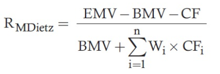
  
- MIRR:

  - This must be solved by trial and error to find the r that equates the EV to the FV of the BV and ECFs. Like modified Dietz, each ECF is weighted for the portion of the month it is available. 

  - 2,700 = 2,500(1 + r) + 45(1 + r)^0.77 + 25(1 + r)&0.37

## e explain the requirements and recommendations of the GIPS standards with respect to composite return calculations, including methods for asset-weighting portfolio returns;

Standard 2.A.6. Composite returns must be calculated by asset-weighting the individual portfolio returns using beginning-of-period values or a method that reflects both beginning-of-period values and external cash flows.

Standard 2.A.7. For periods beginning January 1, 2006, firms must calculate composite returns by asset-weighting the individual portfolio returns at least quarterly. For periods beginning on or after January 1, 2010, composite returns must be calculated by asset-weighting the individual portfolio returns at least monthly.

GIPS calculation methodology recommendations

Standard 2.B.1. Returns should be calculated net of non-reclaimable withholding taxes on dividends, interest, and capital gains. Reclaimable withholding taxes should be accrued.

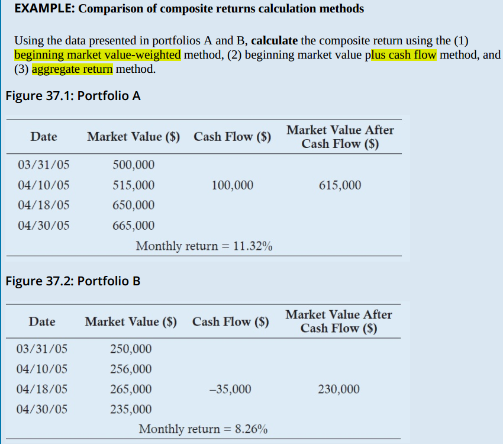   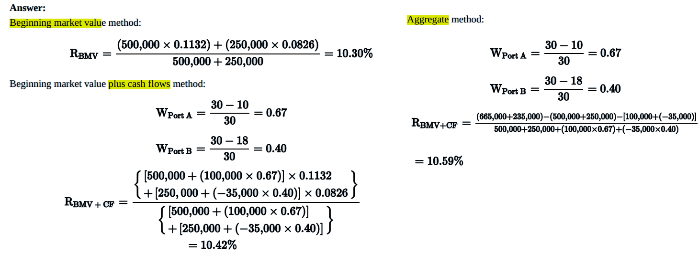

## f explain the meaning of “discretionary” in the context of composite construction and, given a description of the relevant facts, determine whether a portfolio is likely to be considered discretionary;

Standard 3.A.1. All actual fee-paying discretionary portfolios must be included in at least one composite. Although non-fee-paying discretionary portfolios may be included in a composite (with appropriate disclosures), nondiscretionary portfolios must not be included in a firm’s composites.

The IPC defines discretion as “the ability of the firm to implement its intended strategy.” A client may place significant constraints on the manager; for instance, the investment policy statement (IPS) may specify limits on sectors, credit ratings, durations, et cetera. Furthermore, there may be total restrictions on certain transactions, such as the purchase of “unethical” or foreign investments, or the sale of specified stocks. These restrictions do not automatically remove the discretionary nature of the portfolio.

A portfolio becomes nondiscretionary when the manager is no longer able to implement the intended investment strategy. If, for instance, the *** liquidity requirements are so great***  that much of the value must be in cash, or if the portfolio has *** minimal tracking limits from an index portfolio ***, then the description of “discretionary” is really no longer appropriate.

## g explain the role of investment mandates, objectives, or strategies in the construction of composites;

Standard 3.A.4. Composites must be defined according to similar investment objectives and/or strategies. Composites must include all portfolios that meet the composite definition. The full composite definition must be made available on request.

## h explain the requirements and recommendations of the GIPS standards with respect to composite construction, including switching portfolios among composites, the timing of the inclusion of new portfolios in composites, and the timing of the exclusion of terminated portfolios from composites;

Standard 3.A.2. Composites must include only assets under management within the defined firm.

Standard 3.A.3. Firms are not permitted to link simulated or model portfolios with actual performance.

Standard 3.A.5. Composites must include new portfolios on a timely and consistent basis after the portfolio comes under management.

Standard 3.A.6. Terminated portfolios must be included in the historical returns of the appropriate composites up to the last full measurement period that the portfolio was under management.

Standard 3.A.7. Portfolios must not be switched from one composite to another unless documented changes in client guidelines or the redefinition of the composite make it appropriate. The historical record of the portfolio must remain with the appropriate composite.

Standard 3.A.9. If a firm sets a minimum asset level for portfolios to be included in a composite, no portfolios below that asset level can be included in that composite. Any changes to a composite-specific minimum asset level are not permitted to be applied retroactively.

Standard 3.A.10. Firms that wish to remove portfolios from composites in cases of significant cash flows must define significant on an ex-ante composite-specific basis and must consistently follow the composite-specific significant cash flow policy.

Standard 3.B.2. As an alternative to temporarily removing the account from the composite, the firm can direct the significant cash flow into a temporary new account until the funds are invested.

## i explain the requirements of the GIPS standards for asset class segments carved out of multi-class portfolios;

Standard 3.A.8. For periods beginning on or after January 1, 2010, carve-outs must not be included in a composite unless the carve-out is actually managed separately with its own cash balance.

## j explain the requirements and recommendations of the GIPS standards with respect to disclosure, including fees, the use of leverage and derivatives, conformity with laws and regulations that conflict with the GIPS standards, and noncompliant performance periods;

## k explain the requirements and recommendations of the GIPS standards with respect to presentation and reporting, including the required timeframe of compliant performance periods, annual returns, composite assets, and benchmarks;

## l explain the conditions under which the performance of a past firm or affiliation must be linked to or used to represent the historical performance of a new or acquiring firm;

## m evaluate the relative merits of high/low, range, interquartile range, and equal weighted or asset-weighted standard deviation as measures of the internal dispersion of portfolio returns within a composite for annual periods;

## n identify the types of investments that are subject to the GIPS standards for real estate and private equity;

For real estate, the following investment types would fall under the general provisions of the GIPS (as opposed to the provisions dealing directly with real estate and private equity):

- Publicly traded real estate securities, including any listed securities issued by public companies.
- Mortgage-backed securities (MBS).
- Private debt investments, including commercial and residential loans where the expected return is solely related to contractual interest rates without any participation in the economic performance of the underlying real estate.

Note that publicly traded securities include Real Estate Investment Trusts (REITs). If a portfolio consists of real estate plus other investments, the carve-out provisions of GIPS (Standard 3.A.8) would apply.

The exclusions to the definitions of private equity are open-end and evergreen funds, both of which are covered by the general provisions of the GIPS. Because redemptionsand subscriptions may be made after the funds’ inceptions, open-end and evergreen
funds do not have fixed levels of capital with a set number of investors.

## o explain the provisions of the GIPS standards for real estate and private equity;

## p explain the provisions of the GIPS standards for Wrap fee/Separately Managed Accounts;

## q explain the requirements and recommended valuation hierarchy of the GIPS Valuation Principles;

The GIPS valuation hierarchy is a list of value sources. Starting at the top, if the firm is unable to utilize the source, it should proceed to the next source on the list:

1. Objective, observable, unadjusted market prices for similar investments in active markets.

2. Quoted prices for identical or similar investments in markets that are not active.

3. Market-based inputs other than quoted prices that are observable for the investment.

4. Subjective, unobservable inputs

## r determine whether advertisements comply with the GIPS Advertising Guidelines;

## s discuss the purpose, scope, and process of verification;

## t discuss challenges related to the calculation of after-tax returns;

For periods beginning on or after January 1, 2011, when firms include after-tax returninformation in a compliant performance presentation, the information must be presented as supplemental information.

- The pre-liquidation method calculates after-tax returns based on income earned and gains and losses actually recognized over the period through asset sales. This method effectively ignores the effects of future capital gains taxes, generally *** understating tax***  liability (gains are more likely in the long run) and *** overstating after-tax return*** 

- The mark-to-liquidation method assumes all gains, whether recognized or not, are taxed each period. It ignores the time value of money benefits of postponing capital gains and the associated taxes, *** overstating tax liability ***  and ***  understating after-tax return *** .

Client-directed trades: Because we are attempting to measure the after-tax return resulting from the manager’s actions, firms must remove the effects of the resulting capital gains taxes by adjusting the ending value of the portfolio (on paper) by adding back the amount of the these non-discretionary taxes before calculating returns.

## u identify and explain errors and omissions in given performance presentations and recommend changes that would bring them into compliance with GIPS standards.

=================Q===================

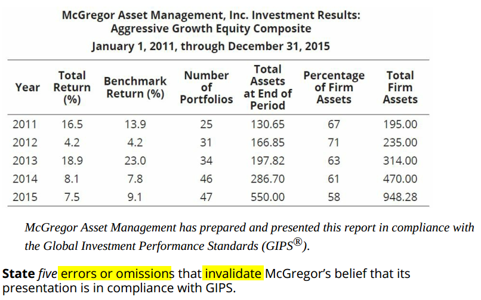

Answer:

Errors and omissions in the McGregor performance presentation:

1. The proper GIPS compliance statement.
2. Definition of firm.
3. Composite description.
4. Benchmark description.
5. If gross-of-fees returns, any fees in addition to trading expenses.
6. If net-of-fees, any fees in addition to management fees and trading expenses that are deducted; if model or actual management fees are deducted; if net of any performance-based fees.
7. Currency used to express returns.
8. Internal dispersion and the measure used.
9. Fee schedule.
10. Composite creation date.
11. That a list of composite descriptions is available.
12. That the policies for valuing portfolios, calculating performance, and preparing compliant statements are available.

Other omissions or errors:

- The correct compliance statement for an unverified GIPS-compliant performance presentation should read as follows:

McGregor Asset Management claims compliance with the Global Investment Performance Standards (GIPS®) and has prepared and presented this report in compliance with the GIPS standards. McGregor Asset Management has not been independently verified.

- For periods beginning on or after 2011, 3-year ex post standard deviation of monthly returns for composite and benchmark must be presented.

- Additional measure must be presented if management feels ex post standard deviation is inappropriate.

=================Q===================

Action 1: The S&P 500 Index was used as the benchmark for comparison with all three composite styles.

A: The S&P 500 Index should not be used as a benchmark for the fixed-income and balanced composites

Action 2: PMG used accrual accounting, and book values are used for computations of fixed-income returns.

A: Portfolio valuations must be based on fair values (not cost basis and book value)

Action 3: For fixed-income return calculations, accrued income is included.

A: Compliant

Action 4: Due to the change in the firm’s client base, PMG did not include its fee schedule.

A: The GIPS requires the disclosure of an appropriate fee schedule.

Action 5: All actual fee-paying discretionary accounts were included in at least one of the three composites.

A: Compliant

Action 6: Asset-weighted composite returns were calculated using end-of-period weightings.

A: Composites must be asset-weighted using begining-of-period weightings or another method that reflects both begining market value and cash flows.

Action 7: The performance of the equity portion of the balanced accounts, excluding cash, was combined with the equity composite results.

A: For periods begining on or after Janurary 1, 2010, a carve-out cannot be included as part of a composite unles it is managed separately with its own cash balance.

Action 8: All composites included only assets under management and were not linked with simulated or model portfolio performance.

A: Compliant

Action 9: Equal-weighted rates of return that adjust for cash flows are used for portfolio returns.

A: Time-weighted rates of return that adjust for cash flows must be used. Periodic returns must be geometrically linked.

Action 10: Performance calculations were made after the deduction of actual trading expenses.

A: Compliant.
