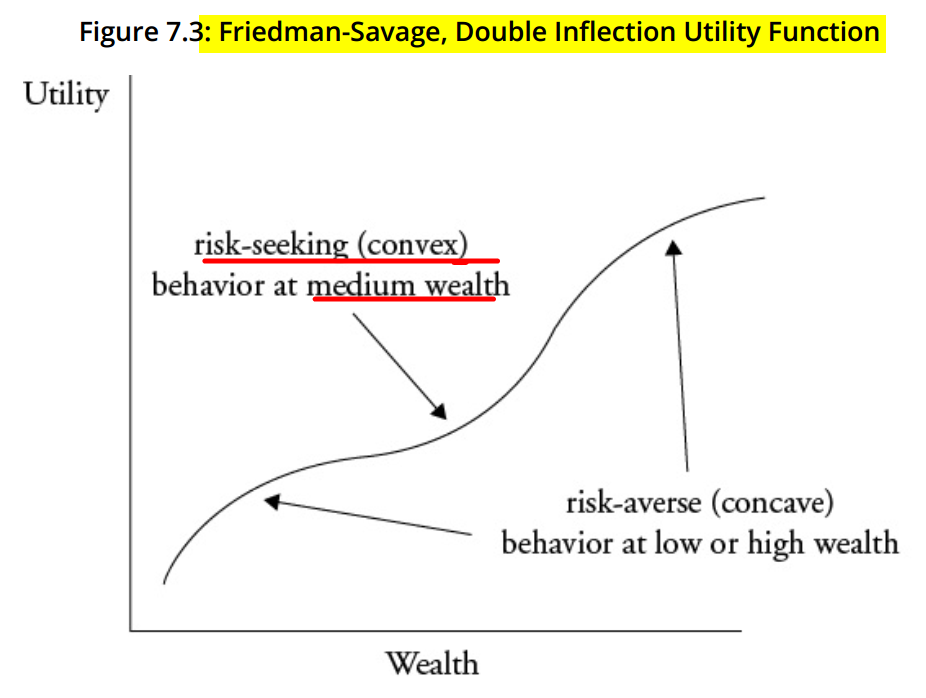
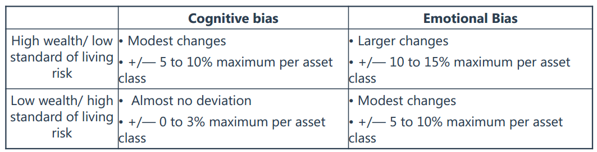

# READING 7. THE BEHAVIORAL FINANCE PERSPECTIVE

The candidate should be able to:
## a contrast traditional and behavioral finance perspectives on investor decisionmaking;

## b contrast expected utility and prospect theories of investment decision making;

Friedman-Savage utility function characterized by an inflection point where the function turns from concave to convex. This type of function explains why people may take low-probability, high-payoff risks (e.g., out-of-the-money options) while at the same time insuring against low-probability, low-payoff risks (e.g., earthquake insurance). The concave portion of the utility function explains purchasing lowpayoff insurance against low-probability losses, while the convex portion of the function explains risk taking with options.

Traditional finance theory assumes risk aversion (concave utility function) at all levels of wealth, which would lead to rejection of all gambles having a non-positive expected return.

Bounded rationality:
  - knowledge capacity limits
  - not assume:
     - perfect info
     - fully rational decisioin making
     - consistent utility maximization
  - practice satisfice

Prospect Theory:
  - relax assumption of risk aversioni, propose loss aversion
  - choices are made in 2 phases:
     - editing phase: 
        - frames proposals
        - establish a reference point
        - simplify number  of choices, address cognitive limitations
     - evaluation phase: loss aversion

## c discuss the effect that cognitive limitations and bounded rationality may have on investment decision making;

## d compare traditional and behavioral finance perspectives on portfolio construction and the behavior of capital markets.

# READING 8. THE BEHAVIORAL BIASES OF INDIVIDUALS

The candidate should be able to:
## a distinguish between cognitive errors and emotional biases;
 - Cognitive errors: faulty reasoning, lack of understanding, info processing mistakes, memory errors -> Easier to correct or mitigate
 - Emotional errors: feelings, impulses, intuition

## b discuss commonly recognized behavioral biases and their implications for financial decision making;
## c identify and evaluate an individual’s behavioral biases;

### Cognitive Errors: Belief Perseverance

RICCH

- Conservatism bias. people maintain their prior views or forecasts by inadequately incorporating new information.
- Confirmation bias. Individuals tend to notice only information that agrees with their perceptions or beliefs. They look for confirming evidence while discounting or even ignoring evidence that contradicts their beliefs or their perceptions.
- Representativeness bias. people tend to classify new information based on past experiences and classifications. This bias occurs because people attempting to derive meaning from their
experiences tend to classify objects and thoughts into personalized categories.
- illusion of control. people tend to believe that they can control or influence outcomes when, in fact, they cannot. expectancy of a personal success probability inappropriately higher than
the objective probability would warrant.
- Hindsight bias. a bias with selective perception and retention aspects. People may see past events as having been predictable and reasonable to expect.

### Cognitive Errors: Information Processing

FAMA

- Framing bias. a person answers a question differently based on the way in which it is asked (framed).
- Anchoring and adjustment. the use of a psychological heuristic influences the way people estimate probabilities. When required to estimate a value with unknown magnitude, people generally begin by envisioning some initial default number an "anchor“ which they then adjust up or down to reflect subsequent information and analysis.
- Mental accounting bias. people treat one sum of money differently from another equalsized sum based on which mental account the money is assigned to.
- Availability bias. people take a heuristic (sometimes called a rule of thumb or a mental shortcut) approach to estimating the probability of an outcome based on how easily the outcome comes to mind.
	
	
### Emotional Biases

LOSSER

- Loss aversion bias. people tend to strongly prefer avoiding losses as opposed to achieving gains. A number of studies on loss aversion suggest that, psychologically, losses are significantly more powerful than gains;
- Overconfidence bias. people demonstrate unwarranted faith in their own intuitive reasoning, judgments, and/or cognitive abilities. This overconfidence may be the result of overestimating knowledge levels, abilities, and access to information.
  - Prediction overconfidence leads to underestimating risk and setting confidence intervals too narrow. Certainty overconfidence relates to over-stated probabilities of success.
  - Self-attribution bias, the combination of self-enhancing bias and self-protecting bias, contributes to overconfidence. By self-enhancing, individuals take all the credit for their successes. By self-protecting, they place the blame for failure on someone or something else.
- Self-control bias. people fail to act in pursuit of their long-term, overarching goals because of a lack of self-discipline. There is an inherent conflict between short-term satisfaction and achievement of some long-term goals.
- Status quo bias. an emotional bias in which people do nothing (i.e., maintain the "status quo") instead of making a change. People art generally more comfortable keeping things the same than with change and thus do not necessarily look for opportunities where change is beneficial.
- Endowment bias. people value an asset more when they hold rights to it than when they do not. Endowment bias is inconsistent with standard economic theory, which asserts that the price a person is willing to pay-for a good should equal the price at which that person would be willing to sell the same good.
- Regret-aversion bias. people tend to avoid making decisions that will result in action out of fear that the decision will turn out poorly. Simply put, people try to avoid the pain of regret associated with bad decisions.

## d evaluate how behavioral biases affect investment policy and asset allocation decisions and recommend approaches to mitigate their effects.

- Goals-based investing
 recognizes that individuals are subject to loss aversion and mental accounting. Builds a portfolio in layers, each consisting of assets used to meet individual goals. 
Pyramiding: 
  - bottom layer comprised of assets designated to meet the investor’s most important goals. 
  - Each successive layer consists of increasingly risky assets used to meet less and less important goals.
  - Provides investor with ability to see risk more clearly. Although portfolio probably won’t be efficient, it will tend to be fairly well diversified.

- Behaviorally Modified Asset Allocation
  - Emotional biases are more often adapted to through deviations from the rational asset portfolio allocation.
  - Higher wealth relative to lifestyle needs allows for greater deviations from the rational portfolio.
  - The emotional biases of the lower-wealth individual are treated about the same as the cognitive biases of the wealthier individual.
  - The amount of deviation is also affected by the number of different asset classes in the portfolio.
  - The lower the suggested deviation from the rational portfolio asset allocation, the greater the need to moderate the investor’s behavioral biases.
    - Due to significant standard of living risk, for example, the cognitive biases of the low-wealth investor must be moderated.

MODERATE VS ADAPT TO

# READING 9. BEHAVIORAL FINANCE AND INVESTMENT PROCESSES

The candidate should be able to:
## a explain the uses and limitations of classifying investors into personality types;
- Uses of classifying investors into behavioral types include:
  - Portfolios that are closer to the efficient frontier and more closely resemble ones based on traditional finance theory.
  - More trusting and satisfied clients.
  - Clients who are better able to stay on track with their long-term strategic plans.
  - Better overall working relationships between the client and adviser.

- Limitations of classifying investors into behavioral types include:
  - Individuals may display both emotional and cognitive errors at the same time, with either behavior appearing irrational.
  - The same individual may display traits of more than one behavioral investor type at the same time; therefore, the investment adviser should not try to classify the individual into only one behavioral investor type.
  - As investors age, they will most likely go through behavioral changes, usually resulting in decreased risk tolerance, along with becoming more emotional about their investing.
  - Even though two individuals may fall into the same behavioral investor type, each individual would not be treated the same due to their unique circumstances.
  - Individuals tend to act irrationally at different times, seemingly without predictability.

## b discuss how behavioral factors affect adviser–client interactions;

A successful client/adviser relationship can be defined in four areas:

  - The adviser understands the long-term financial goals of the client.
  - The adviser maintains a consistent approach with the client.
  - The adviser invests as the client expects.
  - Both client and adviser benefit from the relationship

## c discuss how behavioral factors influence portfolio construction;

## d explain how behavioral finance can be applied to the process of portfolio construction;

## e discuss how behavioral factors affect analyst forecasts and recommend remedial actions for analyst biases;

## f discuss how behavioral factors affect investment committee decision making and recommend techniques for mitigating their effects;

## g describe how behavioral biases of investors can lead to market characteristics that may not be explained by traditional finance. 

Financial bubbles and crashes are periods of unusual positive or negative returns caused by panic buying and selling, neither of which are based on economic fundamentals. In a bubble, the buying is due to investors believing the price of the asset will continue to go up. 
- Another way of defining a bubble or crash is a period of prices for an asset class that is two standard deviations away from the price index’s mean value. 
- A crash can also be characterized as a fall in asset prices of 30% or more over a period of several months. 
