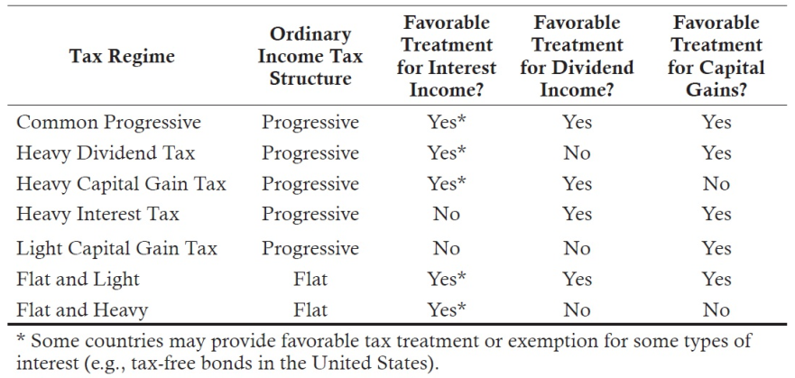
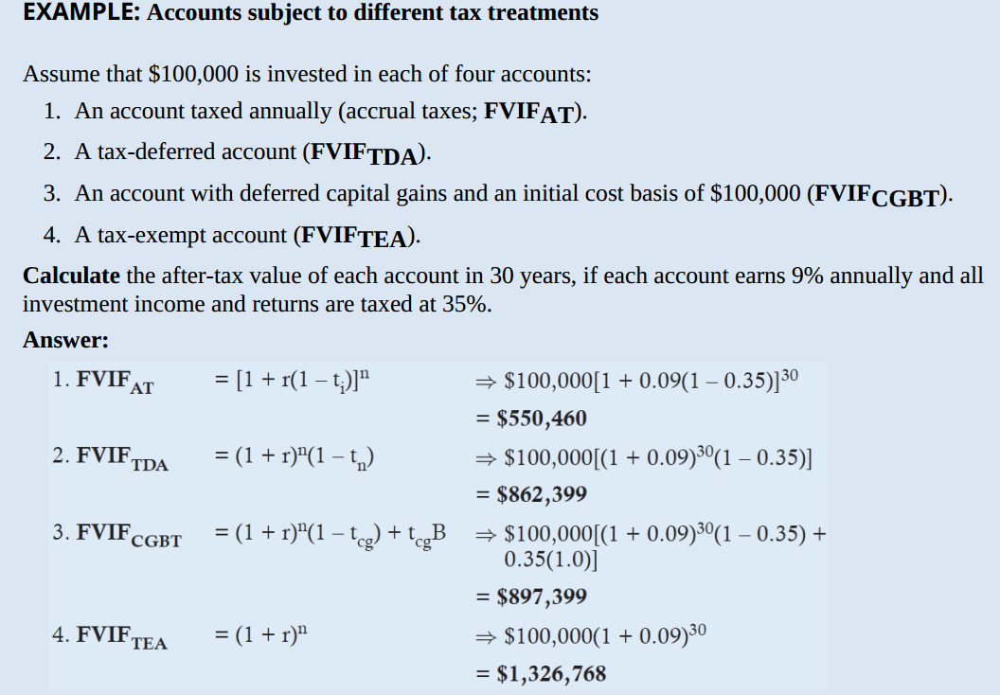
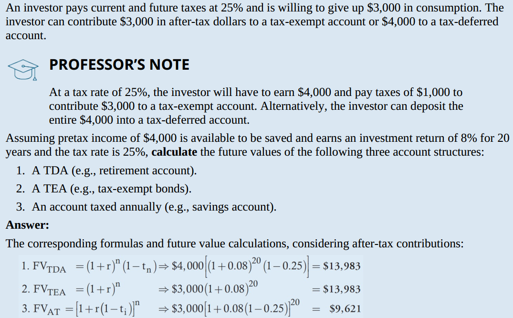
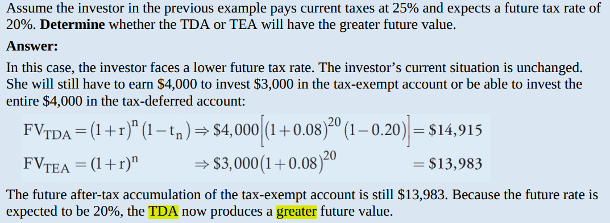
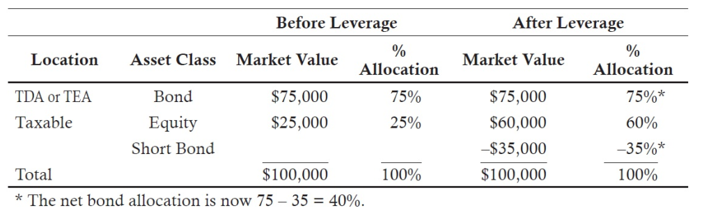

# READING 10. MANAGING INDIVIDUAL INVESTOR PORTFOLIOS

The candidate should be able to:

## a discuss how source of wealth, measure of wealth, and stage of life affect an individual investors’ risk tolerance;

-Source of Wealth：财富的来源
- Entrepreneurial activity：企业家的活动所带来的财富，属于 active，相对承担风险的能力更强
-  Inheritance（继承）
  - one-time windfalls（意外之财）
  - built up over long periods of safe employment （工资），属于 passive，相对承担风险的能力更弱
  
备注：区分 active 和 passive，主要看自有资金是否承担风险，有风险就是 active，没有风险就是 passive

- Measure of wealth：财富的衡量

 Positive correlation between level of risk tolerance & client’s perception of wealth：风险承受能力与客户财富的感知（收益率）是正相关

备注：return 的目标越大，则 asset base 越小，降低了家庭承受风险的能力（Return 的目标在 10%以上，则asset base 越小）

- Stage of life：生命阶段
 - Foundation phase：基础阶段
 - Accumulation phase：积累阶段
 - Maintenance phase (retirement)：维护阶段（退休）
 - Distribution phase：分发阶段（遗产分配）

Situational profiling is a first step at determining investor attitudes toward risk.
Describe a situational profile according to:

i. Source of wealth.

Information related to source of wealth describes how an investor accumulated wealth.
- At one end of the spectrum is wealth acquired through active means (e.g.,entrepreneurial activities). This indicates knowledge and experience with risktaking activities. 
- The other end of the spectrum is wealth acquired through passive means (e.g., inheritance or long-term employment in a stable corporation). The latter may indicate an investor with less knowledge and experience of risk-taking activities.

ii. Measure of wealth.

The key to understanding measures of wealth relates to how an investor perceives his level of wealth. The perception of wealth may be in relation to funds required to sustain lifestyle activities. 
- If a portfolio is perceived as small, risk tolerance may be low. 
- If a portfolio is perceived as large, risk tolerance may be high.

iii. Stage of life.

Stage of life descriptions indicate where an investor is in relation to the life cycle. Life expectancy is a large factor in connecting stage of life to risk tolerance.
- Due to a long time horizon, young investors often have a high tolerance for risk.
- Older investors, however, may have a diminished risk tolerance.

## b explain the role of situational and psychological profiling in understanding an individual investor’s attitude toward risk;

Situational profiling places individuals into categories according to stage of life or economic circumstances. Situational profiling is only a first step in understanding an individual’s preferences, economic situation, goals, and desires. The starting points for situational profiling include investigating an investor’s sources of wealth, measures of wealth, and stage of life.

According to principles of the behavioral finance investment framework, loss aversion would most likely lead an investor to：

Loss aversion means investors prefer uncertain losses to smaller certain losses. Rather than give up and take a small loss, investors would rather take their chances with a larger loss, as long as there is still the possibility of a gain. These investors will tend to hold losing investments too long

Pyramiding is the concept applied to investor portfolio formation in which portfolios are created by matching layers of assets to specific goals. Each layer of assets is not particularly evaluated within an overall portfolio context. 

## c explain the influence of investor psychology on risk tolerance and investment choices;

- Cautious investors
  - are risk averse 
  - base decisions on feelings.
  - not like making their own investment decisions
  - but are difficult to advise and will sometimes even avoid professional help.
  -  their portfolios exhibit low turnover. 
  
- Methodical investors 
 - risk averse 
 - base decisions on thinking.
 - base decisions on facts,  gather lots of data
 - conservative
 - look for more information.
 
- Individualistic investors 
 - less risk averse 
 - base decisions on thinking
 - do their own research 
 - are very confident in their ability to make investment decisions
 
- Spontaneous investors 
 - less risk averse 
 - base decisions on feelings
 - constantly adjust their portfolios， high turnover.
 - acknowledge their lack of investment expertise but at the same time tend to doubt investment advice.
 - chase fads, and continually want to do something

## d explain potential benefits, for both clients and investment advisers, of having a formal investment policy statement;

For the client, the benefits of the IPS include:

- The IPS identifies and documents investment ***objectives and constraints***.
- The IPS is dynamic, allowing ***changes in objectives and/or constraints (O&C)*** in response to changing client circumstances or capital market conditions.
- The IPS is easily understood, providing the client with the ability to bring in ***new managers or change managers*** without disruption of the investment process.
- Developing the IPS should be an ***educational experience*** for the client.
  - Clients learn more about ***themselves and investment decision making***.
  - They are better able to ***understand the manager’s investment recommendations***.
  
For the adviser, the benefits include:
- Greater ***knowledge of the client***.
- Guidance for investment ***decision making***.
- Guidance for ***resolution of disputes***.
  - Signed documentation that can be used to ***support*** the manager’s investment decisions as well as the manager’s ***denials*** of client investment requests.

## e explain the process involved in creating an investment policy statement;

- Determine and evaluate the investor’s risk and return objectives. Planning return expectations should take place concurrently with risk tolerance discussions.
- Determine portfolio constraints.
- Define the appropriate investment strategy based upon an analysis of objectives, constraints, and market expectations.
- Determine the proper asset allocation to meet the investor’s objectives and constraints. An SAA is sometimes included

## f distinguish between required return and desired return and explain how these affect the individual investor’s investment policy;

The division depends on what is important to that client and the facts presented. 
- Required return is what is necessary to meet high-priority or critical goals to that client. They might include
  -  living expenses, 
  - children’s education, 
  - health care, et cetera. 

- Desired return goals will likewise depend on the client but might be things like
  -  buying a second home, 
  - world travel, et cetera.

The treatment of inflation and taxes in the current reading assignments and past exam questions is not consistent and has caused considerable confusion.

To illustrate, consider a client in a 30% tax bracket with $1,000,000, needing a $30,000 after-tax distribution at the end of the year with that amount growing at an estimated 2% inflation rate in perpetuity.

Current CFA Readings Approach:

1. First calculate the real, after-tax return: 30 / 1,000 = 3.00%.

2. Then add inflation for the nominal, after-tax return: 3.00% + 2.00% = 5.00%.

3. Last gross up for taxes to calculate the nominal, pretax return: 5.00% / (1 − 0.30) = 7.14%

 *** Ownership of a personal residence *** is something that will be noted in the IPS, usually under unique. But it is not part of investable assets and should not be included in that number.

## g explain how to set risk and return objectives for individual investor portfolios;

Ultimately, the return and risk objective have to be consistent with reasonable capital market expectations as well as the client constraints. 

If there are inconsistencies, they must be resolved by working with the client.

## h discuss the effects that ability and willingness to take risk have on risk tolerance;

### ablity
ability of the portfolio to sustain losses without putting the client’s goals in jeopardy;
how much volatility the portfolio can withstand and still meet the client’s required expenditures. 

- size of expenditure: negative
- time horizon: positive
- importance of goals: lifestyle>lavish vacation

Ability to bear risk is decreased by:
- Shorter time horizon.
- Large critical goals in relation to the size of the portfolio.
- High liquidity needs.
- Goals that cannot be deferred.
- Situations where the portfolio is the sole source of support or an inability to replace losses in value.

All else equal, 

- ability to take risk are positively related to
  - portfolio size versus needs, 
  - total wealth versus needs,
  - time horizon 

- ability to take risk are negatively related to
 
  - Goal importance, 
  - level of spending needs.

Flexibility can increase the ability to take risk.

### willingness

Willingness to take risk. The client’s willingness to take risk is subjective and determined through an analysis of her psychological profile. 

Explicit statements, client actions, and situational profiling are used to indicate the client’s willingness to take risk.

Willingness to bear risk is determined by 
- statements the client makes or 
- actions or
- life experiences.

Your conclusion should generally go with the more conservative of the two. If there is a conflict between the two, it should definitely be pointed out. Occasionally, a past answer has taken an average of the two if there was not a serious conflict in them. Going with the more conservative is generally best and be sure to state that you have done this.

Q:

A client has high standard-of-living risk (SLR). He also exhibits strong emotional biases and demands the portfolio double in value every two years, stating, “do whatever it takes.” Classify and justify the client’s ability and willingness to take risk. Treat each classification separately. Explain how the portfolio manager will resolve the conflict between this client’s ability and willingness to take risk in the very short run and in the longer run.

A:

Ability is low because of the high SLR.

Willingness is high based on the desire for high returns and willingness to do whatever it takes.

In the short run, go with the lower (ability).

In the long run, work with the client and try to resolve the conflict between ability and willingness. 

## i discuss the major constraint categories included in an individual investor’s investment policy statement;

### Time horizon

- While there are no precise definitions in the reading assignments,
  -  15 years or more is typically considered long term 
  -  short term usually three years or less. 

- In addition, many time horizons are multistage.
- A stage in the time horizon is indicated any time the individual experiences or expects to experience a change in circumstances or objectives significant enough to require evaluating the IPS and reallocating the portfolio.

### Liquidity

Spending needs that will be met by the investment portfolio (i.e., do not consider spending needs that will be met by salary or other income sources). Assume the client will use current income from the portfolio and/or liquidate assets as necessary to meet spending needs.

The liquidity of assets and of a resulting portfolio is a function of the transaction costs to liquidate and price volatility of the assets. 

Clients’ needs for liquidity include:

- Ongoing, anticipated needs for distributions such as living expenses.
- Emergency reserves for unanticipated distributions could be appropriate if client specific and agreed to in advance. Otherwise they create a “cash drag” on portfolio return by continually holding assets in lower return cash equivalents. Holding three months to one year of the annual distribution in cash reserves could be reasonable if agreed to in advance.
- One-time or infrequent negative liquidity events requiring irregular distributions should be noted. Be as specific as possible as to when and how much is needed.
- Positive liquidity inflows not due to the portfolio assets should also be noted.
- Illiquid assets, such as those restricted from sale or those on which a large tax bill would be due on sale, should be noted.
- The client’s ownership of a home is generally an illiquid asset and could be noted here. Alternatively it is often recorded under unique.

### Taxes

Taxation is a global issue and must be taken into account when formulating an investment policy for an individual. 

Some general classifications of taxes are as follows:
- Income tax. Taxes paid, usually annually, on any form of income (e.g., wage,rental, dividend, interest).
- Capital gains tax. Taxes incurred on the appreciation at the sale of an asset that has increased in value.
- Wealth transfer tax. Taxes paid on the total value of assets transferred to another individual through inheritance, gifts, et cetera.
- Personal property tax. Taxes paid on value of an asset (e.g., automobiles, real estate)

The following strategies are used to reduce the adverse impact of taxes:
- Tax deferral
- Tax avoidance
- Tax reduction
- Wealth transfer taxes

### Legal

Most common: personal trust and foundation
- revocable: grantor/trustee have control
- irrevocalbe: grantor no longer has control

Family foundations are another vehicle, similar to the irrevocable trust, used to transfer family assets to future generations

### Uniqueness

- Special investment concerns (e.g., socially responsible investing).
- Special instructions (e.g., gradually liquidate a holding over a period of time).
- Restrictions on the sale of assets (e.g., a large holding of a single stock).
- Asset classes the client specifically forbids or limits based on past experience (i.e., position limits on asset classes or totally disallowed asset classes).
- Assets held outside the investable portfolio (e.g., a primary or secondary residence).
- Desired bequests (e.g., the client intends to leave his home or a given amount of wealth to children, other individuals, or charity).
- Desired objectives not attainable due to time horizon or current wealth.

## j prepare and justify an investment policy statement for an individual investor;

## k determine the strategic asset allocation that is most appropriate for an individual investor’s specific investment objectives and constraints;

Eliminate portfolios that:
- Violate constraints such as:
  - Excess cash equivalents (cash drag).
  - Insufficient cash equivalents to meet appropriate liquidity needs.
  - Hold or fail to hold assets specified in the constraints. For example, retain at least 10% in tech stocks.
- Violate the specified risk objective, such as max shortfall risk or standard deviation.
- Generate insufficient return.
- Have inappropriate asset classes or weightings
  - The taught rule of thumb is 60/40 for the average investor. 
  - Ignoring home ownership. The home is not per se a portfolio asset but it should not be ignored. 
- Fail to address a concentration issue
- At this point, a return to risk ranking, such as Sharpe ratio, could be appropriate if needed for the final selection.

## l compare Monte Carlo and traditional deterministic approaches to retirement planning and explain the advantages of a Monte Carlo approach.

Deterministic planning techniques use single values for economic and financial variables. For instance, expected rates of return, inflation, and interest rates are assigned single point estimates and then used in a modeling framework to estimate assets available for the retirement period. Although useful in formulating expected investment outcome at the retirement stage of life, the deterministic estimation process generatesonly a single number. Investors do not have the capability of evaluating probabilities of that expected value occurring.

Monte Carlo techniques take into account distributions and associated probabilities for input variables and generate a probabilistic forecast of retirement period values. 
- Instead of seeing one single outcome, the investor can see a range of possibilities for the future.
- Probabilistic forecasts give both the client and manager a better indication of the risk/return tradeoff in investment decisions.
- Monte Carlo simulations explicitly show the tradeoffs of short-term risks and the risks of not meeting goals.
- Monte Carlo is better able to incorporate tax nuances.
- Monte Carlo can better model the complications associated with future returns by more effectively incorporating the compounding effect of reinvestment.

# READING 11. TAXES AND PRIVATE WEALTH MANAGEMENT IN A GLOBAL CONTEXT

The candidate should be able to:

## a compare basic global taxation regimes as they relate to the taxation of dividend income, interest income, realized capital gains, and unrealized capital gains;

The tax rules of countries vary. Some combinations of rules include the following:

## b determine the effects of different types of taxes and tax regimes on future wealth accumulation;

annual accrual taxation: FVIFAT = [1 + r(1 – ti)]^n

deferred capital gains taxation: FVIFAT = (1 + r)^n (1 – tcg) + tcgB

B = cost basis / asset value at start of period n

annual wealth taxation: FVIFAT = [(1 + r)(1 – t_w)]^n

blended taxation:

weighted annual realized tax rate: wartr = piti + pdtd + pcgtcg

1) Begin with the after realized tax return (r*) based on the realized tax rate (wartr).

return after realized taxes: r*= r[1 – (piti + pdtd + pcgtcg)] = r(1 – wartr)

2) Then calculate an effective capital gains tax rate (T*) that reflects the capital gains rate that would apply to the deferred return. This T* reflects the effect of all taxes already paid on interest, dividends, and realized capital gains and that the stated CG tax rate only applies to a portion of the return. 

effective capital gains tax rate: T* = tcg[pdeferred cg / (1 – wartr)]

3) Treat this effective capital gains tax rate (T*) as if it applied to 100% of the after realized tax return (which considers the taxes already paid).

4) Lastly, and like the CG tax computation, this must be adjusted for any initial unrealized gain or loss [i.e., the basis (B)].

future value of the investment: FVIFAT = (1 + r*)^n(1 – T*) + T* – (1 – B)tcg

- (1 + r*)^n is the FV of an initial investment unit after the annual realized taxes are considered but before any deferred taxes. 
- (1 – T*)  then treats this as if it is 100% taxed at the effective capital gains tax rate (T*). 
- The  +T* is an addback to reflect that some of the return was already taxed annually.
-  –(1 – B)tcg is a reduction in final result to reflect the effect of the initial unrealized gain and its tax liability

The impact of tax on future value can also be assessed by computing RAE (higher is better) and TAE (lower is better), assuming all else is the same.

Accrual equivalent after-tax return (RAE) is the annual return that produces the same terminal value as the taxable portfolio:

RAE = (FVAT / initial investment)^1/n – 1
 
Accrual equivalent tax rate (TAE) is the tax rate that makes the pretax return (R) equal to the accrual equivalent after-tax return (RAE):

T_AE = 1 – (R_AE / r)

## c explain how investment return and investment horizon affect the tax impact associated with an investment;

For accrual taxes:
- If n > 1, tax drag percentage > t.
- As n and/or r increase, tax drag percentage and amount increase.

For deferred capital gains taxes:

As n and/or r increase, tax drag amount increases.
- If B = 1.0, tax drag percentage = t.
- If B < 1.0, tax drag percentage > t.
- If B > 1.0, tax drag percentage < t.

For annual wealth taxes:
- Tax effects are more onerous as the tax rate applies to total value, not just return.
- As n increases, tax drag percentage and amount increase.
- But as r increases, tax drag percentage decreases even as amount increases.
- Tax drag percentage is lower at moderate time horizon and return.

## d discuss the tax profiles of different types of investment accounts and explain their effects on after-tax returns and future accumulations;

Example: Equal rates TDA vs TEA

Example: Unequal Current and future rates TDA vs TEA

Both TDA and TEA provide tax deferred compounding of return.

Tax-deferred account (TDA) contributions provide a front-end tax advantage;

contributions are pretax, but all withdrawals are taxed.

FVIFAT = (1 + r)^n(1 – tn)

Tax-exempt account (TEA) contributions provide a back-end tax advantage;

contributions are after-tax, and withdrawals are not taxed.

- If the current and the expected future tax rate are equal, TDA and TEA provide equal future value.
- If the future tax rate is expected to be lower, use the TDA.
- If the future tax rate is expected to be higher, use the TEA

Q:
An investor pays 20% current taxes but will pay future taxes at 30%. The investor is willing to give up $2,000 in current consumption and expects to earn 12% in a tax-advantaged account for 30 years. Assuming no contribution limits, determine which account will have the highest future after-tax accumulation.

   A. A tax-deferred account.
   
-> B. A tax-exempt account.

   C. The accounts provide the same future accumulations

A:

B  Because the current tax rate is less than the future tax rate, the tax-exempt account will have a higher expected future accumulation, even though contributions are made from after-tax dollars. The following calculations are unnecessary to answer the question but illustrate its proof.

If the investor pays current taxes at 20% and is willing to give up $2,000 in consumption, she can contribute $2,500 to a tax-deferred account. Because contributions to TDAs are treated as tax deductions against income, the $2,500 contribution will save her $2,500 × 0.20 = $500 in taxes. Therefore, her net consumption would be reduced by only $2,000.

Alternatively, she could invest $2,000 in after-tax dollars in a tax-exempt account. Future value calculations:

FVIF_TDA=2500[(1+0.12)^30(1-0.30)]=52,430

FVIF_TEA=(1+r)^n=2000(1+0.12)^30=59,920

Q:

Which of the following assets would be the most appropriate asset to locate in a tax-deferred account rather than a taxable account?
A. Tax-exempt bonds.
B. High-growth stocks.
***C. Corporate bonds.***

A:

C Some countries exempt the interest income for some types of bonds from taxation. Because most of the return from bonds is income, there is no benefit to placing such tax exempt bonds in a tax deferred account because no tax is owed.

The after-tax return from standard (taxable) corporate bonds would benefit from locating them in the TDA because their income return is generally taxed. 

Highgrowth stocks pay small dividends and provide most of their return from capital gains. By extending the holding period, tax deferral will be possible even in a taxable account. 

So the greatest benefit is from locating the corporate bonds in the TDA. 

### Equal Limits on Contributions (A Special Case)

If the investor has additional disposable (not needed for other purposes) funds that can be contributed, the TEA can (in this situation) be superior for maximizing future wealth even if the current and future tax rates are equal.
 
The TEA is the superior choice, even though current and future tax rates are the same, because the limit on contributions is, in effect, more generous for the TEA (where the limit applies to the after-tax value) than for the TDA (where the limit applies to the
pretax value).

## e explain how taxes affect investment risk;

After-tax return is less variable than pretax return as taxes take a portion of the upside and reduce the downside.

rAT = r(1 – t)

σAT = σ(1 – t)

Assuming there are limits on how much can be placed in the tax-deferred locations, this generally

- favors holding bonds in tax-deferred accounts because the bonds produce most of their return from income.

- In contrast, equities can be held in the taxable accounts. The equity return is typically made up mostly of capital gains rather than dividend income and capital gains can be deferred. By extending the holding period, the TAE can be reduced even in the fully taxable location to improve the equity after-tax return and generate tax alpha.

- In more complicated situations, both tax location and asset allocation can be optimized by using leverage. Suppose an investor has $75,000 in tax-deferred accounts (either TDA or TEA) all invested in bonds and $25,000 in equities in fully taxable accounts to
maximize tax alpha. However, the 25/75 equity/bond allocation is not optimal and 60/40 is the desired allocation. There are two possibilities:

1. Shift $35,000 of the tax-deferred account holdings from bond to equity to produce the 60/40 allocation. However, this will reduce tax alpha even though it increases expected return with a shift to higher return equity.

2. Or borrow and invest in the taxable account the desired amount of increased equity holdings ($35,000). Borrowing is the equivalent of shorting bonds, [i.e., you pay interest on the borrowings (a short position) while you receive interest on bonds owned (a long position)]. This optimizes tax alpha and produces the desired allocation.

## f discuss the relation between after-tax returns and different types of investor trading behavior;

High turnover lowers tax alpha as the benefits of tax-deferred compounding are lost. In addition, more gains are taxed at higher short-term rather than lower long-term rates.

In order from lowest tax alpha (highest turnover) to highest tax alpha (lowest turnover) are: traders, active investors, and passive investors. Exempt investors do not pay taxes.

## g explain tax loss harvesting and highest-in/first-out (HIFO) tax lot accounting;

Tax loss harvesting uses investment losses to offset investment gains or income, resulting in a tax savings. This initial tax savings is overstated because the tax savings is taken now and the low cost basis is not available in the future. Harvesting is a deferral of taxes.

Investors often accumulate a security position through a series of trades, each occurring at different points in time and at different prices. If a partial sale of the position is being made, it is generally best to designate the highest cost basis lot as being sold first (HIFO) to minimize the tax gain or maximize the tax loss. If future tax rates are expected to be higher than current rates, designating the lowest cost basis as being sold (LIFO) may be better as it accelerates tax payments to the present and lowers them in the future.

## h demonstrate how taxes and asset location relate to mean–variance optimization.

Ideally, the efficient frontier of portfolios should be viewed on an after-tax basis. For example, an investor holds both stocks and bonds in both taxable and tax-exempt accounts. In this case, there are four different assets that could appear on the efficient
frontier. Of course, the optimization process would have to be constrained to account for limits on the amount of funds that can be placed in tax-advantaged accounts and the type of assets that can be allocated to them.

The mean-variance optimization should optimally allocate assets and determine the optimal asset location for each asset

# READING 12. ESTATE PLANNING IN A GLOBAL CONTEXT

The candidate should be able to:

## a discuss the purpose of estate planning and explain the basic concepts of domestic estate planning, including estates, wills, and probate;

A will (also known as a testament) is used to transfer estate assets at death.
 
Probate is a legal process to validate and implement the will after death.

Probate can be costly and make details of the will public.

Joint ownership with rights of survivorship, living trusts, retirement plans, life insurance, and other means can sometimes be used to transfer assets outside the probate process.

## b explain the two principal forms of wealth transfer taxes and discuss effects ofimportant non-tax issues, such as legal system, forced heirship, and marital property regime;

Civil law: 大陆法系
a civil law system is based on old Roman law. In this system, laws are handed down (i.e., a top down system) by a legislative body 

Under a separate property rights regime, which is common in civil law countries, each spouse owns and controls his or her property, separate from the other. Each spouse may, barring the presence of other forced heirship rules, bequeath assets as they wish.

Under a community property rights regime, each spouse is entitled to one-half of the estate earned during the marriage. Gifts and inheritances received before or during the marriage may be held separate from marital assets. Assets not distributed under community property rights are distributed according to the will.

Assets that are not considered part of marital assets under a community property rights regime are considered part of the total estate for purposes of forced heirship rules. 

Also, a marital right to the estate is a form of forced heirship.

Common law： 海洋法系

Common law systems, based primarily on old English law, are more “bottom up.” Judges play very important roles in common law systems by refining any existing laws to meet particular situations. Once made by a judge, the decisions become precedent to be applied in future cases.

## c determine a family’s core capital and excess capital, based on mortality probabilities and Monte Carlo analysis;

Core capital is the amount necessary to meet all of an individual’s liabilities plus a reserve for unexpected needs. 

It is the sum of the products of expected spending for each year and the probability of living that long. 

An individual has 50% probability of outliving mortality table expected life, so incorporate a safety reserve into core capital. 

Monte Carlo simulation gives the expected portfolio value and distribution of possible values at retirement.

The probability of running out of money is known as the probability of ruin. Level of spending and probability of ruin are usually positively correlated.

## d evaluate the relative after-tax value of lifetime gifts and testamentary bequests;

Relative value ratios (RV) project the future value to the recipient of making the gift now during the giver’s life versus leaving a bequest (gift) at death. An RV > 1 indicates the value of the gift now is higher.

## e explain the estate planning benefit of making lifetime gifts when gift taxes are paid by the donor, rather than the recipient;

When the donor pays the gift taxes, the future value of the gift to the recipient is increased by an amount equal to the product of the gift and estate tax rates (Tg and Te, the percent of the giver’s wealth being gifted (g/e), and the value of the gift:

//todo

## f evaluate the after-tax benefits of basic estate planning strategies, including generation skipping, spousal exemptions, valuation discounts, and charitable gifts;

Skipping a generation can avoid the double taxation of assets. It increases the FV of the gift by a factor of 1 / (1 – t) if all others factors are the same:

FVno skipping = PV[(1 + r)n1 (1 − t)][(1 + r)n2 (1 − t)]

FVskipping = PV[(1 + r)N(1 − Te)] [N = n1 + n2]

Many countries allow: 

(1) spousal exemptions. 

(2) Valuation discounts can be employed to reduce the taxable value of gifts or the estate. 

(3) The donor to take a tax deduction in the amount of the charitable gift. Value of a gift to charity relative to
leaving it in a bequest is:

//todo

## g explain the basic structure of a trust and discuss the differences between revocable and irrevocable trusts;

In a revocable trust, the settlor can rescind the trust and is considered the legal owner of the assets for tax purposes. 

In an irrevocable trust, the settlor relinquishes ownership. The trustee is considered the owner of the assets for tax purposes. An irrevocable trust protects the trust assets from claims against the settlor.

In a fixed trust, the pattern of distributions to the beneficiaries is predetermined by the settlor and incorporated into the trust documents. 

In a discretionary trust, the trustee determines how the assets are distributed. 

A spendthrift trust is used to transfer assets to a beneficiary who is too young or is otherwise unable to manage the assets.

## h explain how life insurance can be a tax-efficient means of wealth transfer;

Premiums paid on life insurance are not usually considered part of the grantor’s estate for tax purposes. In most jurisdictions, life insurance proceeds pass to beneficiaries without tax consequences, and, depending on jurisdiction, the policy might provide taxfree accumulation of wealth and/or loans to the policy holder on beneficial terms.

By establishing a trust on behalf of the beneficiaries and making that trust the direct beneficiary of a life policy, the policy holder transfers assets to young, disabled, et cetera, beneficiaries outside the probate process.

## i discuss the two principal systems (source jurisdiction and residence jurisdiction) for establishing a country’s tax jurisdiction;

Under source jurisdiction (a.k.a. territorial tax system) a country levies taxes on all income generated within its borders. 

Under residence jurisdiction, a country taxes the global income of its residents.

## j discuss the possible income and estate tax consequences of foreign situated assets and foreign-sourced income;

In response to citizens who renounce their citizenship to avoid taxes, some residence jurisdictions impose an exit tax, usually based on the gains on assets leaving, as if they were sold (deemed disposition). This could include a tax on income earned for a shadow
period.

## k evaluate a client’s tax liability under each of three basic methods (credit, exemption, and deduction) that a country may use to provide relief from double taxation;

In a residence-residence conflict, two countries claim residence for the same individual. 

In a source-source conflict, two countries claim authority over the same income. 

In a residence-source conflict, an individual is subject to residence jurisdiction and receives income on assets in a foreign country with source jurisdiction.

Tax treaties may partially or fully resolve the double taxation of residence-source conflicts. The income is taxed by the source country and then:

- Exemption method: Not taxed by the residence country.
- Credit method: The tax owed to the residence country is computed, and a credit for taxes paid to the source country is applied:
  - If more is owed the residence country, the difference is paid.
  - If less is owed the residence country, the bill is zero.
- Deduction method: Taxes owed the source country reduce the taxable income in (and thereby partial reduce the tax owed to) the residence country.

EXAMPLE: Residence-source conflict

An individual living in a country that bases income tax on residency has total worldwide income of 1,500,000. 600,000 of that amount is generated in a source jurisdiction country. The domestic country charges 40% income taxes on worldwide income, and the source country charges 35% taxes on income generated within its borders.
Determine the income taxes paid on the foreign source income and the country or countries to which it is owed under the:

|-------Method---------|-----------Source-----------|-------------Residence-----------|------Total--------------|
|-------      ---------|-----------      -----------|-------------         -----------|------     --------------|
|Credit method         |60w*0.35=21w                |60w*0.4-21w(credit)=3w           |24w                      |
|Exemption method      |60w*0.35=21w                |exempt                           |24w                      |
|Deduction method      |60w*0.35=21w                |60w-21w=39w; 39w*0.4=15.6w       |36.6w                    |

## l discuss how increasing international transparency and information exchange among tax authorities affect international estate planning.

In the estate planning process, financial advisers should attempt to structure estates to hold and transfer assets in the most tax-efficient ways. This could include holding foreign assets and even holding funds in a foreign country to more efficiently provide
living and/or business expenses. 

Tax avoidance is legal. 

Tax evasion is hiding, misrepresenting, or otherwise not recognizing income so as to illegally avoid taxation.

Many countries enter into global treaties which provide for the sharing of information.

QIs collect all the information required by the United States but provide the information on their U.S. customers only. 

A similar agreement exists in the European Union, by which EU member banks exchange customer information with each other.

# READING 13. CONCENTRATED SINGLE-ASSET POSITIONS

The candidate should be able to:

## a explain investment risks associated with a concentrated position in a singleasset and discuss the appropriateness of reducing such risks;

- Systematic risk is the risk that cannot be diversified away through holding a portfolio of risky assets. In the single factor CAPM, this would be beta. In multifactor models there will be more than one systematic risk.

- Company-specific risk is the nonsystematic risk of an investment that can be diversified away. It would derive from events that affect a specific investment but not the overall market. A corporate bankruptcy as a result of financial fraud would be an extreme example of company-specific risk. Nonsystematic risk increases the standard deviation of returns without additional expected return.

- Property-specific risk for real estate is the direct counterpart to company-specific risk for a company. It is the additional, diversifiable risk associated with owning a specific property.

## b describe typical objectives in managing concentrated positions;

There are three common objectives when managing a concentrated position:
1. Reduce the risk caused by the wealth concentration.
2. Generate liquidity to meet diversification or spending needs.
3. Optimize tax efficiency to maximize after-tax ending value.

Reducing the concentrated position is not appropriate for all clients. There are other client specific objectives and constraints to consider:
- Restrictions on sale. Stock ownership in a public company may be received by a company executive as part of a compensation package, with company expectations or regulatory requirements that the executive will hold the stock for a certain length of time.
- A desire for control. Majority ownership brings control over the business.
- To create wealth. An entrepreneur may assume high specific risk in expectation of building the value of the business and his wealth.
- The asset may have other uses. Real estate owned personally could also be a key asset used in another business of the owner.

## c discuss tax consequences and illiquidity as considerations affecting the management of concentrated positions in publicly traded common shares, privately held businesses, and real estate;

Sale of a concentrated position may trigger a large capital gains tax liability. A large concentrated position is often accumulated and held for many years, resulting in a zero or low tax basis. A plan to defer, reduce, or eliminate the tax may be desirable.

Illiquidity and/or high transaction costs can be a factor even if there is no tax due. A public company trading with insufficient volume may require a price discount to sell.

The expense of finding a buyer for a private business or real estate can be substantial.

The intended use by the prospective buyer may affect the price.

## d discuss capital market and institutional constraints on an investor’s ability to reduce a concentrated position;

Institutional and capital market constraints such as tax law can significantly affect the costs of selling or monetizing a concentrated position. Legal issues can depend on the form of asset ownership: sole proprietorship, limited partnership, limited company, or public stock. Other specific issues that may exist include:

- Margin lending rules limit the percentage of the asset’s value that can be borrowed. Derivative positions can be used to reduce the risk of the asset position and increase the percentage of value that can be borrowed. Rule-based systems tend to be rigid and define the exact percentage that can be borrowed, while risk based systems consider the underlying economics of the transaction.
- Securities law and regulations may define the owner as an “insider” (who is presumed to have material, nonpublic information) and impose restrictions, regulations, and reporting requirements on the position.
- Contractual restrictions and employer mandates may impose restrictions (such as minimum holding periods or blackout periods when sales may not be made) beyond those of securities law and regulation.
- Capital market limitations in the form of market structure and regulation can have indirect consequences. Monetization strategies commonly require over-thecounter derivative trades with a dealer to hedge the security’s risk and increase the LTV ratio. To offer such trades, dealers must be able to hedge the risks they assume. This may be impossible. For example, if the asset is an initial public offering (IPO) or trades infrequently, there will not be a price history on which the dealer can base a hedge. Borrowing and shorting the underlying asset is often required for the dealer to hedge their risk. This is prohibited in some markets.

## e discuss psychological considerations that may make an investor reluctant to reduce his or her exposure to a concentrated position;

Cognitive biases are generally easier to overcome with education than are emotional biases.

Typical cognitive biases include 
- conservatism in maintaining existing beliefs;
- confirmation in seeking support for what is already believed; 
- illusion of control when the investor believes he can control what will happen to the investment; 
- anchoring and adjustment in making decisions in reference to the current position held; and 
- availability in making decisions based on ease of recalling information.

Typical emotional biases include
- overconfidence,
- familiarity, and
- illusion of knowledge leading the investor to overestimate the probability the investment will produce favorable returns; 
- status quo bias and a failure to consider making changes; 
- naive extrapolation of past results; 
- endowment in expecting to be able to sell the asset for more than the investor would pay for it; 
- and loyalty bias in retaining employer stock or feeling an obligation to retain an inherited position.

## f describe advisers’ use of goal-based planning in managing concentrated positions;

A goal-based decision process modifies traditional mean-variance analysis to accommodate the insights of behavioral finance theory. The portfolio is divided into tiers of a pyramid, or risk buckets, with each tier or bucket designed to meet progressive levels of client goals.

1. Allocate funds to a ***personal risk bucket*** to protect the client from poverty or a drastic decline in lifestyle. Low-risk assets such as ***money market and bank CDs, as well as the personal residence***, are held in this bucket. Safety is emphasized, but a below-market return is likely.

2. Next, allocate funds to a  ***market risk bucket*** to maintain the client’s existing standard of living. Portfolio assets in this bucket would be allocated to ***stocks and bonds*** earning an expected market return.

3. Remaining portfolio funds are allocated to an ***aspirational risk bucket*** holding positions such as a private business, concentrated stock holdings, real estate investments, and other riskier positions. If successful, these high-risk investments could substantially improve the client’s standard of living.

To implement a goal-based plan, the manager and client must determine the primary capital necessary to meet the goals of the ***first two*** risk buckets and the amount of any remaining surplus capital to meet aspirational goals. If a concentrated holding in the aspirational bucket leaves insufficient funds for the first two primary capital buckets, sale or monetization of the concentrated position must be discussed with the client

## g explain uses of asset location and wealth transfers in managing concentrated positions;

Asset location determines the method of taxation that will apply. Location in a tax deferred account would defer all taxes to a future date. In a taxable account, interest, dividends, and capital gains may be subject to different tax rates (or deferral possibilities in the case of when to realize capital gains).

Wealth transfer involves estate planning and gifting to dispose of excess wealth. The specific strategies used depend on the tax laws of the country and the owner’s situation.

Key considerations include:

1. Advisors can have the greatest impact by working with clients before significant unrealized gains occur. If there are no unrealized gains, there are generally no financial limitations on disposing of the concentrated position.

2. Donating assets with unrealized gains to charity is generally tax-free even if there are gains.

3. An estate tax freeze is a strategy to transfer future appreciation and tax liability to a future generation. This strategy usually involves a partnership or corporate structure. A gift tax would be due on the value of the asset when the transfer is made; however, the asset (including any future appreciation in value) will be exempt from future estate and gift taxes in the giver’s estate. Any tax owed is “frozen,” meaning paid or fixed near an initial value.

A five-step process can be used to make decisions for managing a concentrated position:
Step 1: Establish written objectives and constraints for the client. Nonfinancial issues such as retaining control of the asset and wealth transfer goals should be included in the document.
Step 2: Identify the techniques and strategies that best meet these objectives and constraints.
Step 3: Consider the tax advantages and disadvantages of each technique.
Step 4: Consider the other advantages and disadvantages of each technique.
Step 5: Document the decisions made.

Three broad techniques can be used to manage concentrated positions:

- Sell the asset: This will trigger a tax liability and loss of control.
- Monetize the asset: Borrow against its value and use the loan proceeds to accomplish client objectives.
- Hedge the asset value: Often done using derivatives to limit downside risk. Hedging techniques often utilize over-the-counter (OTC) or exchange-traded derivatives.

## h describe strategies for managing concentrated positions in publicly traded common shares;

Monetization generally involves receiving cash for a position without triggering a tax event. It is a two-step process:

Step 1: Hedge a large part of the risk in the position. This is often complicated by tax regulations.

Step 2: Borrow using the hedged position as collateral. The more effective the hedge, the higher the loan to value (LTV) ratio for the loan.

To illustrate potential monetization tools, consider an investor with 100,000 shares of PBL, which is trading for $50 per share. Four tools can be considered for hedging the asset.

1. Short sale against the box. The investor borrows 100,000 shares of PBL and sells them short. The investor is long and short the stock, a “riskless position” that is expected to earn the risk-free rate of return. The investor can use the short sale proceeds to meet portfolio objectives.

2. Equity forward sale contract. The investor enters a forward contract to sell the 100,000 shares of PBL. The investor has a known sale price and does not share in any upside or downside price movement of PBL from that contract price.

3. Forward conversion with options. A pair of options is used to hedge the stock position, selling calls and buying puts with the same strike price. A hedged ending value of $50 is established.

4. Total return equity swap. The investor enters a swap to pay the total return on the $5,000,000 of PBL and receives LIBOR.

Selecting the tool will depend on tax treatment. The goal is to select the tool that will not trigger an existing tax liability.

It is also possible to use modified hedging to minimize downside risk while retaining upside in the underlying position.

Protective puts (sometimes called portfolio insurance): The investor would purchase puts on 100,000 shares of PBL.

There are several ways to lower the cost of the protection:
- Purchase an out-of-the-money put. 
- Use a pair of puts, buying a put with a higher strike price of XH and selling a put with a lower strike price of XL.
- Add exotic features to the option (not found in standard options). For example, a knock-out put expires prior to its stated expiration if the stock price rises above a specified level. This may reduce the protection, and the option will cost less.
- No-cost or zero-premium collars are a common way to lower initial cost, in this case to zero, by giving up some stock upside. A put is purchased and a call is sold with different strike prices selected so the premiums are equal.

Prepaid variable forwards (PVF) are economically similar to a collar and loan in one transaction. The owner of 100,000 PBL shares (currently priced at $50) could enter a PVF with a dealer. The dealer would pay the owner $45 per share now, equivalent to borrowing $45 per share. The loan will be repaid by delivering shares of PBL at a future date. The PVF could specify delivery of all 100,000 shares if PBL is below $50 per share on the repayment date but require delivery of a smaller number of shares if the price of PBL rises above $50.

## i discuss tax considerations in the choice of hedging strategy;

A ****mismatch in character****, two items in a strategy that trigger different tax treatments.

A hedging strategy needs to consider any mismatch and select the tool or strategy that maximizes after-tax value for the investor.

Many tax codes treat employer stock options as an alternative to salary and tax any gains on the options as ordinary income. Hedging the options could produce a mismatch in character. As an example, a gain on stock options of $100,000 is taxed as ordinary income at 30%, while offsetting losses of $100,000 on the derivatives hedge are used to reduce long-term gains that are taxed at 10%. The tax of $30,000 is reduced by only $10,000 of capital gains tax not paid and only if the investor has $100,000 of capital gains to shelter. Whatever the strategy, it is essential to verify how it will be treated for tax purposes.

****Yield enhancement with covered calls**** is another potential strategy. The owner of shares could sell call options. The premium income received can be viewed as either enhancing the income yield of the stock or protecting against the stock price decline.

Two tax-optimization equity strategies combine tax planning with investment strategy.

1. ****Index tracking with active tax management****. Cash from a monetized concentrated stock position is invested to track a broad market index on a pretax basis and outperform the index on an after-tax basis. For example, if dividends are taxed at a higher rate than capital gains, the tracking portfolio could be structured with a lower dividend yield but higher expected price appreciation.

2. A ****completeness portfolio structures**** the other portfolio assets for greatest diversification benefit to complement (complete) the concentrated position. For example, if the concentrated position is an auto stock, the rest of the assets are selected to have low correlation with auto stocks such that the resulting total portfolio better tracks the return of the chosen benchmark.

Both of these tax-optimization strategies allow the investor to ****retain ownership**** of the concentrated position but may take time and sufficient other assets and funds to implement. Both strategies ****provide diversification**** while ****deferring the gain****.

A perfect hedge is generally inappropriate if it will cause the underlying gain to be taxed or if the necessary derivatives do not exist. A ****cross hedge**** may be used instead. The investor who holds a large position in an auto stock but finds it cannot be shorted to create a hedge could consider ***three cross hedge possibilities***:

1. Short shares of a ****different auto stock**** or another stock that is highly correlated with the concentrated position. The highly correlated short position will increase (decrease) in value to offset decreases (increases) in the auto stock.

2. Short an index that is ****highly correlated**** with the concentrated position. Shorting a different stock or an index will introduce company-specific risk. A negative event could affect the concentrated position but have no offsetting effect on the value of the short position.

3. ****Purchasing puts**** on the concentrated position is also considered a cross-hedge in that the put and stock are different types of assets. 

****Exchange funds**** are another possibility. Consider 10 investors, each of whom has a concentrated position in a single stock with a low cost basis. Each investor’s position is in a different stock. The investors contribute their holdings into a newly formed exchange fund, and each now owns a pro rata share of the new fund. The investor now participates in a diversified portfolio and defers any tax event until shares of the fund are sold.

## j describe strategies for managing concentrated positions in privately held businesses;

## k describe strategies for managing concentrated positions in real estate;

## l evaluate and recommend techniques for tax efficiently managing the risks of concentrated positions in publicly traded common stock, privately held businesses, and real estate.

# READING 14. RISK MANAGEMENT FOR INDIVIDUALS

The candidate should be able to:

## a compare the characteristics of human capital and financial capital as components of an individual’s total wealth;

## b discuss the relationships among human capital, financial capital, and net wealth;

## c discuss the financial stages of life for an individual;

## d describe an economic (holistic) balance sheet;

## e discuss risks (earnings, premature death, longevity, property, liability, and health risks) in relation to human and financial capital;

## f describe types of insurance relevant to personal financial planning;

## g describe the basic elements of a life insurance policy and how insurers price a life insurance policy;

## h discuss the use of annuities in personal financial planning;

## i discuss the relative advantages and disadvantages of fixed and variable annuities;

## j analyze and critique an insurance program;

## k discuss how asset allocation policy may be influenced by the risk characteristics of human capital;

## l recommend and justify appropriate strategies for asset allocation and risk reduction when given an investor profile of key inputs.
