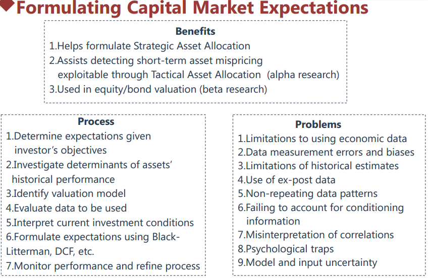
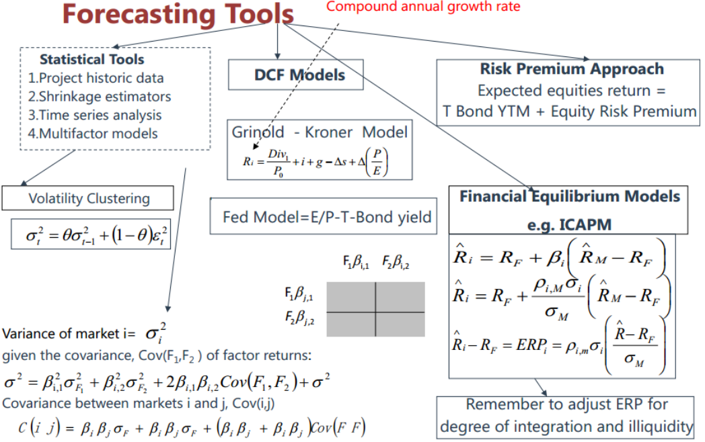
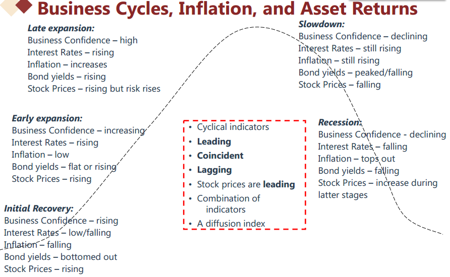
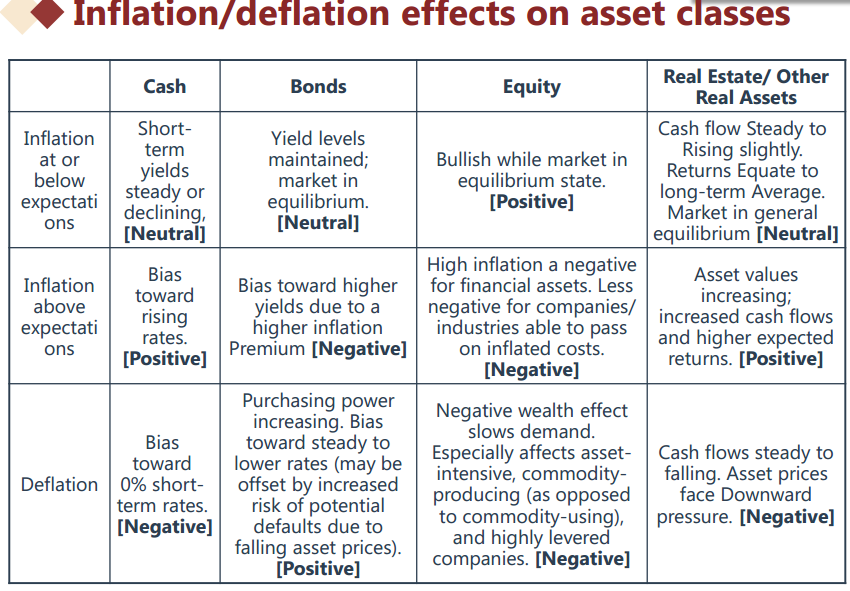
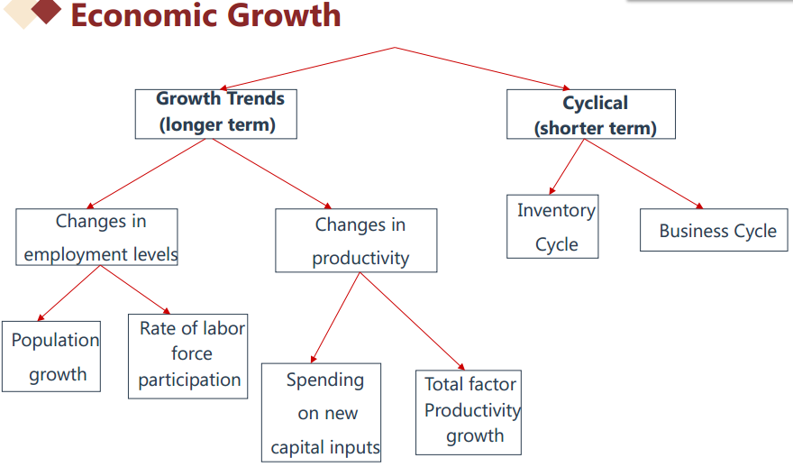
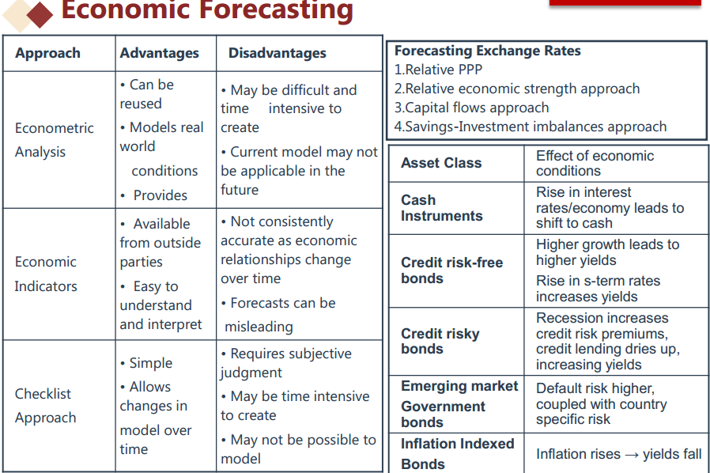
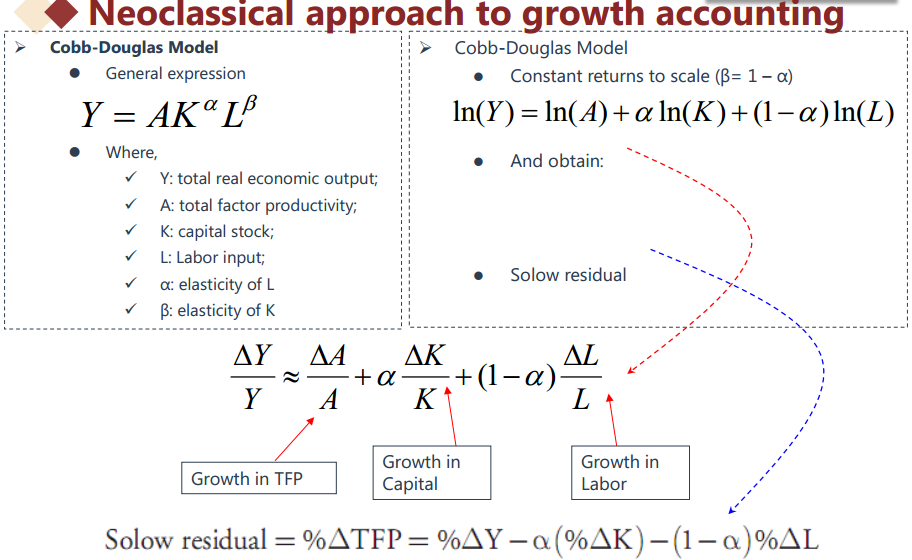
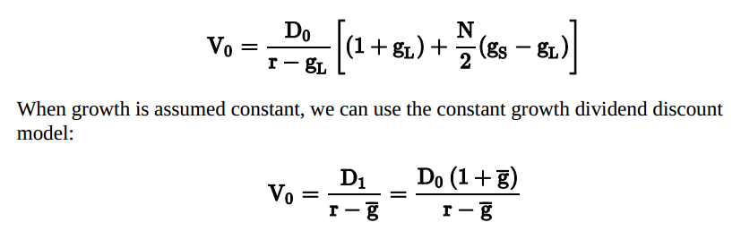
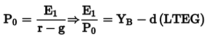
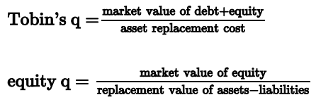

# Reading 16: Capital Market Expectations

## Module 16.1: Formulating Capital Market Expectations

## a: Discuss the role of, and a framework for, capital market expectations in the portfolio management process.

Alpha research
Beta research

7 steps to CME:

## b: Discuss challenges in developing capital market forecasts.

Problems of forecasting
- limitations to using economic data.
  - transcription error
  - survivorship bias
  - appraisal (smoothed) data
- data measurement errors and biases
- limitations of historical returns
  - regime changes and non-stationary
- ex post to determine ex ante
- patterns unlikely to occur
  - data mining
  - time period bias
- fail to account for conditioning information
- misinterpretation of correlation
- psychological traps
  - anchoring
  - status quo
  - confirming evidence
  - overconfidence
  - prudence
  - recallability
- model and input uncertainty

3. Module 16.2: Statistical Tools and Discounted Cash Flow Models

## c. demonstrate the application of formal tools for setting capital market expectations, including statistical tools, discounted cash flow models, the risk premium approach, and financial equilibrium models. 

 - Statistical tools

   - historical return
   - geometric average
   - ERP+bond yield
   - shrinkage estimate (weighted average)
   - Time series model: 
      - volatility clustering: sigma^2=beta*sigma^2+(1-beta)eplison^2
   - multifactor model
   - rigorous approach: Level 1 -> Level 2

 - DCF
   - disadvantage: not account for current market condition, suitable for long term valuation
   - GGM
   - G&K model:
      - expected income return: D1/P0-deltaS
      - expected nominal earning growth: i+g
      - repricing return: delta P/E

## Module 16.3: Risk Premiums, Financial Equilibrium, and Surveys

- Risk premium: R = rf+inflation+default+illiquidity+maturity+tax
- Financial Equilibrium: 
  - ICAPM: Ri=Rf+beta(Rm-Rf) => RPi=Rho*Sigmai*market sharpe ratio
  -  adjust market impeferction (Singer & Terhaar)
    - assuming full integration: ERP=Rho*Sigma*MSR + illiquidity
    - assuming full segmentation: ERP=Sigma*MSR + illiquidity
    - weighted average of the two
    
EXAMPLE: Using market risk premiums to calculate expected returns, betas, and covariancesSuppose an analyst is valuing two equity markets. Market A is a developed market, and Market B is an emerging market. The investor’s time horizon is five years. The other pertinent facts are:

Sharpe ratio of the global investable portfolio 0.29
Standard deviation of the global investable portfolio 9%
Risk-free rate of return 5%
Degree of market integration for Market A 80%
Degree of market integration for Market B 65%
Standard deviation of Market A 17%
Standard deviation of Market B 28%
Correlation of Market A with global investable portfolio 0.82
Correlation of Market B with global investable portfolio 0.63
Estimated illiquidity premium for A 0.0%
Estimated illiquidity premium for B 2.3%

Calculate the assets’ expected returns, betas, and covariance.

Answer:

First, we calculate the equity risk premium for both markets assuming full integration. Note that for the emerging market, the illiquidity risk premium is included:
ERPi = ρi,Mσi(market Sharpe ratio)
ERPA = (0.82)(0.17)(0.29) = 4.04%
ERPB = (0.63)(0.28)(0.29) + 0.0230 = 7.42%

Next, we calculate the equity risk premium for both markets assuming full segmentation:
ERPi = σi(market Sharpe ratio)
ERPA = (0.17)(0.29) = 4.93%
ERPB = (0.28)(0.29) + 0.0230 = 10.42%

Note that when we calculate the risk premium under full segmentation, we use the local market as the reference market instead of the global market, so the correlation between the local market and itself is 1.0.

We then weight the integrated and segmented risk premiums by the degree of integration and segmentation in each market to arrive at the weighted average equity risk premium.
 
ERPi = (degree of integration of i)(ERP assuming full integration) + (degree of segmentation of i)(ERP assuming full segmentation)
ERPA = (0.80)(0.0404) + (1 − 0.80)(0.0493) = 4.22%
ERPB = (0.65)(0.0742) + (1 − 0.65)(0.1042) = 8.47%

The expected return in each market figures in the risk-free rate:

Ra^=5%+4.22%=9.22%
RB^=5%+8.46%=13.46%

The betas in each market, which will be needed for the covariance, are calculated as:
Betai=Rho(i,M) Sigma_i / Sigma_M

BetaA=0.82*17/9=1.55
BetaB=0.63*28/9=1.96

Lastly, we calculate the covariance of the two equity markets:

Cov(i,j)= Betai Betaj Sigma_M^2

Cov(A,B)=1.55*1.96*9.0=246.08

## d. explain the use of survey and panel methods and judgment in setting capital market expectations. 

Capital market expectations can also be formed using surveys. In this method, a poll is taken of market participants (e.g., economists and analysts) to determine what their expectations are regarding the economy or capital market. If the group polled is constant over time, this method is referred to as a panel method.

Surveys have been taken regarding the equity risk premium, with investors expecting a premium in the range of 2% to 3.9%. Other studies have found that the expectations of practitioners are consistently more optimistic than that of academics.

Judgment can also be applied to project capital market expectations. Although quantitative models provide objective numerical forecasts, there are times when an analyst must adjust those expectations using her experience and insight to improve upon those forecasts.

## e. discuss the inventory and business cycles and the effects that consumer and business spending and monetary and fiscal policy have on the business cycle.

Understanding the business cycle can help the analyst identify inflection points where the risk and opportunities for higher return may be heightened. To identify inflection points, the analyst should understand what is driving the current economy and what may cause the end of the current economy.

The inventory cycle is often measured using the inventory to sales ratio. The measure increases when businesses gain confidence in the future of the economy and add to their inventories in anticipation of increasing demand for their output. As a result, employment increases with subsequent increases in economic growth. This continues until some precipitating factor, such as a tightening in the growth of the money supply, intervenes. At this point, inventories decrease, employment declines, and economic growth slows.

## Module 16.4: The Business Cycle

inflection point

cyclical activity:
- GDP: real
- output gap: potential vs current
- recession: decrease over 2 consecutive quarters

inventory cycle: 2-4 years  inventory to sales ratio
business cycle: 9-11 years
 - initial recovery
 - early upswing
 - late upswing
 - slow down
 - recession

Big table for the 5 cycles ==TODO

## f. discuss the effects that the phases of the business cycle have on short-term/longterm capital market returns. 

The relationship between the business cycle and assets returns is well documented.

Assets with higher returns during business cycle lows (e.g., bonds and defensive stocks) should be favored by investors because the return supplements their income during recessionary periods—these assets should have lower risk premiums. Assets with lower returns during recessions should have higher risk premiums. Understanding the relationship between an asset’s return and the business cycle can help the analyst provide better valuations.

|Business cycle | Inflation   | Economic policy     |Market - ST       |Market - LT
|----------------|----------------|-----------------|------------------|-----------|
|Initial recovery|Initially declining inflation|Stimulative| Low or declining|bottoming and bond prices peaking|
|Early upswing    | Low inflation and good economic growth|Less stimulative| Increasing | Bottoming or increasing, bond prices begin to decline|
|Late upswing    |Increasing     |Restrictive        |increasing       |increasing, bond prices declining|
|Slowdown       |accelerate      |less restrictive    | peaking then declining      |peaking then declining, bond prices start to increase|
|Recession      |inflation peaking | Easing           |declining      |declining, bond prices increasing, stock prices begin to increase later in recession|

## g. explain the relationship of inflation to the business cycle and the implications of inflation for cash, bonds, equity, and real estate returns. 

Inflation varies over the business cycle, rising in the latter stages of an expansion and falling during a recession and the initial recovery.

Deflation reduces the value of investments financed with debt (e.g., real estate) because leverage magnifies losses.

Bond prices will rise during a recession when inflation and interest rates are declining.

In a strong expansion, bonds tend to decline in price as inflationary expectations and interest rates rise.

Equities provide an inflation hedge when inflation is moderate. High inflation can be problematic because slow growth may result from central bank action. Declining
inflation or deflation is harmful because this can result in declining economic growth.

Increasing inflation is positive for cash instruments because the returns on cash instruments increase as inflation increases. Deflation is negative for cash because the return falls to zero.

Inflation and asset returns

|Level           |Cash Equivalents |Bonds       | Real Estate   | Equity    |
|----------------|-----------------|------------|---------------|-----------|
|at or below exp |Neutral with stable or declining yield |Neutral with stable or declining yield | Neutral with typical rates of return | Positive with predictable economical growth|
|above exp       |Positive with increasing yields| Negative as rates increase| Positive | Negative|
|Deflation       | Negative (approx 0% interest rate) | Positive (fixed future CF has greater purchase power) | Negative   | Negative  | 

Severe threat of deflation:
- encourage default on debt obligation
- limit the central banks ability to lower interest rate and stimulate the economy. => QE

Consumer spending:
 - seasonal pattern
 - > business spending
 - non-farm payroll + unemployment claims => after tax income => consumer spending
 - savings rate, consumer confidence

Business spending:
 - volatile

## h. demonstrate the use of the Taylor rule to predict central bank behavior. 

## Module 16.5: Monetary Policy and Interest Rates

Taylor rule: rtarget = rneutral + [0.5(GDPexpected − GDPtrend) + 0.5(iexpected − itarget)]

where:
rtarget = short-term interest rate target
rneutral = neutral short-term interest rate. The rate at which a balance between growth and inflation is achieved
GDP expected = expected GDP growth rate
GDP trend = long-term trend in the GDP growth rate
iexpected = expected inflation rate
itarget = target inflation rate

e.g.  Rtarget = 4% + [0.5(0%-2%)+0.5(7%-3%0] 
              = 4% + (-1%+2%)
              = 5%

In this example, the weak projected economic growth calls for cutting interest rates. If inflation were not a consideration, the target interest rate would be 1% lower than the neutral rate. 

However, the higher projected inflation overrides the growth concern because projected inflation is 4% greater than the target inflation rate. 

In net, the target rate is 5% because the concern over high inflation overrides the weak growth concern.

A central bank can use the Taylor rule to determine the appropriate level for short term interest rates.

An investment strategist who expects unanticipated changes in the inputs to the Taylor rule can use the rule to anticipate changes in short-term interest rates by
the central bank.

## i. interpret the shape of the yield curve as an economic predictor and discuss the relationship between the yield curve and fiscal and monetary policy. 

The yield curve demonstrates the relationship between interest rates and the maturity of the debt security and is sensitive to actions of the federal government as well as current and expected economic conditions. For example, 
- when both fiscal and monetary policies are expansive, the yield curve is sharply upward sloping, which indicates that the economy is likely to expand in the future. 
- When fiscal and monetary policies are restrictive, the yield curve is downward sloping, indicating that the economy is likely to contract in the future.

When fiscal and monetary policies are in disagreement, the shape of the yield curve is less definitively shaped. Recall that monetary policy controls primarily short-term interest rates. 
- If monetary policy is expansive while fiscal policy is restrictive, the yield curve will be upward sloping, though it will be less steep than when both policies are expansive. 
- If monetary policy is restrictive while fiscal policy is expansive, the yield curve will be more or less flat.

### Negative interest rate:

Reason: implicit advantage of quick transfer > explicit cost of holding deposits at negative rates

Similar effects as QE (in theory):
- Holders of funds find desirable to spend money
- invest in long term stocks and bonds -> drive up asset prices and create wealth effect
- consumer and business to borrow zero or negative rates to spend now

Complicate the process of forming CME:
- Risk free rate is starting point in buildup model. When risk free rate is negative, the neutral rate is more appropriate for starting point. But neutral rate is not fully risk free, so default risk must be removed.
- CME over shorter time horizon is complicated by the time path over which negative rates will converge to a long-run sustainable risk free rate.
- Shorter term projections of asset class returns is to interpret negative risk free rate as being consistent with contraction or early recovery stage of business cycle.
- Historical data to use as starting point is more problematic because few comparable periods exist. Negative rates suggest significant economic changes are occurring, such regime change makes statistics based on historical data less reliable.
- Negative rates combined with less tested QE make forecasting more challenging.

Fiscal policy
- First, it is not the level of the budget deficit that matters—it is the change in the deficit.
- Second, changes in the deficit that occur naturally over the course of the business cycle are not stimulative or restrictive.

Yield curve:

|Monetary      |Fiscal - Expansive   | Fiscal - Restrictive  |
|--------------|-----------------------|--------------------|
| Expansive    |Sharply upward sloping |moderately steep    |
| Restrictive  | flat                  |Downward sloping = inverted|

## j. identify and interpret the components of economic growth trends and demonstrate the application of economic growth trend analysis to the formulation of capital market expectations. 

In forecasting a country’s long-term economic growth trend, the trend growth rate can be decomposed into two main components and their respective subcomponents:
1. Changes in employment levels.
- Population growth.
- Rate of labor force participation.
2. Changes in productivity.
- Spending on new capital inputs.
- Total factor productivity growth

## k. explain how exogenous shocks may affect economic growth trends. 

Exogenous shocks are unanticipated events that occur outside the normal course of an economy and have a negative impact upon it. They can be caused by different factors, such as natural disasters, political events, or changes in government policies. Typically, two types of shocks have occurred, which are oil shocks and financial crises. 
- Oil shocks are usually caused by crises in the Middle East followed by decreased oil production, leading to increasing prices, inflation, reduced consumer spending, higher unemployment, and a slowed economy. 
- The opposite shock would be a decline in oil prices, leading to lower inflation and boosting the economy. 
- Financial crises have occurred when countries can’t meet their debt payments, currencies are devalued, and property values have declined. In a financial crisis, banks usually become vulnerable, forcing the central bank to provide stability to the economy by reducing interest rates, which is difficult to do in an already low interest rate environment.

## l. identify and interpret macroeconomic, interest rate, and exchange rate linkages between economies. 

Macroeconomic links refer to similarities in business cycles across countries.

Economies are linked by both international trade and capital flows so that a recession in one country dampens exports and investment in a second country, thereby creating a slowdown in the second country.

Exchange rate links are found when countries peg their currency to others. The benefit of a peg is that currency volatility is reduced and inflation can be brought under control.

Interest rates between the countries will often reflect a risk premium, with the weaker country having higher interest rates.

Interest rate differentials between countries can also reflect differences in economic growth, monetary policy, and fiscal policy.

## m. discuss the risks faced by investors in emerging-market securities and the country risk analysis techniques used to evaluate emerging market economies. 

Emerging market risks stem from unstable political and social systems and heavy infrastructure investments financed by foreign borrowing. Investors should answer six questions before investing in these markets:
1. Does the country have responsible fiscal and monetary policies? This is determined by examining the deficit to GDP ratio.
2. What is the expected growth? Should be at least 4%.
3. Does the country have reasonable currency values and current account deficits? A volatile currency discourages needed foreign investment, and an overvalued
currency encourages excessive government borrowing.
4. Is the country too highly levered? Too much debt can lead to a financial crisis if foreign capital flees the country.
5. What is the level of foreign exchange reserves relative to short-term debt? Many emerging country loans must be paid back in a foreign currency.
6. What is the government’s stance regarding structural reform? A supportive government makes the investment environment more hospitable.

## n. compare the major approaches to economic forecasting. 

Econometric analysis utilizes economic theory to formulate the forecasting model. The models range from being quite simple to very complex, involving several data items of various time period lags to predict the future.

Economic indicators attempt to characterize an economy’s phase in the business cycle and are separated into lagging indicators, coincident indicators, and leading indicators. Analysts prefer leading indicators because they help predict the future path of the economy.

In a checklist approach, the analyst checks off a list of questions that should indicate the future growth of the economy. Given the answers to these questions, the analyst can then use his judgment to formulate a forecast or derive a more formal model using statistics.

## o. demonstrate the use of economic information in forecasting asset class returns.

Investors ultimately use capital market expectations to form their beliefs about the attractiveness of different investments. Following are examples of how specific
information can be used to forecast asset class returns.

- If a cash manager thought that interest rates were set to rise, she would shift to short-term cash instruments.
- A change in short-term rates has unpredictable effects for the yields on long-term bonds.
- During a recession, the risk premium on credit risky bonds increases.
- Most emerging market debt is denominated in a non-domestic currency, which increases its default risk.
- The yields for inflation-indexed bonds will fall if inflation increases.
- In the early expansion phase of the business cycle, stock prices are increasing. Later in the expansion, earnings growth and stock returns slow.
- The returns for emerging market stocks are affected by business cycles in the developed world.
- Interest rates affect real estate returns through both the supply and demand as well as the capitalization rate used to discount cash flows.

## p. explain how economic and competitive factors can affect investment markets, sectors, and specific securities. 

When the government promotes competition in the marketplace, the efficiency of the economy increases, likely leading to higher long-term growth in the economy and the stock market.

Shorter-term growth is affected by the business cycle. In a recession, sales and earnings decrease. Non-cyclical or defensive stocks are less affected by the business cycle and thus will have lower risk premiums and higher valuations than cyclical stocks. Cyclical stocks are characterized by high business risk and/or high fixed costs.

## q. discuss the relative advantages and limitations of the major approaches to forecasting exchange rates.

- The relative form of purchasing power parity (PPP) states that differences in inflation between two countries will be reflected in changes in the exchange rate
between them. Specifically, the country with higher inflation will see its currency value decline.
- The relative economic strength approach: The idea behind this approach is that a favorable investment climate will attract investors, which will increase the
demand for the domestic currency, therefore increasing its value.
- The capital flows approach focuses primarily on long-term capital flows such as those into equity investments or foreign direct investments.
- The savings-investment imbalances approach starts with the concept that an economy must fund investment through savings. If investment is greater than
domestic savings, then capital must flow into the country from abroad to finance the investment.

## r. recommend and justify changes in the component weights of a global investment portfolio based on trends and expected changes in macroeconomic factors. 

Be able to discuss how the relationships covered in the previous LOS can be used in assessing relative attractiveness of asset classes (i.e., using historically based estimates of expected return and risk, Singer-Terhaar, phases of the business cycle, and the Taylor rule)

# Reading 17: Equity Market Valuation

## a. explain the terms of the Cobb-Douglas production function and demonstrate how the function can be used to model growth in real output under the assumption of constant returns to scale. 

## b. evaluate the relative importance of growth in total factor productivity, in capital stock, and in labor input given relevant historical data. 

Once we have estimated the growth equation, %ΔY = %ΔA + α %ΔK + (1 − α) %ΔL, we can use the historical growth of capital and labor, along with the estimates of output elasticities for labor and capital, to decompose the growth of GDP in order to evaluate the relative effects of labor growth, capital accumulation, and increases in factor productivity on economic growth.

## c. demonstrate the use of the Cobb-Douglas production function in obtaining a discounted dividend model estimate of the intrinsic value of an equity market.

We assume the growth rate in corporate earnings and dividends is the same as the growth rate in gross domestic product (GDP). If an economy is expected to grow at a particularly high rate of growth for a number of years and then revert to a sustainable growth rate, we apply the H-model:

When growth is assumed constant, we can use the constant growth dividend discount model:

## d. critique the use of discounted dividend models and macroeconomic forecasts to estimate the intrinsic value of an equity market. 

In a top-down forecast, the analyst utilizes macroeconomic factors to estimate the performance of market-wide indicators. Successive steps include identifying sectors in the market and then individual securities that will perform best, given market expectations.

In a bottom-up forecast, the analyst first takes a microeconomic perspective by focusing on the fundamentals of individual firms. For a macro forecast, the analyst can then aggregate the expected performance of individual securities.

To determine which to use, determine the manager’s focus. For example, a macro hedge fund manager who focuses on optimal allocations of global markets or currencies would use a purely top-down approach. An active manager who buys and sells individual securities to capture short-term pricing inefficiency would utilize a bottom-up approach.

## e. contrast top-down and bottom-up approaches to forecasting the earnings per share of an equity market index. 

## f. discuss the strengths and limitations of relative valuation models. 

## g. judge whether an equity market is under-, fairly, or over-valued using a relative equity valuation model. 

### The Fed model

The Fed model assumes the yield on long-term U.S. Treasuries should be the same as the expected operating earnings yield on the S&P 500. When the S&P 500 earnings yield is higher (lower) than the Treasury yield, the interpretation is that the index is too low (high).

The Fed model:
- Does not consider the equity risk premium.
- Ignores growth in earnings.
- Compares a real variable (index level) to a nominal variable (Treasury yield).

### The Yardeni model

The Yardeni model assumes investors value total earnings rather than dividends:

Important considerations include:
- It uses the yield on A-rated corporate debt as the equity risk premium.
- The risk premium used is actually a measure of default risk, not a true measure of equity risk.
- It relies on an estimate of the value investors place on earnings growth (d), which is assumed to be constant over time.
- The growth rate used in the model (LTEG) might not be a fair estimate of longterm sustainable growth.

### CAPE

CAPE: The numerator is the value of the price index, and the denominator is the average of the previous ten years’ reported earnings. Both are adjusted for inflation
using the consumer price index.

Important considerations include:
- It considers the effects of inflation.
- It captures the effects of business cycles.
- Current or expected earnings could provide more useful information.
- It does not consider the effects of changes in accounting rules or methods.
- Very high or low CAPE ratios can persist, limiting its usefulness in forming shortrun expectations.

### Q-Models

Important considerations include:
- Both ratios are mean-reverting.
- Both have demonstrated a negative relationship with equity returns.
- Replacement costs can be difficult to estimate.
- Very high or low ratios can persist, limiting their usefulness in forming short-run expectations.

