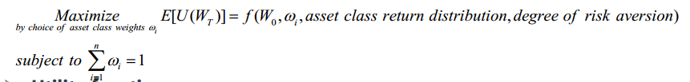
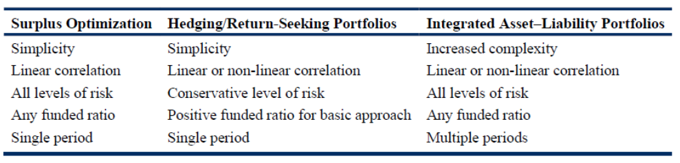
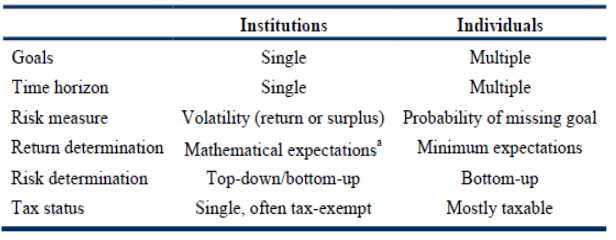

# Study Session 9—Asset Allocation and Related Decisions in Portfolio Management (1)

## Reading 18: Introduction to Asset Allocation

### a. prepare an economic balance sheet for a client and interpret its implications for asset allocation. 

Extended portfolio assets

- For individual investors
  - Human capital (The PV of future earnings)
  - The PV of pension income
  - The PV of expected inheritances

- For institutional investors
  - Underground mineral resources
  - The PV of future intellectual property royalties

Extended portfolio liabilities
- For individual investors
  - The PV of future consumption
- For institutional investors
  - The PV of prospective payouts for foundations

### b. compare the investment objectives of asset-only, liability-relative, and goals-based asset allocation approaches. 

Three broad approaches to asset allocation

- Asset-only: Mean–variance optimization (MVO)
  - focus solely on the asset side of the investor’s balance sheet

- Liability-relative: Funding liabilities => Institution
  - provide for the money to pay liabilities when they come due
  - Liability-driven investing (LDI) is an investment industry term that generally encompasses asset allocation that is focused on funding an investor’s liabilities 

- Goals-based: Achieving the goals => Individual
  - specify asset allocations for sub-portfolios, each of which is aligned to specified goals ranging from supporting lifestyle needs to aspirational
  - Goals-based investing (GBI) is an investment industry term that encompasses the asset allocation focused on addressing an investor’s goals

Liability-relative: Distinctions between liabilities for an institutional investor and goals for an individual investor
- Liabilities of institutional investors are legal obligations or debts, whereas goals, such as meeting lifestyle or aspirational objectives, are not; This suggests that penalties for not meeting liabilities are much higher for liability-relative approaches
- Whereas institutional liabilities, such as life insurer obligations or pension benefit obligations, are uniform in nature (all of a single type), constant and numerous, an individual’s goals may be many and varied;
- Liabilities of institutional investors of a given type (e.g., the pension benefits owed to retirees) are often numerous and so, through averaging, may often be forecast with confidence. In contrast, individual goals are not subject to the law of large numbers and averaging;

| Asset Allocation Approach |Relation to Economic Balance Sheet |Typical Objective |Typical Uses and Asset Owner Types|
|---------|----------------                |---------|----------------                |
|Asset-only | Does not explicitly model liabilities or goals|Maximize Sharpe ratio for acceptable level of volatility| Liabilities or goals not defined and/or simplicity is important     - Some foundations, endowments     - Sovereign wealth funds     - Individual investors|
|Liability relative |Models legal and quasiliabilities | Fund liabilities and invest excess assets for growth|Penalty for not meeting liabilities high     - Banks     - Defined benefit pensions     - Insurers|
|Goals based |Models goals |Achieve goals with specified required probabilities of success |Individual investors|

### c. contrast concepts of risk relevant to asset-only, liability-relative, and goals-based asset allocation approaches. 

Asset-only
- Primary measure of risk: volatility (standard deviation) of portfolio return
- Other risk sensitivities:
  - Risk relative to benchmarks: tracking risk (tracking error)
  - Downside risk
    - semi-variance
    - peak-to-trough maximum drawdown
    - measures focusing on the extreme (tail) segment of the downside: Value at risk (VaR)

Liability-relative
- Shortfall risk
- Volatility of contributions needed to fund liabilities
- The standard deviation of the surplus 

Goal-based
- Maximum acceptable probability of not achieving a goal

### d. explain how asset classes are used to represent exposures to systematic risk and discuss criteria for asset class specification. 

Three “super classes” of assets:
- Capital assets. An ongoing source of something of value (e.g. I/Div.); can be valued by NPV.
- Consumable/transformable assets. Such as commodities, can be consumed or transformed, as part of the production process, into something else of economic value, but which do not yield an ongoing stream of value.
- Store of value assets. Currencies and art. Economic value is realized through sale or exchange

Criteria for specifying asset classes for the purpose of asset allocation
- Assets within an asset class should be relatively homogeneous;
- Asset classes should be mutually exclusive;
- Asset classes should be diversifying;
- The asset classes as a group should make up a preponderance of world investable wealth;
- Asset classes selected for investment should have the capacity to absorb a meaningful proportion of an investor’s portfolio.

### e. explain the use of risk factors in asset allocation and their relation to traditional asset class–based approaches. 

Investors select asset classes based on their desired exposure to common risk factors.

Examples of risk factors include volatility, liquidity, inflation, interest rates, duration, foreign exchange, and default risk. 

Risk factor exposures may overlap across multiple asset classes. 

Examining these overlapping risk factors can help investors identify the correlations among asset classes.

### f. select and justify an asset allocation based on an investor’s objectives and constraints. 

Strategic asset allocation is long term in nature; hence, the weights are called targets and the portfolio represented by the strategic asset allocation is called the policy portfolio.

Selecting and justifying a strategic asset allocation based on investor objectives and constraints is outlined in the following nine steps:

1. Determine investor objectives.
2. Determine investor tolerance for risk.
3. Determine investor time horizon(s).
4. Determine investor constraints.
5. Select the asset allocation approach.
6. Specify the asset classes.
7. Develop potential asset allocations.
8. Simulate results of potential asset allocations.
9. Repeat Step 7 until the optimal asset allocation is discovered

### g. describe the use of the global market portfolio as a baseline portfolio in asset allocation. 

Global market portfolio sums all investable assets (global stocks, bonds, real estate, and so forth) held by investors, and reflects the balancing of supply and demand across world markets.
- Minimize non-diversifiable risk
- The available portfolio that makes the most efficient use of the risk budget
- As a reference point for a highly diversified portfolio
- Mitigate investment biases, such as home-country bias

Global market-value weighted portfolio should be considered as a baseline asset allocation.

### h. discuss strategic implementation choices in asset allocation, including passive/active choices and vehicles for implementing passive and active mandates.

The SAA can be implemented with passive or active management for both asset class weights and allocations within asset classes.

TAA introduces active decisions to deviate from the SAA in an effort to add value, but it is likely to increase error.

Strategic asset allocation / Policy portfolio
- an asset allocation that is expected to be effective in achieving an asset owner’s investment objectives, given his or her investment constraints and risk tolerance, as documented in the investment policy statement

Optimal asset allocation

 Utility function
- Mean-variance utility:

U=E(r_p)-1/2 lambda sigma_p^2

- Optimal allocation to the risky asset

omega^*=1/lamba * [(miu-r_f)/sigma^2]

Active management security selection is based on investor insights or expectations.

To better understand the degree of passive/active management in a portfolio, we can view decisions along a spectrum from most passive to most active:

1. The most passive approach would include buying and holding a self-rebalancing, broad index of risky assets, such as the global market portfolio. 

2. Tilting the allocation toward a certain investment style index (e.g., growth equity index) is slightly more active given that it involves an active decision, but it still uses the passive implementation of indexing.

3. The next step toward a more active approach would involve taking a growth investment approach while using security selection to enhance returns. 

4. The most active approach would include unconstrained mandates where the portfolio is not managed with regard to traditional benchmarks.

#### Factors affect decision

The decision of where to invest along the active/passive spectrum depends on the following factors:

- Availability of appropriate investments (e.g., a relevant index).
- Active management scalability in terms of value added from each active decision. (太小规模和太大规模都无法操作)
- Investor constraints, such as social and environmental concerns, when using a passive approach. (e.g. ESG investing criteria与现有指数产品不符合)
- An investor belief in efficient markets, which would discourage the use of active management.
- The cost-benefit tradeoff where additional transaction costs are needed for achieving excess returns.
- The tax status of investors, which differs between taxable and tax-exempt investors

#### Risk budgeting

Risk budgeting specifies which risks and how much of each risk can be taken. Active risk budgeting specifies risk as allowable deviations from the portfolio’s benchmark.

### i. discuss strategic considerations in rebalancing asset allocations. 

The primary benefit of rebalancing is maintaining the investor’s desired exposure to systematic risk factors. 

Rebalancing also provides discipline. “Letting it ride” can lead to the failure to realize the gains from temporarily overvalued securities before they fall back to their true values. 

Rebalancing is the discipline of adjusting portfolio weights to more closely align with the strategic asset allocation.
- Approaches to rebalancing
  - Calendar rebalancing: on a periodic basis

    - The primary benefit to calendar rebalancing is that it provides discipline without the requirement for constant monitoring.
    - The drawback is that the portfolio could stray considerably between rebalancing dates and return to its strategic allocation ranges on the rebalancing date. 
    - In other words, rebalancing is related to the passage of time rather than the value of the portfolio.

  -  Percent-range rebalancing
    - Trigger points or Rebalancing range (or corridor)
    - Benefit: range-based rebalancing provides the benefit of minimizing the degree to which asset classes can violate their allocation corridors. 
    - Cost is increased by the time and expense of constantly monitoring the portfolio (as compared to only checking valuations on the specified calendar dates) and by potentially more frequent trading

- Frequency of the portfolio valued
  - The more frequent the monitoring, the greater the precision in implementation

#### Strategic considerations

|Considerations                       | Rebalancing ranges                                               |
|---------------------------------------|--------------------------------------------------------------------|
|Transaction costs                 |Higher costs, wider ranges                                      |
|Risk-aversion                         |More risk-averse, narrower ranges                        |
|Asset class correlation        | Less correlated, narrower ranges in case further divergence|
|Beliefs in momentum favor/ mean reversion|Beliefs in momentum, wider ranges; Mean reversion,narrower ranges|
|Liquidity                                  |Illiquid investments complicate rebalancing,commonly wider ranges|
|Volatility                                | Higher volatility makes divergences from the strategic asset allocation more likely, thus narrower ranges|
|Taxes                                    |Encourage asymmetric and wider rebalancing ranges, range may be less below a certain target weight than above for example, 25%->(24%,28%)|
|Derivative                              |Synthetically rebalance a portfolio. Results in lower transaction costs, lower taxes, easier and quicker|

## Reading 19: Principles of Asset Allocation

1. Exam Focus
2. Module 19.1: Basic Mean-Variance Optimization

The candidate should be able to:

### a. describe and critique the use of mean–variance optimization in asset allocation.

MVO requires three sets of inputs: returns, risks (standard deviations), and pair-wise correlations for the assets in the opportunity set, and the objective function expressed as follows:

Um=E(Rm)-1/2 lambda Var_m

There are some issues to consider:

- Non-constraint vs no negative weights;
  - The simplest optimization places no constraints on asset class weights except the budget constraint that weights sum to 1.
  - The non-negativity constraint leads to corner-portfolio EF.
- Only risky asset vs separating out cash and cash equivalent as risk-free asset (non-constraint).
  - Cash is treated as risky asset → risky-asset EF
  - Cash and cash equivalent are treated as risk-free assets → linear EF (CML)

Strengths
- Most common and widely used
- Basis for more sophisticated approaches

#### Criticism of MVO

Weaknesses
- GIGO
- The asset allocations tend to be highly concentrated in a subset of the available asset classes; (add constraints)
- The outputs (asset allocations) are highly sensitive to small changes in the inputs; (Resampled MVO, Reversed MVO and Black-Litterman Model)
- Investors are often concerned with characteristics of asset class returns such as skewness and kurtosis that are not accounted for in MVO; (Non-normal optimization approaches)
- The MVO may ignore the effect of illiquidity (Three additional methods)
- While the asset allocations may appear diversified across assets, the sources of risk may not be diversified; (Risk budgeting and Factor-based model)
- MVO is a single-period framework that does not take account of trading/ rebalancing costs and taxes;(MCS method)
- MVO allocations may have no direct connection to the factors affecting any liability or consumption streams;

| No                   |Criticism                                  |Solution                                                  |
|--------------------|----------------------------------------|---------------------------------------------------|
|1                       | GIGO                                       | Improving quality of inputs (reverse optimization & Black-Litterman model); adding more constraints; resampling MVO|
|2                    | Concentrated asset allocation| Improving quality of inputs(reverse optimization & Black-Litterman model); adding more constraints; resampling MVO |
|3                    | Skewness and kurtoisis           | Use asymmetric riks eg CVAR|
|4                    | Risk diversification                    | Risk parity|
|5                    | Ignore liability                            | Surplus optimization, Two-portfolio approach, Integrated asset-liability |
|6                    | Single period framework         | MCS|

#### Adding constraints:

There are two primary reasons (advantage) practitioners typically apply additional constraints:
- To incorporate real-world constraints into the optimization problem ;
- And to help overcome some of the potential shortcomings of mean–variance optimization elaborated above (input quality, input sensitivity, and highly concentrated allocations).

Disadvantage: If a very large number of constraints are imposed, one is no longer optimizing but rather specifying an asset allocation through a series of binding constraints.

When running an optimization, in addition to the typical budget constraint and the non-negativity constraint, one can impose additional constraints.
- ***fixed*** asset allocation, eg 30% to real estate or 45% to human capital
- asset allocation ***range***, eg the emerging market allocation must be between 5% and 20%
- ***upper*** limit to address liquidity issues, such as private equity or hedge funds
- ***relative*** allocation between asset classes,  eg., the allocation to emerging market equities must be less than the allocation to developed equities
- ***liability-relative*** : require an allocation to hedge the liability

#### resampling

Resampled mean–variance optimization combines Markowitz’s mean–variance optimization framework with Monte Carlo simulation and, all else equal, leads to more-diversified asset allocations.

- start with basic MVO
- MCS to generate thousands of random variations of the inputs, resulting in efficient frontier
- resampleed EF is an average of all the simulated EF

Criticisms including thefollowing:
- Some frontiers have concave “bumps” where expected return decreases as expected risk increases;
- The “riskier” asset allocations are overdiversified;
- The asset allocations inherit the estimation errors in the original inputs; and
- The approach lacks a foundation in theory

#### Reversed optimization

Reverse optimization is a powerful tool that helps explain the implied returns associated with any portfolio. It can be used to estimate expected returns for use in a forward-looking optimization.

- Reverse optimization takes as its inputs a set of asset allocation weights of global market portfolio that are assumed to be optimal and with additional inputs of covariance and the risk aversion coefficient, solves for expected returns (also called implied returns).

- Some practitioners will find the link between reverse optimization and CAPM equilibrium elegant.
  - First, use the weights associated with the asset classes (or various indexes) to form a working version of the global market portfolio;
  - And use the beta of each asset relative to our working version of the global market portfolio;
  - Then to infer what expected returns would be if all assets were priced by the CAPM according to their market beta. Where, we assume a risk-free rate of 2.5% and a global market risk premium of 4%;
  - Run a new MVO;

#### Black–Litterman model 

- The Black–Litterman model has helped make the MVO framework more useful. It enables investors to combine their unique forecasts of expected returns with reverse optimized returns in an elegant manner.
  - Starts with excess returns (in excess of the risk-free rate) produced from reverse optimization;
  - And then provides a technique for altering reverse-optimized expected returns in such a way that they reflect an investor’s own distinctive views.
  - A new MVO is run.

- Deriving expected returns by reverse optimization or by reverse optimization tilted toward an investor’s views on asset returns (the BlackLitterman model) is one means of addressing the tendency of MVO to produce efficient portfolios that are not well diversified.

- Reverse optimization and the Black–Litterman model address the issue of MVO’s sensitivity to small differences in expected return estimates by anchoring expected returns to those implied by the asset class weights of a proxy for the global market portfolio.

#### Non-normal distribution

A normal distribution is fully explained by the first two moments because the skewness and (excess) kurtosis of the normal distribution are both zero.

- Unfortunately, variance or standard deviation is an incomplete measure of risk when returns are not normally distributed. Investor preferences may go beyond the first two moments (mean and variance) of a portfolio’s return distribution. The third and fourth moments are, respectively, skewness and kurtosis.

  - Skewness measures the degree to which return distributions are asymmetrical
  - Kurtosis measures the thickness of the distributions’ tails (i.e., how frequently extreme events occur)

- A number of variations of these more sophisticated optimization techniques have been put forth, most of them consider the non-normal return distribution characteristics and use a more sophisticated definition of risk, such as:
  - Mean–semivariance optimization
  - Mean–conditional value-at-risk optimization
  - Mean–variance-skewness optimization
  - Mean–variance-skewness-kurtosis optimization

### b. recommend and justify an asset allocation using mean–variance optimization.

### c. interpret and critique an asset allocation in relation to an investor’s economic balance sheet. 

A significant portion of the typical investor’s asset portfolio is 

- human capital and also 

  - For investors who have ***stable*** jobs with consistent wages that increase with inflation, we can model the cash flows associated with human capital (future wages) as an
inflation-linked bond. 
  - For individuals with less certain and more ***volatile*** future wages, we could model their human capital as a mix of inflation-linked bonds, equities, and corporate bonds. 
  - By including this source of economic value in the investor’s portfolio, the individual’s capacity to take on additional risk is increased. Because human capital is ***not tradable***, one of the constraints must be to ***set the percentage*** allocation to human capital at whatever it is currently valued at in relation to the investor’s total portfolio value.

- the residential real estate property the investor owns and lives in. 
  - with return and risk inputs estimated using a residential real estate property index
  - allocation to the property must be constrained to its current value

We can adapt the MVO framework to incorporate these kinds of assets into the analysis by estimating the expected return and risk inputs for these assets and constraining the allocations to match current values.

### d. discuss asset class liquidity considerations in asset allocation. 

Definition
- Liquid asset classes: such as publicly listed equities and bonds.
- Less liquid asset classes: such as direct real estate, infrastructure, and private equity.

Why difficult
- When make asset-allocation decisions, there are two problems for the less liquid asset classes:
  - Due to the lack of accurate indexes, it is more challenging to make capital market assumptions for these less liquid asset classes 
  - Even if there were accurate indexes, there are no low-cost passive investment vehicles to track them.
  - The risk-return characteristics of a specific real estate, private equity, or infrastructure investment are different from those of its asset class. Its risk and return characteristics reflect both systematic and nonsystematic risk.

To address these issues:
- Exclude illiquid asset classes when running an MVO, but use them to meet separately set target asset allocations.
- Include the illiquid asset classes in MVO and model the inputs of the specific (not asset class) investments you plan to use (i.e., the risk estimate will be based on both nonsystematic and systematic).
- Include the illiquid asset classes in MVO using highly diversified asset class inputs, recognizing that the actual investments made may have different characteristics. 

### e. explain absolute and relative risk budgets and their use in determining and implementing an asset allocation. 

The goal of risk budgeting is to maximize return per unit of risk, where we can define risk as total portfolio risk, active risk, or residual risk.

Marginal contribution to total risk:

MCTRi = (beta of asset classi with respect to the portfolio)(total portfolio risk as measured by standard deviation)

Absolute contribution to total risk:

ACTRi = (weighti)(MCTRi) % of risk contributed by positioni 
             = ACTRi / total portfolio risk

By estimating each asset classes’ marginal contribution to total risk (MCTR), we can 

(1) see what happens to portfolio risk as we change individual allocations, 

(2) identify optimal allocations: The optimal allocations to each asset class occur when the ratio of excess return to MCTR is equal for all asset classes and is equal to the portfolio Sharpe ratio. 

(3) develop a risk budget.

 $ MCTR_i=\beta_i * \sigma_p $

 $ ACTR_i=\omega_i * MCTR_i $

Optimal:

 $ ExcessReturn_i/MCTR_i= ExcessReturn_j/MCTR_j=SR_p $

#### Risk budget
A risk budget is simply a particular allocation of portfolio risk. The goal of risk budgeting is to maximize return per unit of risk—whether overall market risk or active risk.
- The risk budgeting process is the process of finding an optimal risk budget.
  -  The marginal contribution to total risk (MCTR) identifies the rate at which risk would change with a small (or marginal) change in the current weights.

MCTRi =  βi × σ p

  -  The absolute contribution to total risk (ACTR) for an asset class measures how much it contributes to portfolio return volatility.

ACTR =wi x MCTR   = wi × βi × σp

  - Excess return=expected return - risk-free rate
    - Sometimes, it is based on reverse-optimized returns

  - An asset allocation is optimal when the ratio of excess return (over the risk-free rate) to MCTR is the same for all assets and matches the Sharpe ratio of the tangency portfolio.
    - Ratio of excess return to MCTR=(Expected return – Risk-free rate)/MCTR
    - Critically, beta takes account not only of the asset’s own volatility but also of the asset’s correlations with other portfolio assets.
  - The objective of risk budgeting in asset allocation is to use risk efficiently in the pursuit of return. A risk budget specifies the total amount of risk and how much of that risk should be budgeted for each allocation.

#### Risk parity

- Risk parity portfolio
  - A risk parity asset allocation is based on the notion that each asset (asset class or risk factor) should contribute equally to the total risk of the portfolio for a portfolio to be well diversified.

wi x Cov(ri,rp)=1/n σp^2                      ACTR= wi × βi × σp = 1/n  × σp

- Construct the overall portfolio
  - Deriving a risk parity–based asset allocation (risk parity portfolio)
  - Borrow or to lend so that the overall portfolio corresponds to the investor’s risk appetite.

Advantage
- The sources of risk are diversified (asset classes)
-  Back tests of levered risk parity portfolios have produced promising results

Disadvantage
- It ignores expected returns
- The contribution to risk is highly dependent on the formation of the opportunity set (fixed-income vs equity)
- Back tests argue that they suffer from look-back bias
- Dependent on the ability to use extremely large amounts of leverage at low borrow rates (which may not have been feasible)

### f. describe how client needs and preferences regarding investment risks can be incorporated into asset allocation. 

Ways to incorporate client risk preferences into asset allocation include:
- Specifying additional constraints.
- Specifying a risk aversion factor for the investor.
- Using Monte Carlo simulation.

### g. discuss the use of Monte Carlo simulation and scenario analysis to evaluate the robustness of an asset allocation.

Monte Carlo simulation can be used to 

- (1) address the limitations of MVO 
  - as a single period model and 
  - the related issues of rebalancing and taxes (realized C/G) in a multiperiod framework (interim cash flow) and 
(2) guide individual investors to identify their risk tolerance level.

Monte Carlo simulation complements MVO by addressing the limitations of MVO as a single-period framework.
- MCS can help paint a realistic picture of potential future outcomes, including the likelihood of meeting various goals, the distribution of the portfolio’s expected value through time, and potential maximum drawdowns.
- Monte Carlo simulation can effectively grapple with a range of practical issues that are difficult or impossible to formulate analytically.
  -  Rebalancing and taxes: In the multi-period world, rebalancing triggers the realization of capital gains and losses. Given a specific rebalancing rule, different SAAs will result in different patterns of tax payments.
  -  Path dependent: Investors save/deposit money in and spend money out of their portfolios; thus, in the more typical case, terminal wealth is path dependent because of the interaction of cash flows and returns.

### h. describe the use of investment factors in constructing and analyzing an asset allocation. 

Factor-based asset allocation also requires three sets of inputs: returns, risks (standard deviations), and pair-wise correlations for these factors in the opportunity set, in order to get an optimized solution.
- MVO and more sophisticated approaches that overcome some of the limitations or weaknesses of as applied to an opportunity set consisting of ***traditional, non-overlapping***  asset classes.
- An alternative approach used by some practitioners is to move away from an opportunity set of asset classes to an opportunity set consisting of investment ***factors*** , or factor-based asset allocation.

The factors are typically similar to the fundamental (or structural) factors in widely used multi-factor investment models. Typical factors used in asset allocation include size, valuation, momentum, liquidity, duration (term), credit, and volatility.
- Returns can be combined from shorting large-cap stocks and going long small-cap stocks, for an example, “Size factor return = Small-cap stock return – Large-cap stock return”.
  - Constructing factors in this manner removes most market exposure from the factors because of the short positions that offset long positions.
- Pair-wise correlations between factors are smaller than that of asset classes.

R= RF+βmkt,j*(Rmkt-RF)
            +βSMB,j*(Rsmall-Rbig)
            +βHML,j*(Rhbm-Rlbm)

### i. recommend and justify an asset allocation based on the global market portfolio.

### j. describe and evaluate characteristics of liabilities that are relevant to asset allocation. 

Liability-relative asset allocation is aimed at the general issue of rendering decisions about asset allocation in conjunction with the investor’s liabilities.
- Liability-relative investors view assets as an inventory of capital, which is available to achieve goals and to pay future liabilities.
- Were developed in an institutional investor context, but these ideas have also been applied to individual investors.
  - Because many large institutional investors possess legal liabilities and operate in regulated environments in which an institution’s inability to meet its liabilities with current capital has serious consequences.

Liability-relative Asset Allocations Methods include:
1. Surplus optimization
2. Hedging/Return-seeking Portfolio Approach
3. Integrated asset-liability Approach

The plan surplus and the funding ratio are calculated as follows:

plan surplus = market value of investment portfolio assets − present value of the pension liabilities

funding ratio = market value of assets / present value of liabilities

The following characteristics of liabilities are relevant to the asset allocation decision:
- Fixed versus contingent: Fixed liabilities have cash flows whose amount and timing are specified in advance, such as a fixed-rate corporate bond. Contingent liabilities have cash flows that depend on uncertain future events, such as the pension liability associated with a defined pension plan.
- Legal versus quasi-legal: Legal liabilities are obligations defined in a legal agreement. Quasi-legal liabilities are not legal obligations but are cash outflows expected to occur in the future and are essential to the mission of the institution. University endowments can be considered to have quasi-legal liabilities.
- Duration and convexity measure the change in value of a liability for a given change in interest rates. In the CFA curriculum, we typically talk about durationand convexity in relation to fixed-income securities, but the concept can be applied to any liability.
- Liability value versus size of sponsoring organization: A large liability in relation to the size of the sponsoring organization will necessarily be accounted for in the asset allocation decision; a small liability can usually be ignored as its effect on the optimal asset allocation is minimal.
- Factors that affect future cash flows: These factors include inflation, interest rates, risk premiums, and other economic conditions. DB pension obligations are
influenced by the choice of the discount rate, for example.
- Timing considerations, including longevity risk.
- Regulations affecting the determination of the liability’s value, typically found in the insurance industry

### k. discuss approaches to liability-relative asset allocation. 

### l. recommend and justify a liability-relative asset allocation. 

Three approaches to liability-relative asset allocation. They are summarized:
- Surplus optimization: This is an extension of MVO in which we determine an efficient frontier based on the surplus with its volatility as our measure of risk,
stated either in money or percentage terms.
- Two-portfolio approach: In this approach, we separate the asset portfolio into two subportfolios: a hedging portfolio and a return-seeking portfolio.
- Integrated asset-liability approach: This approach integrates both the assets and the liabilities in a joint optimization method.

#### Surplus Optimization
We can define the surplus return as:

Rs,m = surplus return = (change in asset value − change in liability value) / initial asset value

Then the objective function to maximize is:

Um = E(Rs,m) − 0.005 × λ × Vars,m

where:

E(Rs,m) = expected surplus return

Vars,m = variance of surplus return

We then proceed with the same MVO as previous, except we also include the expected returns and variances of the liabilities. The correlations reflect the extent to which the assets are useful to hedge the liabilities.

Expected returns and variances of liabilities
- We assume that the liabilities have the same expected returns and volatilities as US corporate bonds;
- An alternative approach is to deploy a set of underlying factors that drive the returns of the assets.

- Asset liability management (ALM) considers the allocation of assets with respect to a given liability or set of liabilities.
- The ALM approach maximize the difference (the surplus) between assets and liabilities at each level of risk (much like the efficient frontier represents the maximum return at each level of risk).

The comparison between the two asset mixes (asset-only and surplus):
- The asset mixes are very different on the conservative side of the two frontiers.
  - The most conservative mix for the surplus efficient frontier consists mostly of the US corporate bond index because it results in the lowest volatility of surplus over the one-year horizon.
  - In contrast, the most conservative mix for the asset-only efficient frontier consists chiefly of cash.
- The two asset mixes (asset-only and surplus) become similar as the degree of risk aversion decreases, and they are identical for the most aggressive portfolio (private equity).
- Bonds disappear from the frontier about halfway between the most conservative and the most aggressive mixes.

#### Hedging/Return-seeking Portfolio Approach

In this approach, the liability-relative asset allocation task is divided into two parts, thus this approach is also called two-portfolio approach.
- We distinguish as “basic” the two-portfolio approach in the case in which there is a surplus 
  - In the basic case, the first part of the asset allocation task consists of hedging the liabilities through a hedging portfolio.
  - In the second part, the surplus (or some part of it) is allocated to a return-seeking portfolio, which can be managed independently of the hedging portfolio (e.g. using MVO).
- And as “variants” the approach as applied when there is not a positive surplus
  - A partial hedge, whereby capital allocated to the hedging portfolio is reduced in order to generate higher expected returns
  - And dynamic versions whereby the investor increases the allotment to the hedging portfolio as the funding ratio increases.

Compared to basic approach
- These variants do not hedge the liabilities to the full extent possible given the assets and thus are less conservative than the basic approach discussed above.
- Still, there can be benefits to a partial hedge when the sponsor is able to increase contributions if the funding ratio does not increase in the future to 1 or above.

An essential issue involves the composition of the hedging portfolio
- The designated cash flows can be hedged via cash flow matching, duration matching, or immunization, e.g. frozen DB pension plan.
- What’s the most important is the hedging portfolio must include assets whose returns are driven by the same factors that drive the returns of the liabilities.

There are two limitations of this approach:
- If the funding ratio is less than one, it’s difficult to create a hedging portfolio that completely hedges the liabilities.
  - In this case, the sponsor might increase contributions enough to generate a positive surplus.
  - Or applications of variants of the two-portfolio approach are possible, such as partial hedge variant.
- A hedging portfolio may not be available to hedge certain kinds of risk (like earthquakes).
  - In these cases, the investor might be able to partially hedge the portfolio with instruments that share some of the same risks. The investor has “basis risk” when imperfect hedges are employed.
  - As an aside, the investor might be able to set up a contract with someone who, for a fee, will take on the liability risk that cannot be hedged. Insurance contracts have this defining characteristic.

#### integrated asset liability approach 

- The approach, integrating the liability portfolio with the asset portfolio, requires a formal method for selecting liabilities and for linking the asset performance with changes in the liability values.
  - The previous two approaches are most appropriate when asset allocation decisions are made after, and relatively independently of, decisions regarding the portfolio of liabilities.
  - However, the integrated asset-liability approach integrates and jointly optimizes asset and liability decisions.
    - Loss in stress scenarios in banks
    - Catastrophic risk in property/casualty insurance company
- This approach can be implemented in a factor-based model, linking the assets and liabilities to the underlying driving factors.
- It has the potential to improve the institution’s overall surplus.

#### Comparing

Surplus optimization and the hedging/return-seeking portfolio
- The surplus optimization approach links assets and the present value of liabilities through a correlation coefficient. The two-portfolio model does not require this input.
- Implementation of the basic two-portfolio approach depends on having an overfunded plan. A variant of the two-portfolio approach might be applied, however.
- Surplus optimization does not require an overfunded status. Both approaches address the present value of liabilities, but in different ways.

### m. recommend and justify an asset allocation using a goals-based approach. 

The goals-based approach is useful for individual investors, who typically have a number of (sometimes conflicting) objectives, with different time horizons and different levels of urgency.
- The investor’s portfolio is composed of subportfolios, and each investment goal is addressed individually with these subportfolios.
- Taxable and tax-exempt investments are part of the opportunity set.
- Minimum expectations are specified for each goal

### n. describe and critique heuristic and other approaches to asset allocation. 

Additional ad hoc approaches to asset allocation include:
- 120 minus your age.
  - 120 – Age = Percentage allocated to stocks, which leads directly to an age-based stock versus fixed income split
  - The heuristic lines lack some of the nuances of the various glide path lines, but it would appear that an age-based heuristic leads to asset allocations that are broadly similar to those used by target-date funds.
- 60/40 split.
  - An asset allocation consisting of 60% equities and 40% fixed income.
  - Equity allocation: supplying a long-term growth foundation; fixedincome allocation: risk reduction benefits
  - There is some evidence that the global financial asset market portfolio is close to this prototypical 60/40 split.
- Endowment model or Yale model.
  - High allocations to non-traditional assets
  - A commitment to active management
  - Seeks to earn illiquidity premiums
  - Endowments with long time horizons are well positioned to capture
- Risk parity.
  - The idea with the risk parity asset allocation approach is that diversification is achieved by ensuring that each asset class contributes the same amount to the total portfolio risk.
  - This addresses critique 4 of MVO that diversification across asset classes does not guarantee diversification across risk sources.
  - The criticism of this approach is that it ignores expected returns and focuses only on risk.
- 1/N rule
  - In empirical studies comparing approaches, however, the 1/N rule has been found to perform considerably better, based on Sharpe ratios and certainty equivalents, than theory might suggest. One possible explanation is that the 1/N rule sidesteps problems caused by optimizing when there is estimation error in inputs.

### o. discuss factors affecting rebalancing policy. 

The following indicate wider corridors for asset classes:
- Higher transaction costs.
- Higher investor risk tolerance.
- Higher correlation of the asset class with the rest of the portfolio.
- Higher volatility of asset classes indicates a narrower corridor to control risk.

Ultimately, the choice of corridor width depends on a trade-off between risk control, transaction costs, and correlations between classes. 

In complex situations, a quantified cost-benefit analysis will be required.

#### Issues with individuals

Human capital: 
- consistent wages: model as an inflation-linked bond
- less certain and volatile wages: mix of inflation-linked bonds, equities and corporate bonds
- Constraint: HC not tradable, so percentage is current value

Residential real estate:
- Return and risk estimated using a residential RE property index
- Allocation constraint at current value

#### MCS
Can be used to:
- Address the limitation of single period: consider tax, interim cash flows in multiple period framework. = simulate future return paths over time.
- Guide individuals for risk tolerance level, illustrate range and likelihood of possible outcomes given various assumptions.

# Study Session 10—Asset Allocation and Related Decisions in Portfolio Management (2)

## Reading 20: Asset Allocation With Real-World Constraints

1. Exam Focus
2. Module 20.1: Real World Issues
3. Module 20.2: Adjusting the Strategic asset allocation
4. Module 20.3: Behavioral Issues

The candidate should be able to:

### a. discuss asset size, liquidity needs, time horizon, and regulatory or other considerations as constraints on asset allocation. 

#### Asset size

Economies and diseconomies of scale
- The advantages subject to large assets are:
  - Have sufficient size to build a diversified portfolio of investment strategies.
- The disadvantages subject to large assets are:
  -  The illiquidity occurred when invest in small-cap stocks, either buy or sell;
  -  Invest in small-cap stock will cause the market wildly fluctuate;
  -  Capital inflow may cause active investment managers to pursue ideas outside of their core investment thesis;
  -  Organizational hierarchies may slow down decision making and reduce incentives.

- The disadvantages subject to small assets are:
  -  Insufficient amount to meet the minimum requirement for some investments;
  -  Lower governance capacity-sophistication and manpower resourceto develop the required knowledge base for complex asset classes and investment vehicles;
  -  Higher internal management fees;
  -  Too small to diversify across the range of asset classes.

#### Liquidity
The asset owner’s liquidity needs should be matched to the liquidity characteristics of an asset when optimizing asset allocation.

Investor behavior often changes during periods of negative returns, so any liquidity analysis should include an evaluation of liquidity requirements in times of market stress.

Longer time horizons typically allow for greater risk exposure due to the time diversification of risk.

Changes in goals, liabilities, and human capital as time passes mean the asset allocation process is a dynamic one that must be regularly revisited.

|Portfolio Owner                    | Typical Liquidity Needs                                                         |
|--------------------------------------|--------------------------------------------------------------------------------|
|Banks                                    |High liquidity needed to support day to day operations and stand ready to repay deposits|
|Sovereign Wealth Funds, Endowments, Pension Plans, Foundations | Longer time horizons and lower liquidity needs|
|Property and Casualty Insurance |Relatively high due to unpredictability of claims    |
|Life and Auto Insurance     |Relatively low due to predictability of claims                      |
|Individuals                            |Varies by individual circumstance                                        |

### b. discuss tax considerations in asset allocation and rebalancing. 

After-Tax Portfolio Optimization

The return will be affected by the tax:
  rat = rpt(1 – t)  
rat = the expected after-tax return
rpt = the expected pre-tax (gross) return
t = the expected tax rate

 If the expected return composed by different integral:
 rat = pd rpt(1 – td) + pa rpt(1 – tcg)
pd = the proportion of rpt attributed to dividend income
pa = the proportion of rpt attributed to price appreciation
td = the dividend tax rate
tcg = the capital gains tax rate

As the tax and tax loss carry forward exist, the expected volatility of willbe reduced as well.
σat = σpt(1 – t)
σat = the expected after-tax standard deviation
σpt = the expected pre-tax standard deviation

As the expected return and after-tax standard deviation differ from the original data, the optimal portfolio would change as well.

Taxes and Portfolio Rebalancing
- As the after-tax volatility would be reduced by tax, and the correlations of asset classes will remain after the charge of tax, the asset class movements should be larger for a taxable investor than an otherwise equal tax-exempt investor to remain a same risk portfolio.
- In another words, the rebalancing ranges for a taxable portfolio can be wider than those of a tax-exempt portfolio with a similar risk profile:
 Rpt=Rat/(1-t)

Where
Rat=the after-tax rebalancing range
Rpt= the pre-tax rebalancing range

Strategies to Reduce Tax Impact
- Tax loss harvesting refers to sell securitizes in loss statue along with the selling of profitable securitizes when realize profit.
- Strategic asset location refers to placing less tax-efficient assets in accounts with more favorable tax treatment.
  - As a general rule, the portion of a taxable asset owner’s assets that are eligible for lower tax rates and deferred capital gains tax treatment should first be allocated to the investor’s taxable accounts. (一般原则：债券放入tax deferred account, 股票放入taxable account)
  - One important exception to this general rule regarding asset location applies to assets held for near-term liquidity needs.

### c. recommend and justify revisions to an asset allocation given change(s) in investment objectives and/or constraints. 

Asset allocations should be reviewed in the light of changing goals, beliefs, or other constraints.

Asset allocations may change automatically along a predetermined glide path in reaction to milestones or predictable events that change an investor’s risk ability and willingness to take risk.

Q. The changes that were allowed in OHF’s strategic asset allocation in Phase 4 are best classified as relating to changes in:

A constraints.
B beliefs.
C goals.

Solution

B is correct. In Phase 4, lower oil prices and reduced production would have resulted in substantial declines in cash inflows that management perceived to be long term in nature. To compensate for these changes, management sought both lower withdrawals and increased equity exposure to bolster its declining cash inflows.

### d. discuss the use of short-term shifts in asset allocation. 

tactical asset allocations (TAAs)

Short-term alterations to the long-term strategic asset allocation are known as tactical asset allocations (TAAs). The permitted size of alterations is likely to be dictated by the investment policy statement.

TAAs aim to enhance returns by altering asset classes, sectors, or risk-factor premium weightings.

#### Constraints

The success of the TAA should be judged against the benchmark of the SAA. 
- The size of deviations may often be limited to a range around this allocation. 
- There may also be an allowable range of predicted volatility or a tracking error budget versus the SAA.

#### Evaluation
The performance of TAAs can be measured by comparing realized portfolio results with TAA implemented to what would have happened under strategic asset allocation (SAA). Success is indicated by a better Sharpe ratio, information ratio, or t-stat of the excess returns. Actual TAA results that plot on the efficient frontier also indicate success. 
- Comparing the Sharpe ratios under the TAAs and the SAAs.
- Calculating the information ratio or t-stat of the excess realized returns relative to the SAA.
- Comparing the realized risk and return of the TAA to portfolios lying on the SAA’s efficient frontier. It may be less optimal than other portfolios on that frontier.
- Perform attribution analysis on the excess return to identify the contribution of specific under- or over-weightings.

#### Drawbacks
- TAAs can result in excessive trading and tax costs and
- in the concentration of risk in specific assets in the portfolio.

#### Discretionary TAA 
relies on ***qualitative*** interpretation of macroeconomic variables.

- macroeconomic data, such as bond yields and credit spreads, monetary policy, GDP growth, earnings and inflation predictions, and other leading economic indicators.
- fundamental data, such as  deviation of P/E, P/B ratios and dividend yield from their historic means
- sentiment indicators:
  - Economic sentiment: CPI
  - Market sentiment: Margin borrowing, short interest, volatility

#### Systematic TAA

 uses ***quantitative*** signals to dictate shifts in weightings, whereas discretionary allocation relies on qualitative interpretation of data and manager skill in identifying shorter-term trends.

- Value ratios: 
  - EQ: Dividend yield, cash flow yield, earnings yield
  - FX: Short term interest rate differentials, Carry in currencies
  - CO: Roll yield, Carry in commodities
  - FI: yield spread, YTM and term premiums
- Momentum, Trend: most recent 12-month trend; MA crossover

### e. identify behavioral biases that arise in asset allocation and recommend methods to overcome them. 

How to deal with behavior biases
- Loss-aversion: In goals-based investing, loss-aversion bias can be mitigated by framing risk in terms of shortfall probability or by funding high-priority goals with low-risk assets.
- Illusion of Control: The illusion of control can be mitigated by using the global market portfolio as the starting point in developing the asset allocation.
- Mental Accounting: Goals-based investing incorporates mental accounting directly into the asset allocation solution. Each goal is aligned with a discrete sub-portfolio, and the investor can specify the acceptable level of risk for each goal. Provided each of the subportfolios lies along the same efficient frontier, the sum of the sub-portfolios will also be efficient.
- Representative Bias: The strongest defenses against recency bias are an objective asset allocation process and a strong governance framework.
- Framing Bias: The framing effect can be mitigated by presenting the possible asset allocation choices with multiple perspectives on the risk/reward trade-off.
- Availability Bias: Familiarity bias (a bias stems from availability bias) can be mitigated by using the global market portfolio as the starting point in developing the asset allocation, where deviations from this baseline portfolio must be thoughtfully considered and rigorously vetted.

A strong governance process guards against most behavioral biases and should include clearly defined objectives (short and long term), responsibilities, and decision-making process along with a framework for monitoring, reviewing, and performing periodic internal audits.

## Reading 21: Currency Management: An Introduction

The candidate should be able to:

### a. analyze the effects of currency movements on portfolio risk and return. 

An investment in assets priced in a currency other than the investor’s domestic currency (a foreign asset priced in a foreign currency) has two sources of risk and return: 
(1) the return on the assets in the foreign currency and 
(2) the return on the foreign currency from any change in its exchange rate with the investor’s domestic currency. 

These returns are multiplicative and an investor’s returns in domestic currency can be calculated as:

Equation 1: RDC = (1 + RFC)(1 + RFX) − 1 = RFC + RFX + (RFC)(RFX)

RDC ≈ RFC + RFX

Equation 2: RDC=Sum Wi(RDC,i)

Equation 3: σ2(RDC) ≈ σ2(RFC) + σ2(RFX) + 2σ(RFC)σ(RFX)ρ(RFC,RFX)

Equation 4: σ(RDC) = σ(RFX)(1 + RFC)

where for Equation 4:

RFC = the return on a foreign currency denominated risk-free asset

#### FX Swap

FX swaps are distinct from currency swaps.
- Similar to currency swaps, FX swaps involve an exchange of principal amounts in different currencies at swap initiation that is reversed at
swap maturity.
- Unlike currency swaps, FX swaps have no interim interest payments and are nearly always of much shorter term than currency swaps.
- FX swaps are important for managing currency risk because they are used to “roll” forward contracts forward as they mature.
- If a trader wanted to adjust the size of the currency hedge (i.e., the size of the outstanding forward position), the forward leg of the FX swap can be of a different size than the spot transaction when the hedge is rolled

### b. discuss strategic choices in currency management.

- Passive hedging is rule-based and typically matches the portfolio’s currency exposure to the portfolio’s benchmark in order to eliminate currency risk relative to the benchmark.
- Discretionary hedging allows the manager to deviate modestly from passive hedging. The primary goal is currency risk reduction while seeking some modest value added return.
- Active currency management allows wider discretion to selectively hedge or not hedge and to deviate substantially from the benchmark. The goal is value added, not risk reduction. At the extreme, an active manager can treat currency as an asset class and take positions independent of the portfolio assets. For example, a manager who is bearish on the Swedish krona (SEK) can short the SEK even if no SEK assets are owned.
- Currency overlay management is a broad term referring to the use of a separate currency manager. The asset manager first takes positions in the markets considered most attractive, without regard to the resulting currency exposures. The overlay manager then adjusts the currency exposures. The overlay manager’s mandate can be passive, discretionary, or active.

Arguments made for not hedging currency risk include the following:
- Avoid the time and cost of hedging or trading currencies.
- Currency effects are a “zero-sum game”; if one currency appreciates, another must depreciate.
- In the long run, currencies revert to a theoretical fair value.

Arguments for active currency management include the following:
- In the short run, currency movement can be extreme.
- Inefficient pricing of currencies can be exploited to add to portfolio return.
- Inefficient pricing of currency can arise as many foreign exchange (FX) trades are dictated by international trade transactions or central bank policies

Strategic Diversification issues:
- In the longer run, currency volatility has been lower than in the short run, reducing the need to hedge currency in portfolios with a long-term
perspective.
- Positive correlation between returns of the asset measured in the foreign currency (RFC) and returns from the foreign currency (RFX) increase volatility of return to the investor (RDC) and increase the need for currency hedging. Negative correlation dampens return volatility and decreases the need to hedge.
- Correlation tends to vary by time period, providing diversification in some periods and not in others, suggesting a varying hedge ratio is appropriate.
- Empirical evidence indicates higher, positive correlation in bonds than in equity portfolios, suggesting that hedging is more appropriate for bond
portfolios. This makes theoretical sense because interest rate movement tends to drive both bond prices and currency values.
- The hedge ratio (the percentage of currency exposure to hedge) varies by manager preference.

Strategic Cost issues:
- The bid/asked transaction cost on a single currency trade is generally small, but ***repeated transaction costs*** add up. Full hedging and frequent rebalancing can be costly.
- Purchasing options to hedge involves an upfront ***option premium*** cost. If the option expires out-of-the-money, the premium is lost.
- ***Forward*** currency contracts are often shorter term than the hedging period, requiring contracts be ***rolled over*** as they mature (an FX swap). The hedge lowers return volatility but the rollover can create cash flow volatility with realized gains and losses on the maturing contracts. Financing cash outflows when interest rates are high can be costly as the interest that would have been earned on the funds is lost.
- ***Overhead costs ***can be high. A back office and trading infrastructure are needed for currency hedging. Cash accounts in multiple currencies may have to be maintained to support settlements and margin requirements.
- ***One hundred percent*** hedging has an opportunity cost with no possibility of favorable currency movement. Some managers elect to ***"split the difference"v between 0 and 100% hedging and adopt a 50% strategic hedge ratio.
- Hedging every currency movement is costly and managers generally chose ***partial hedges***. They may hedge and rebalance monthly rather than daily or accept some amount of negative currency return rather than zero.

### c. formulate an appropriate currency management program given financial market conditions and portfolio objectives and constraints. 

Factors that favor a benchmark neutral or fully hedged currency strategy are:
- A short time horizon for portfolio objectives.
- High risk aversion.
- High short-term income and liquidity needs.
- Significant foreign currency bond exposure.
- Low hedging costs.
- Clients who doubt the benefits of discretionary management.
- A client who is unconcerned with the opportunity costs of missing positive currency returns.

### d. compare active currency trading strategies based on economic fundamentals, technical analysis, carry-trade, and volatility trading. 

1. Economic fundamentals assumes that purchasing power parity (PPP) determines exchange rates in the very long run. In the shorter run, currency appreciation is associated with:
- Currencies that are undervalued relative to fundamental value (based on PPP).
- Currencies with a faster rate of increase in fundamental value.
- Countries with lower inflation.
- Countries with higher real or nominal interest rates.
- Countries with a decreasing country risk premium.

2. Technical analysis:
- Overbought (or oversold) currencies reverse.
- A currency that declines to its support level will reverse upward unless it pierces the support level, in which case, it can decline substantially.
- A currency that increases to its resistance level will reverse downward unless it pierces the resistance level, in which case, it can increase
substantially.
- If a shorter term moving average crosses a longer term moving average, the price will continue moving in the direction of the shorter term moving
average.

3. The carry trade exploits the forward rate bias (i.e., forward exchange rates are not a valid predictor of currency market movement).
- Borrow the lower interest rate currency (often a developed market).
- Convert it to the higher rate currency (often an emerging market) at the spot exchange rate.
- Invest and earn the higher interest rate.
This is a risky, not a hedged, trade. If the higher interest rate currency appreciates or depreciates less than “implied” by the forward rate, the trade will be profitable.
In times of severe economic stress, the carry trade can be very unprofitable as the higher interest rate (and riskier) currency collapses.

4. Volatility trading profits from changes in volatility.
- If volatility is expected to increase, enter a straddle (purchase a call and put with the same strike price, typically using at-the-money options). A strangle (buy an out-of-the-money call and put) can also be used. The strangle will cost less but will have less upside if volatility increases.
- If volatility is expected to decline, enter a reverse straddle or strangle (i.e., sell the options)

### e. describe how changes in factors underlying active trading strategies affect tactical trading decisions. 

|Expectations                        |                                                     |Actions                                                         |
| --------                                    |   --------------                                 | -----------                                                       |
|Relative currency               | Appreciation                               |Reduce the hedge on or increase  the long position in the currency         |
|                                             |Depreciation                                |Increase the hedge on or decrease the long position in the currency        |
|Volatility                             |Rising                                            |Long straddle(or strangle)                        |
|                                            |Falling                                            |Short straddle(or strangle)                       |
|Market conditions            |Stable                                            | A carry trade                                            |
|                                           |Crisis                                              | Discontinue the carry trade                    |

### f. describe how forward contracts and FX (foreign exchange) swaps are used to adjust hedge ratios. 

Typically, forward contracts are preferred for currency hedging because:
- They can be customized, while futures contracts are standardized.
- They are available for almost any currency pair, while futures trade in size for only a limited number of currencies.
- Futures contracts require margin which adds operational complexity and can require periodic cash flows.
- Trading volume of FX forwards and swaps dwarfs that of FX futures, providing better liquidity.

A hedge can be a static hedge, which is established and held until expiration, or a dynamic hedge, which is periodically rebalanced.

The choice of hedging approach should consider:
- Shorter term contracts or dynamic hedges with more frequent rebalancing tend to increase transaction costs but improve the hedge results.
- Higher risk aversion suggests more frequent rebalancing.
- Lower risk aversion and strong manager views suggest allowing the manager greater discretion around the strategic hedging policy.

Hedging also exposes the portfolio to roll yield or roll return. Roll yield is a return from the movement of the forward price over time toward the spot price of an asset. It can be thought of as the profit or loss on a forward or futures contract if the spot price is unchanged at contract expiration.

Forward Premiums or Discounts and Currency Hedging Costs

|If the hedge requires:|           FP/B > SP/B, iB < iP; The forward price curve is upwardsloping.   | FP/B < SP/B, iB > iP; The forward price curve is downward-sloping|
|-------------------------------|---------------------------------------------------------------------------------------------------|-----------------------------------------------------------------------------------------------|
|A long forward position in Currency B, the hedge earns:|Negative roll yield, which increases hedging cost and discourages hedging.|Positive roll yield, which decreases hedging cost and encourages hedging.|
|A short forward position in currency B the hedge earns:|Positive roll yield, which decreases hedging cost and encourages hedging.|Negative roll yield, which increases hedging cost and discourages hedging.|

#### question bank

Because of equity investments in Australia and Switzerland, FB has long currency exposure to AUD and CHF. The appropriate risk-neutral strategy is to over-hedge (hedge ratio > 1) AUD and not hedge CHF. 
- The AUD is selling at a forward premium of 2.27%, which means that the expected roll yield for a short hedge in AUD is 2.27%. 
- Furthermore, the AUD is expected to depreciate by 3.28%, which means the short position in the AUD gains 3.28%. 
Thus, a short hedge of the AUD is appropriate. 

- The CHF is at a forward discount of 2.64%, which means that the expected roll yield for a short hedge of CHF is −2.64%. 
- The CHF is expected to appreciate 1.32%, which means that a short position in CHF would lose 1.32%. 
Thus, in this instance it would not be appropriate to hedge the CHF.

Currency Pair	Current Spot Rate	Six-Month Forward Rate	Six-Month Forecast Spot Rate	Forward Premium/Discount	Spot Appreciation/Depreciation
BRL/AUD	2.1046	2.1523	2.0355	2.27%	−3.28%
BRL/CHF	2.5309	2.4641	2.5642	−2.64%	1.32%

#### EXAMPLE 9: Hedging and roll yield

A portfolio’s reporting currency is the Korean won (KRW) and the portfolio holds investments denominated in EUR, USD, and CHF. Current exchange rate information is provided below along with the manager’s expectation for the spot rate in six months.

|Currency    |Spot EX Rate |Six-Month Forward EX Rate |Manager’s forecast|
|----------------|--------------------|-----------------------------------------|---------------------------|
|KRW/EUR | 1,483.99         |1,499.23                                   | 1,450.87                 |
|KRW/USD | 1,108.78        | 1,112.56                                   | 1,146.63                 |
|KRW/CHF |1,265.22         |1,257.89                                    | 1,212.55                 |

1. Which foreign currencies trade at a forward premium or discount?
2. Which foreign currency hedges would earn a positive roll yield?
3. Which foreign currencies would an active currency manager hedge?
4. Comment on how the roll yield affects the decision to hedge the EUR or USD.
5. Calculate the implied unannualized roll yield of a currency hedged for the portfolio’s long exposure to CHF.

Answer:

1. The EUR and USD trade at a forward premium; forward price is above spot price.

2. The hedge will requite a forward sale of the currency and sale at a forward premium will earn positive roll yield. Those are the EUR and USD.

3. An active manager will selectively hedge those currencies where the hedge is expected to improve return. The manager will compare expected unhedged with hedged returns. The manager is initially long each foreign currency so increases in the currency’s value are a gain.

|         |Unhedged                                        | Hedged                                        |
| ------ | ---------------                                      |  --------------------                            |
|EUR| (1,450.87)/(1,483.99)-1=-2.23%  | (1,499.23/1,483.99)-1=1.03%   |
|USD| (1,146.63/1,108.78)-1=3.41%     |(1,112.56/1,1108.78)-1=0.34%   |
|CHF| (1,212.55/1,265.22)-1=-4.16%    |(1,257.89/1,265.22)-1=-0.58%    |

Comparing unhedged expected returns with hedged returns, the manager will hedge the EUR and CHF.

4. Selling forward the USD and EUR will result in positive roll yield which will reduce hedging costs. However, roll yield is only one factor to consider. The positive roll yield for selling the USD forward is not as attractive as the expected appreciation of leaving the USD unhedged.

5. The implied roll yield is the forward premium or discount. It is also the hedged currency return:
(F0 – S0) / S0 = (F0 / S0) - 1 = (1,257.89 / 1,265.22) - 1 = -0.58%

This example demonstrates two issues involved with forward currency hedging. In essence, they are the same issue viewed from two different perspectives:
1. Positive (negative) roll yield will reduce (increase) hedging cost compared to the initial spot price.
2. Hedging locks in the Forward price as an end of period exchange ram

### g. describe trading strategies used to reduce hedging costs and modify the risk–return characteristics of a foreign-currency portfolio.

The cost of hedging a currency exposure:
- Positive roll will reduce and negative roll will increase hedging costs.
- Hedging with forward (or futures) has no explicit option premium cost, but it has implicit cost; it removes upside as well as downside.
- Active managers can selectively over- or under-hedge. Buy more or sell less of the currency expected to appreciate.
- An at-the-money (ATM) put (a protective put or portfolio insurance) is the most expensive (upfront premium cost) form of option hedging (e.g., buy a 50 delta put).

Option hedging costs can be reduced by decreasing upside potential or increasing downside risk. To hedge an existing currency exposure:
- Buy an out-of-the-money (OTM) put.
- Use a collar; buy an OTM put and sell an OTM call. P低-C高: Short the risk reversal
- Use a put spread; buy an OTM put and sell a further OTM put. P低-P低低
- Use a seagull spread; buy an OTM put, sell a further OTM put and sell an OTM call.  P低-P低低-C高
- Use exotic options that require addition conditions before they can be exercised or which can expire early.

### h. describe the use of cross-hedges, macro-hedges, and minimum-variance-hedge ratios in portfolios exposed to multiple foreign currencies. 
No need to hedge if they are highly correlated while  long one and short the other -> natural hedge.

If hedge:
  - cross-hedges, (sometimes called a proxy hedge) uses a hedging vehicle that is different from, and not perfectly correlated with, the exposure being hedged.
  - macro-hedges, type of cross hedge that addresses ***portfolio-wide risk factors*** rather than the risk of individual portfolio assets. One type of currency macro hedge uses a derivatives contract based on a ***fixed basket*** of currencies to modify currency exposure at a macro (portfolio) level.
  - minimum-variance-hedge ratios: a mathematical approach to determining the hedge ratio. Regress past changes in value of the portfolio (RDC) to the past changes in value of the hedging instrument (the foreign currency) to find the hedge ratio that would have minimized standard deviation of RDC. The hedge ratio is the beta (slope coefficient) of that regression.

Positive correlation between RFX and RFC; MVHR > 1.

Negative correlation between RFX and RFC; MVHR < 1.

R_DC = 0.12+1.25(% ∆S_USD/EUR ) +  ε

### i. discuss challenges for managing emerging market currency exposures. 

Non-deliverable forwards (NDFs) settle the net gain or loss in a single currency (rather than exchanging currencies)

Non-deliverable forwards (NDFs): Emerging market governments frequently restrict movement of their currency into or out of the country to settle normal derivative transactions. NDFs are an alternative to deliverable forwards and require a cash settlement of gains or losses in a developed market currency at settlement rather than a currency exchange.

A benefit of NDFs is lower credit risk because delivery of the notional amounts of both currencies is not required. Only the gains to one party are paid at settlement.

An additional point to consider with NDFs is that they exist because the emerging market government is restricting currency markets. Changes in government policy can lead to sharp movements in currency values (i.e., there is tail risk).

